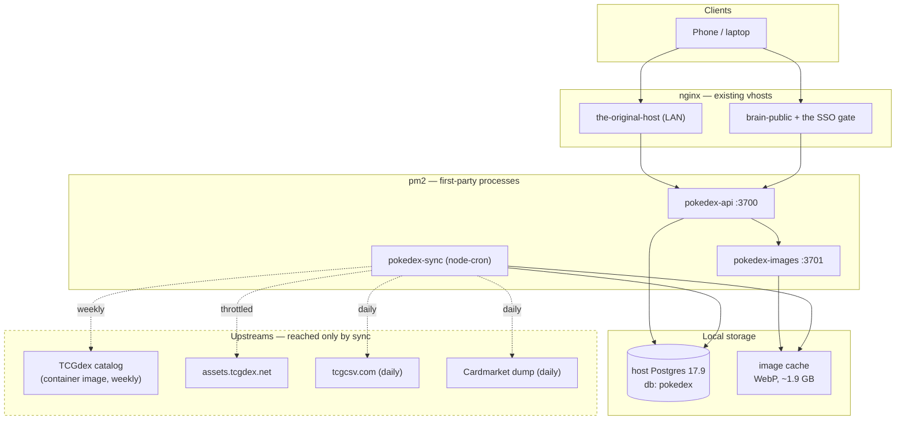

# pokedex — Architecture

**Status:** Phase 1 draft, 2026-07-24. Sections 1–7 are settled and evidence-backed.
Sections 8–9 are pending two in-flight research streams and are marked as such.

This document is the synthesis. It states *what we are building and why*, and points
at the research documents that justify each choice. It deliberately does not repeat
their evidence — where a number appears here, the citation tells you where it was
measured.

| Document | What it settles |
|---|---|
| `research/DATA-LAYER.md` | Catalog ingest, prices, images, storage engine, sync jobs |
| `research/SCHEMA.md` | Tables, DDL, indexes *(in flight)* |
| `research/DECK-FORMATS.md` | Legality rules, PTCGL grammar, format data sources |
| `research/DEX-DATA.md` | Species mapping, sprites, capture semantics |
| `research/BEHAVIOR-SPEC.md` | Product behavior — the three goals, variants, lists |
| `research/ROUTE-MAP.md` | URL structure / IA |
| `UI-SPEC.md` | Design tokens, components, layout |
| `research/FRONTEND.md` | Frontend stack + performance plan *(in flight)* |
| `PRIOR-ART.md` | What to borrow, what to avoid, license posture |
| `DECISIONS.md` | Locked decisions + corrections to the original brief |

---

## 1. The one-paragraph version

pokedex is a single-user Pokémon TCG collection app that runs entirely on the original host
(the original host). It holds its own copy of the card catalog, its own cached card
art, and its own accumulating price history — so it keeps working if every upstream
vanishes. Card data is imported from TCGdex's open database, prices come from
TCGCSV and Cardmarket bulk dumps, and both are pulled by scheduled jobs that write
to a local Postgres. Nothing in a user request path ever touches the network.

## 2. Guiding constraints

1. **This is a live legacy deployment box.** the legacy git host, nginx, six pm2 services and six containers
   are already running and the user depends on them. pokedex must not perturb them:
   no port collisions, no Postgres restart, memory ceilings on every process.
2. **Offline resilience is structural, not a fallback.** The read path is
   Postgres + local image tree. There is no proxy-on-demand, so there is no network
   failure mode to handle in the UI.
3. **Own the data.** Every sync is additive and writes to local storage. Price
   history accrues to us and is never re-fetched from a provider's retention.
4. **Match the box's conventions, not the brief's assumptions.** Where the original
   brief and `/home/cheyras/CLAUDE.md` disagree about deployment shape, the box wins
   — see `DECISIONS.md`.

## 3. Topology

The dashed boundary is the point: **only `pokedex-sync` crosses it.** A user
request never leaves the box.

## 4. Runtime & deployment

**pm2 + nginx, not Docker Compose.** All six existing first-party services on this
box are pm2-managed Express apps behind nginx; Docker here is reserved for
third-party appliances. Following the brief's `docker-compose.arm64.yml` would make
pokedex the only first-party service with a different operational shape, for no
benefit. *This changes a named brief deliverable and is flagged for user approval.*
Rationale and the counter-argument: `research/DATA-LAYER.md` §7.1, `DECISIONS.md`.

| Process | Port | Role | Notes |
|---|---|---|---|
| `pokedex-api` | 3700 | REST API + static SPA | `max_memory_restart`, fork mode |
| `pokedex-images` | 3701 | Serves the local WebP cache | Separable so image I/O can't stall the API |
| *(reserved)* | 3702 | Ad-hoc/transient only | See the TCGdex hazard note below |
| `pokedex-dev` | 3703 | Vite dev server | Not run in production |
| `pokedex-sync` | — | `node-cron` scheduler | No listening socket |

All bound to `127.0.0.1`. nginx is the sole ingress; the block 3700–3709 was
verified free (`ss -tln`). The brief's port list is stale in both directions —
see `DECISIONS.md`.

**Ingress.** A `location` block on the existing `the-original-host` vhost (LAN) and on
`brain-public` behind the SSO gate (remote), per the user's locked decision. The app
therefore serves from a **sub-path**, which constrains the frontend's asset base
URL, router basename and service-worker scope — called out early because it is
cheap now and expensive later.

**Never reload nginx or touch pm2 for other services without asking.**

## 5. Data ingest

### 5.1 Catalog — direct import, never the TCGdex API

We do **not** run `tcgdex/cards-database`'s API server. Its process statically
imports all 18 languages into memory *per cluster worker* and forks one worker per
core; measured JSON→object expansion on this Pi is 6.4×, so stock defaults would
want 2.5–4.5 GB on a box with ~3.7 GB free. This is a live hazard to the other
services, and is the most plausible cause of the crash preceding this session.

Instead the weekly `catalog` job pulls the published image, streams `docker save`
through `tar`, extracts `generated/en/{cards,sets,series}.json` and imports it.
No container is ever created.

**Verified end-to-end by the lead agent, 2026-07-24** — not merely proposed:

| Check | Result |
|---|---|
| `docker save` → layer → extract | ✅ `usr/src/app/generated/en/` in layer `c701e058…` |
| `cards.json` size | **27,235,709 B (27.24 MB)** — matches DATA-LAYER's figure |
| Cards | **23,444** — matches the GraphQL sweep in `research/SCHEMA.md` |
| `variantId` occurrences | **35,648** — matches the sweep's variant-row count exactly |
| Cards with `variants_detailed` | 23,369 → **75 with zero variants**, matching the sweep |
| `thirdParty` present | ✅ per-variant **and** card-level — the "two shapes" DATA-LAYER §3.3 warns about |
| `pricing` present | **0** — confirms prices are not in the catalog, by design |
| Peak RSS to parse | **173 MB** — matches DATA-LAYER's measured 172.6 MB |

Two independent methods (compiled-JSON extraction and a 218-request GraphQL sweep)
agree to the row on card and variant counts. This is the strongest evidence in the
project and it de-risks Phase 2's foundation.

**Why this check mattered:** GraphQL exposes neither `variantId`, `thirdParty` nor
`pricing`, so the import path is the *only* source of `card_variant`'s natural key
and the price join. Had extraction failed, the schema's core identity model would
have had no supply. Extracted artifacts are in the session scratchpad under
`extract/usr/src/app/generated/en/`.

### 5.2 Images — eager warm, WebP, capped

TCGdex serves WebP natively, so the entire English corpus at both resolutions is
**1.87 GB** — the brief's "several GB" figure was a PNG-based estimate for an
asset we never fetch as PNG. One-time warm is ~43.6k requests at 5 req/s (~2.4 h),
driven from an upstream manifest rather than by probing for 404s. 4 GB cap, LRU
eviction on `high` only. AVIF re-encode measured and rejected.

**Ingest must validate `content-type`:** `assets.tcgdex.net` returns HTTP 200 with
a 299-byte HTML body for unsupported extensions, so a loop trusting status codes
will cache garbage. Validate the *magic bytes* too — a size-only check
(`length > 800`) passes an HTML error page and a PNG alike, which is how 30 cached
files named `.webp` came to hold PNG bytes.

**Every cached byte records where it came from.** `image_asset` is the cache
manifest (metadata only — bytes live on the filesystem) and every write goes through
a single choke point, `apps/images/src/store.ts`:

- `putAsset({ cacheKey, kind, relativePath, bytes, provenance })` stages the file,
  writes the row, then publishes with an atomic rename — bytes and metadata land
  together or neither does. `ensureRecorded` is the variant for bytes already on
  disk; it never overwrites provenance someone else established.
- **`provenance` is a required argument.** `fromUrl(url)` for anything fetched;
  `unknownProvenance('<why>')` — which records `source_url = NULL` — only when the
  source genuinely cannot be established. A guessed URL is never acceptable: it
  would make coverage look total over a fiction.
- `content_type` is sniffed from the bytes, never inferred from the extension.

**Serving does not depend on the manifest.** `apps/images` resolves every request
from the on-disk path (a pure function of the upstream URL) and serves a
placeholder/404 on a miss; a missing row degrades metadata (LRU, stats, provenance),
never a page. This is deliberate — do not add a manifest lookup to the read path.

**Drift is checked, not assumed:** `pnpm --filter pokedex-images manifest:check`
reconciles disk against the manifest in both directions (orphans, missing files,
size/content-type mismatches, leftover `.tmp`) and exits non-zero on drift, so it can
be cronned. It is deliberately **not** in CI, which excludes live-DB work.
`manifest:backfill` records any un-recorded files, confirming each candidate source
URL with a HEAD before it will write one. See DECISIONS.md 2026-08-07 for the
1,970-orphan incident that motivated all of this.

### 5.3 Prices — daily, and the UI must say so

For a self-hoster the TCGplayer feed falls through to **TCGCSV, once daily**; the
"~hourly" figure in the brief applies only to the hosted API, which holds partner
credentials we don't have. Cardmarket is likewise daily. Every price in the UI
therefore renders **"as of {date}"** — honest by construction rather than implying
live pricing.

Steady state is ~180 external requests/day (1.8% of TCGCSV's stated ceiling), and
exactly **1** on days when their `last-updated.txt` is unchanged.

### 5.4 Sync invariants

- **Skip-if-unchanged is the first step of every job**, gated on the upstream's own
  stamp (`last-updated.txt`, Cardmarket `createdAt`, image digest).
- **`captured_at` is the source's timestamp, not `now()`.** This makes the price key
  a natural dedupe key and aligns the series to the observation rather than to when
  cron fired. Re-running a day's sync is a genuine no-op.
- One transaction per group, a resumable cursor, and a `pg_advisory_lock` so a
  manual run cannot race the scheduler.
- A failed sync writes `status='error'` and changes nothing else.

Full job table, cadences and per-host politeness policy: `research/DATA-LAYER.md` §7.

## 6. Storage

**Host Postgres 17.9, dedicated `pokedex` database and role, connection pool capped
at 3.** Marginal cost 25–35 MB, versus ~180–250 MB for a second instance. The
decisive point is blast radius: `max_connections` is 20 with 10 already in use, so a
3-connection pool fits with 7 to spare — **no config change and no restart of a
Postgres that other services depend on.** All tuning is role-scoped.

Honest counter-argument, recorded rather than buried: every other pm2 app on this
box uses SQLite, and sharing Postgres couples pokedex to the brain apps. Flagged for
user decision in `DECISIONS.md`.

Price history is bounded by a hybrid cadence (weekly full corpus + daily for
owned/watchlist), monthly range partitions and BRIN on `captured_at` — roughly
530 MB/year rather than 1.75 GB/year for naive daily full snapshots.

## 7. Correctness traps that shape the design

These are verified findings that a reasonable implementation would otherwise get
wrong. They are listed here, not only in the research docs, because each one is
silent when wrong.

| Trap | Consequence if missed |
|---|---|
| TCGdex Cardmarket `*-holo` fields mean **reverse holo**, not holo finish | Wrong prices sitewide, no visible error |
| `legal.standard` is per-print; reprints confer legality | Deck validator rejects most real decks |
| `dexId[0]` does not follow the card name on multi-species cards | Wrong species captured |
| 4 **Trainer** cards carry `dexId` | Trainers silently capture Pokémon; gate on `category='Pokemon'` |
| TCGdex uses both apostrophe codepoints for Farfetch'd | Naive join drops half the prints |
| PTCGL section headers are **line counts**, not card counts | Importer rejects valid decks |
| `assets.tcgdex.net` 200s with HTML for unsupported extensions | Cache fills with garbage |
| TCGdex `card(id:)` prefix-matches; `localId` padding is inconsistent | Wrong card returned; join numerically |
| No upstream English-image fallback exists (hard 404) | Must be application logic |

## 8. Data model

Full DDL, indexes and worked SQL: `research/SCHEMA.md` (2,584 lines).

**Variants are the atomic unit.** `card_variant` is the ownership, pricing and
buy-link row.

> **Correction (Phase 2, verified against the real catalog):** the natural key is
> **`(card_id, variant_kind_code)`**, *not* `tcgdex_variant_id`. Earlier passes
> assumed `variantId` was a per-variant identifier; it is not — the compiled
> catalog has only **324 distinct `variantId` values across 35,648 rows** (it is a
> facet-tuple hash, and the sentinel `"generated"` alone covers 10,296 rows).
> `tcgdex_variant_id` is retained as a non-unique, nullable attribute. The real key
> is the same one the reverse-holo cross-fill (§8.1) keys on, so the two are
> consistent: a cross-filled row and its eventual TCGdex backfill collide on
> `(card_id, variant_kind_code)` and reconcile in place.

**The taxonomy is an open enum implemented as data.** A `variant_kind` lookup table
carries typed facet columns decomposed from `variants_detailed`, so a new stamp is
one `INSERT` and never a migration, while `WHERE finish='reverse'` stays an indexed
predicate rather than a JSON probe. The axis set is **provably closed**, not
sampled: GraphQL introspection of `DetailedVariants` returns exactly five fields
(`type`, `subtype`, `size`, `stamp[]`, `foil`) and no sixth key occurs anywhere in
the corpus.

Census over all 218 sets — the numbers the model is sized against:

| Axis | Distinct | Notes |
|---|---|---|
| `type` | 5 | normal 20,483 · reverse 8,105 · holo 7,055 · lenticular 3 · metal 2 |
| `size` | 2 | standard 35,540 · jumbo 108 |
| `foil` | 19 | energy, cosmos, pokeball, masterball, rainbow, gold, … |
| `subtype` | 21 | **12 of 21 are printing errors** → modelled with an `is_error` flag |
| `stamp` | 116 | **~45 are player names** from World Championship decks |

323 combinations actually occur. Variants per card: mean 1.521, p99 4,
**max 20** (`sv05-144`, every Worlds/IC stamp permutation). 75 cards have zero
variants and get a synthesized `normal` flagged `is_synthesized`.

**The pack-pulled tier is solved structurally, not procedurally.** Three layers —
machine-derived (`variant_kind.tier_derived`, rewritten wholesale each sync),
human-asserted (`variant_tier_override`, with mandatory rationale), and a
`variant_tier_resolved` **view** returning `COALESCE(card, kind, derived)`. Derived
and asserted live in different tables and the resolved value is never stored, so
there is no merge step that could clobber a human decision.

The derivation rule was **measurably wrong on its first pass** and caught by
running it against the corpus: v1 left **432 cards with no standard-tier variant**,
making Master Set unachievable for them. The largest error was classifying 302
`pokeball` + 211 `masterball` rows as special when they are exactly pkmn.gg's
"Poke Ball / Master Ball Pattern". v2 inverted the `foil` clause from an allow-list
to a three-value deny-list and cut the failure to 153 cards. This is why the rule is
versioned (`tier_rule_version`) — so an improvement can *retire* stale overrides
rather than accumulate them.

**Set progress is split by scope:** single-set derived on read; all-sets
materialized into `user_set_progress` (~600 rows, 3 touched per mutation, nightly
sweep), because the two most-navigated pages would otherwise cost ~210–430 ms per
load. This is the model's **only unbenchmarked verdict** and is flagged as such.

**Price history** is append-only and partitioned, keyed
`(variant, source, currency, captured_at)` with `captured_at` from the source. Sized
from measured inputs — 31,610 priceable variants × 2 sources ≈ 63,220 rows per full
snapshot at ~113 B/row. Hybrid cadence ≈ **780 MB/yr** (daily-full would be 2.6 GB;
a narrow per-metric row would be 9–13 GB).

**Binder placement** uses a single `slot_index` that survived all four measured
layouts *and* the zero-pocket inside cover with no stored offset — spread and side
are pure parity derivations.

`user_id` is on every user-owned row; catalog and pricing tables are global.

### 8.1 🔴 Open risk — TCGdex variant coverage is incomplete

Measured while validating the tier rule against authenticated evidence:
**TCGdex is missing reverse-holo variant rows for ~6,300 cards.** Black & White,
XY and Sun & Moon all sit at **1.00–1.04 variants per card**, which is not
plausible for eras where reverse holos were standard pack contents.

**Why it matters:** Master and Grandmaster progress are `(card, variant)` pair
fractions. A missing variant row shrinks the denominator, so those sets would
report **falsely high completion** — the worst failure mode available, because it
looks like working software. Complete Set progress is unaffected (card fraction).

**Why it was not caught earlier:** every cross-check that matched used vintage
sets, which have no reverse holos to miss. Base Set 2 agreed perfectly.

**RESOLVED 2026-07-24** — verified against real TCGCSV payloads
(`research/TCGCSV-VARIANTS.md`). The gap is real and **precisely bounded**: four
eras (Call of Legends, Black & White, XY, Sun & Moon), ~6,275 cards with no reverse
row. Confirmed structural, not incidental — TCGdex's `cardCount.reverse` is 0 and
`variants.reverse` is `false` throughout, so the reverse concept is absent at every
level. Pre-2002 sets (Base/Gym/Neo), trainer kits and digital Pocket sets are
*legitimately* single-variant and **must not** be cross-filled.

**The fix works and is safe.** TCGplayer's `subTypeName` (`Normal` /
`Reverse Holofoil` / `Holofoil`) on the TCGCSV **prices** endpoint joins to TCGdex
numerically at 89.6–100% and recovers ~81.6% of missing rows (~4,660 projected).
The decisive control: on two sets where TCGdex already has reverse rows, cross-fill
produced **zero false positives** and agreed bidirectionally (116/116). TCGplayer's
"Reverse Holofoil" is a faithful proxy for TCGdex's `reverse` variant.

**Model (now folding into the schema):** `card_variant` gains `source`
(`tcgdex` | `tcgcsv`) and `fill_confidence`. A cross-filled row has
`tcgdex_variant_id = NULL` and keys on the **existing** `UNIQUE (card_id,
variant_kind_code)` — the reverse-holo kind code is deterministic, so a later TCGdex
backfill lands on the same slot via `ON CONFLICT … DO UPDATE`, promoting the row in
place (real `variantId`, `source → tcgdex`) with the row `id` and any attached user
ownership preserved. No duplicate, no orphan.

Numeric-join fills count toward Master/Grandmaster **immediately** (excluding them
would recreate the false-high bug). Only `cleanName`-fallback fills and unmatched
misses are marked provisional via the extended `set_variant_coverage` view. The
stored-progress invalidation-on-catalog-sync point still stands and still weakens
the case for materialising `user_set_progress`.

### 8.2 Corrections this work forced on `DATA-LAYER.md`

- `cardCount.{normal,holo,reverse,firstEd}` **exceeds the card count in 47 of 214
  sets** (`base1`: normal=346 for 102 cards), so it cannot drive progress
  denominators. `official` vs `total` is the **secret-rare split**, not
  main-vs-master as previously recorded.
- `Σ cardCount.total` overstates the corpus by **302 phantom cards**.

## 9. Frontend

Built against `UI-SPEC.md`. Full rationale and version pins: `research/FRONTEND.md`.

**Stack** (versions read from the npm registry 2026-07-24, not from memory):
React **19.2.8** (the brief's React 18 is stale), TanStack Router **1.170.18**,
TanStack Query **5.101.4**, TanStack Virtual **3.14.8**, Vite **8.1.5**,
Tailwind **4.3.3**. Vendor floor **125.9 KB gzip**. Charts and drag-and-drop are
lazy chunks (`d3-scale`/`d3-shape`; `@dnd-kit`).

`react-router` v8 was **rejected on a hard constraint**: it declares
`engines: node >=22.22.0` and this box runs Node 20.20.2 with six pm2 services and
a documented native-ABI failure mode. `recharts` rejected at 143.9 KB gzip — 2.2×
the entire React runtime.

**Virtualization.** TanStack Virtual in window mode, virtualizing *rows* with the
column count from a single `ResizeObserver`. Explicitly **not** `lanes`, which is
masonry placement and would break row-major card-number order — the one ordering
users of a set page actually care about. Row height is computed arithmetically, so
there is no measure pass.

**Images.** `srcset` across our cached resolutions with an `aspect-ratio` box to
prevent layout shift. Measured gotcha: on a DPR-2 phone the browser correctly
rejects `low` (245w against 335 needed) and pulls `high` — **14.4 MB per set
page**. A 400w derivative (mean 33.0 KB, +721 MB corpus, still inside the 4 GB cap)
roughly halves it.

**Offline is tiered, and honest about phones.** No phone holds 1.87 GB. Tier 0:
app shell, ~5–6 MB, always. Tier 1: visited art, LRU-capped ~2,000 images ≈ 33 MB.
Tier 2: opt-in pack (owned cards + tracked sets), ~50–120 MB. Offline therefore
means *full metadata browse, search and edit everywhere; real art for what you own*.

On iOS the binding constraint is not quota (since iOS 17 Safari grants ~60% of
device disk) but **eviction**: ITP deletes all script-writable storage — including
the service-worker registration — after 7 days without user interaction. Mitigated
by Home-Screen install plus `navigator.storage.persist()`, using both because
neither is documented as sufficient alone.

**Building on the Pi is fine**, on Vite 8's Rolldown: ~1.0–1.2 GB peak against
~4.5 GB available, ~10–12 min cold. Two guardrails: keep `tsc` out of the deploy
path (TypeScript's checker is the memory hog, not the bundler) and `nice`/`ionice`
the build. `a co-hosted app/deploy.sh` already builds on-Pi in production today.

### 9.1 🔴 PWA is currently impossible on LAN

`http://localhost/` is **not a secure context** — the LAN vhost is plaintext
`listen 80`. No service worker, no install, no offline, on any browser. Only
`example.invalid` has TLS. The brief requires PWA and offline resilience,
so **this must be resolved or the requirement dropped**.

Cheapest fix: **split-horizon DNS**. the local DNS resolver is already running on this box, so one
`address=/example.invalid/<pi-lan-ip>` line makes the existing Let's
Encrypt certificate serve LAN clients, with no new cert, no new port, and no
external dependency. It changes DNS resolution for services the user depends on, so
it is a user decision, not ours.

Incidental, box-wide: nginx `gzip_types` is commented out in `nginx.conf`, so
JS/CSS/JSON are served **uncompressed** for every service on this machine today.
`gzip_static` is compiled in; brotli is not. Recommend scoping any fix to pokedex's
own location blocks rather than editing the global config.

## 10. Open questions for the user

1. **Storage engine** — host Postgres (recommended) vs SQLite like the other apps.
2. **Backend language** — Node/TS (matches all six existing services) vs the brief's
   Python/FastAPI.
3. **Deployment shape** — pm2 + nginx (recommended) vs the brief's Docker Compose.
4. **An authenticated pkmn.gg session** — about a dozen behaviors, including the
   Master/Grandmaster variant boundary we must model, only close from a logged-in
   account, some Pro-gated.

Separately, and not a pokedex question: this box writes **6.84 GB/day at idle** and
has **no backup**. pokedex adds ~0.8% to that. The backup gap is the larger risk.
