# SCHEMA.md — pokedex canonical data model

**Author:** schema research subagent · **Date:** 2026-07-24 (first pass) · **revised 2026-07-24b**
**Status:** proposed. Binding once approved at the Phase-1 checkpoint.
**Engine posture:** **Postgres-first DDL, SQLite deltas noted inline and consolidated in §16.**
The storage engine is still open (`DECISIONS.md` → "Open — pending Phase 1 research"), so nothing
below assumes one and ignores the other.

## Evidence tags

| Tag | Meaning |
|---|---|
| **[E]** | Grounded in a research doc. Filename + section cited inline. |
| **[P]** | Projected — arithmetic or extrapolation from an **[E]** measurement. The basis is shown. |
| **[X]** | Invented by me. No evidence backs it; it is a design proposal. Called out every time. |

I have tried to make **[X]** conspicuous rather than smooth. Where I am guessing, §18 says so again.

## Second-pass revision log — what changed, and why

The first pass was written before [Data Layer](https://github.com/cheyras/deckscout/wiki/Data-Layer) and `DECK-FORMATS.md` existed, and flagged its
own two biggest weaknesses as unresolved. Both are now resolved. **Corrections are recorded here
rather than silently folded in**, because a visible correction is more useful than a clean table.

| # | First pass said | Now measured | Where |
|---|---|---|---|
| C1 | "~2.1 variants per card" **[P]**, from two sample cards | **1.521** — measured over all 23,444 EN cards / 35,648 variant rows. My estimate was **38 % too high**. | §4.5 |
| C2 | `finish` vocabulary includes `poke-ball-pattern`, `master-ball-pattern` | **Wrong axis.** `type` has exactly **5** values (`normal`, `reverse`, `holo`, `lenticular`, `metal`). Poké Ball / Master Ball are **`foil`** values on `type=reverse`. | §4.5, §5.3 |
| C3 | `foil` seeded as 4 values (`cosmos`,`gold`,`galaxy`,`league`) | **19** non-null values. I had missed 15, including the two highest-impact ones (`pokeball` 302, `masterball` 211). | §4.5 |
| C4 | `stamp` seeded as ~12 values | **116** distinct values, and up to **2 stamps on one variant**. Decisively vindicates the junction table over a scalar column. | §4.5 |
| C5 | `variant_kind` projected at "60–150 rows" | **323** distinct facet combinations actually occur. | §4.5 |
| C6 | Tier rule v1 | v1 leaves **432 cards with no standard-tier variant** (Master Set unachievable). Rule **v2** cuts that to 153 and reclassifies 1,269 rows. | §5.3 |
| C7 | `price_observation` at ~45,000 variants → 2.2 GB/yr | Real priceable rows **31,610** ([Data Layer](https://github.com/cheyras/deckscout/wiki/Data-Layer) §4.5). Revised figures and an adopted **hybrid cadence**. | §11 |
| C8 | `observed_on DATE`, yearly partitions, PK-only index | Adopted [Data Layer](https://github.com/cheyras/deckscout/wiki/Data-Layer) §7.3's **`captured_at` = the source's own stamp**, **monthly** partitions, and a **BRIN** companion index. My DATE grain was a cruder way to get the same dedupe. | §7.2 |
| C9 | §8 decks marked PROVISIONAL | Replaced with `DECK-FORMATS.md`'s evidence-backed model. The `no_rule_box` check is no longer crude; `legal.standard` is **removed** as a legality predicate. | §8 |
| C10 | `card_count_total` "advisory" — no number | Measured: `Σ cardCount.total` = 23,746 vs 23,444 real cards → **302 phantom cards**. And per-variant `cardCount` fields **exceed the card count in 47 of 214 sets** — unusable as denominators. | §6, §9.2 |
| C11 | Binder `slot_index` — untested against real layouts | **Survives.** 9/4-pocket spreads, 12/16-pocket single pages, and the zero-pocket inside cover are all pure *render-time* derivations from `slot_index`. No stored page/pocket, no fudge. | §14.2 |

### Third pass — authenticated evidence (pkmn.gg authenticated captures (not tracked), 37 logged-in screenshots)

The first authenticated evidence in the project. It **confirms** more of the model than it breaks,
but what it breaks, it breaks hard.

| # | Earlier pass said | Authenticated evidence | Where |
|---|---|---|---|
| D1 | Tier rule **v2**: `standard` iff no stamp, base size/finish, non-organised-play foil, non-error subtype | **Falsified.** `IMG_0592` shows Base Set Clefairy with **one** primary `Holofoil` and two rows under `Other Variants`. v2 marks **3–4** of Base Set's variants standard, so it would demand shadowless + 1999-copyright printings for Master Set. **Rule v3** keys on *print run*: exactly **1 standard variant for all 102 Base Set cards**. | §5.3 |
| D2 | `tier` is a boolean-ish `standard`/`special` | The UI states provenance as **`Found in {printRun} Booster Packs`** — three strings, no more. `1st Edition Holofoil Shadowless` **is pack-pulled** yet sits in `Other Variants`. So **pack-pulled ≠ standard**; the Master boundary is *pack-pulled **from the base print run***. | §5.3, §5.4 |
| D3 | Variant display names come straight from the facet tuple | Names are **composed**, and pkmn.gg authenticated captures (not tracked) §12.2's grammar is **wrong** — see §5.4. `Unlimited` is a *contrastive* token, not `subtype=unlimited`. | §5.4 |
| D4 | Master % — unit unstated | **Confirmed a `(card, variant)` pair fraction**, not a card fraction. My §9.2/§17.2 already computed it that way. Complete stays a **card** fraction. | §9.2 |
| D5 | `user_set_progress` keyed `(user, set, goal)`, 3 rows | **Confirmed necessary.** Bar 2 is **Master** by default and Grandmaster *only* when that goal is chosen — never a copy of Complete. Observed at goal=Complete with bar 2 showing a different value. Store three, render two. | §9.2, §9.3 |
| D6 | Set `LVL` bands "low confidence" (`BEHAVIOR-SPEC.md` §3.2) | **Solved:** `LVL = 0 if pct = 0 else 1 + floor(pct/25)`, nine data points, milestone dots pixel-measured at 25/50/75 %. | §9.2 |
| D7 | `trainer_level` — `floor(u/10)` vs `1+floor(u/10)` undetermined | **Solved:** `Unique 276 → badge 27`. `floor(u/10)`, level-0 start. | §9.5 |
| D8 | Card attributes modelled: type, subtype, artist… | **`Tags`** is a chip field alongside Type and Artist (e.g. `Basic`), all three linking into search. Not previously modelled. | §6 |
| D9 | `price_current.upstream_updated_at` per (variant, source) | **Confirmed and sharpened.** Freshness is **per product** — two cards read `2 hours ago` and `18 hours ago`. And a variant can have **no price and no buy link at all**. Absence must be first-class. | §7.1 |
| D10 | Binder mutation unmodelled | Binder editing is **boolean per-pocket variant checkboxes**, not steppers. Same table, different mutation — and a real data-loss hazard. | §14.2 |
| D11 | `variant_tier_resolved` boundary was **[I]** | **Confirmed** as exactly the `Other Variants` / `Additional Variants` grouping, named three ways in three surfaces. | §5.3 |

### 🔴 A finding that neither sibling doc reports: our Master denominators will not match pkmn.gg's

Testing rule v3 against the census turned up something more consequential than the rule itself.
**TCGdex's variant coverage is incomplete for entire eras**, measured as variants per card:

| serie | cards | variants/card |
|---|---|---|
| Diamond & Pearl | 900 | 2.24 |
| Scarlet & Violet | 3,698 | 1.86 |
| Sword & Shield | 3,670 | 1.57 |
| **Sun & Moon** | **2,917** | **1.04** |
| **Black & White** | **1,437** | **1.00** |
| **XY** | **1,932** | **1.00** |

Black & White, XY and Sun & Moon all shipped reverse-holo commons in reality. TCGdex carries
**no reverse-holo variant rows for ~6,300 cards across those three eras**. Brand-new sets are worse:
Chaos Rising (`me04`, 2026) has 119 of 122 cards at exactly one variant.

This is what explains the one place my rule and the authenticated evidence disagree.
pkmn.gg authenticated captures (not tracked) §11 brackets Pitch Black's Master denominator at **193–194** (or 204–205);
rule v3 over TCGdex's data predicts **187**, which fits no admissible band. The 8-day-old set is
simply under-populated upstream. The control case proves the rule is sound: **Base Set 2 predicts
exactly 130 standard pairs, one per card for all 130** — precisely what §11 independently derived
from the observed `22.3 % / 22.3 %` double reading. Two unrelated methods agreeing.

**Consequences, and they are structural:**

1. **Complete Set progress is stable; Master and Grandmaster are not.** Complete is a card fraction
   and cards are well-covered. Master/Grandmaster denominators move whenever upstream backfills.
2. **`user_set_progress` must be invalidated by *catalog* syncs, not only by collection mutations.**
   The first pass only recomputed on collection change plus a nightly sweep. That is not enough —
   a catalog sync that adds a `card_variant` row silently makes a stored denominator wrong. §9.3.
3. **The UI must not present Master % as authoritative for sparse sets.** §9.3 adds a
   `set_variant_coverage` view so a provisional percentage can be marked as such.

### A correction to a sibling doc

**[Data Layer](https://github.com/cheyras/deckscout/wiki/Data-Layer) §3.1 and §8 item 12 are wrong about `cardCount`.** They state that
`cardCount.{holo, reverse, normal, firstEd}` "drive per-variant set-progress denominators" and that
`official` vs `total` "is exactly the main-set vs master-set distinction … no derivation needed".
Neither holds:

- In **47 of 214 sets** a per-variant count *exceeds the number of cards in the set* — `base1`
  reports `normal: 346` for 102 cards, `firstEd: 104` for 102 cards. Used as a denominator these
  produce >100 % progress. Measured, §9.2.
- `official` vs `total` is the **printed vs secret-rare** split (the `165 + 42 Secret` → `0 / 207`
  finding, `BEHAVIOR-SPEC.md` §2.1). **Master Set is about *variants*, not secret rares**
  (`BEHAVIOR-SPEC.md` §2.1 / changelog C1). Conflating the two would make Master Set mean "own the
  secret rares", which is not what pkmn.gg computes.

This *strengthens* the first pass's §9.2 decision to derive every denominator from `COUNT(*)` over
real rows. It is now backed by a measurement rather than caution.

## Dependency status

| Sibling doc | Status | Consequence |
|---|---|---|
| [Data Layer (wiki)](https://github.com/cheyras/deckscout/wiki/Data-Layer) | ✅ read (791 lines) | §7, §11, §15 reconciled. Divergences justified inline. |
| `research/DECK-FORMATS.md` | ✅ read (1,554 lines) | §8 rewritten. |
| `research/INTERACTION-CAPTURE.md` + [UI Spec](https://github.com/cheyras/deckscout/wiki/UI-Spec) §5 | ✅ read | §14.2 binder verified against measured layouts. |

---

# 1. Design principles, stated once

1. **The atomic unit of ownership is `(user, card, variant)`.** Not the card.
   [E] `BEHAVIOR-SPEC.md` §1.1 — "the schema must be `collection_item(card_id, variant_id, quantity)`
   … Do **not** model ownership at card level with a variant side-table of flags."
2. **Catalog is global; anything a user could disagree about carries `user_id`.**
   [E] `DECISIONS.md` 2026-07-24 "Users: single-user now, multi-user-ready schema". §12 defines the
   seam precisely, including the one row type where I had to make a judgment call.
3. **Push invariants into the DB.** A price of zero should be *unstorable*, not merely un-inserted.
   A dynamic list should be *unable* to hold duplicates. A card should be *unable* to have two
   primary variants. Constraints are cheaper than tests and they survive a rewrite of the app layer.
4. **Never store a resolved value that a sync will later recompute over a human's decision.**
   Derived and asserted live in different tables; a view resolves them. §5.
5. **Indexes are a liability on microSD.** Every index in §13 names the query that forces it. Sorting
   that `BEHAVIOR-SPEC.md` §5.3 documents as *client-side* gets no index at all.
6. **Surrogate `BIGINT` PKs with `UNIQUE` natural keys, and keep the foreign keys.**
   [E] [Prior Art](https://github.com/cheyras/deckscout/wiki/Prior-Art) §3 item 10 — pokecollector had to *drop* `cards.set_id`'s FK to make a
   composite `{tcgdexId}_{lang}` string PK work, and now joins Set↔Card in Python. Take the
   multi-language concept, reject that implementation.

---

# 2. How this schema avoids each of pokecollector's four failures

[Prior Art](https://github.com/cheyras/deckscout/wiki/Prior-Art) §1 and §4 name four structural defects. Explicitly, one by one:

| pokecollector defect | Citation | How pokedex avoids it |
|---|---|---|
| **Four booleans on the card row** (`variants_normal/reverse/holo/first_edition`), README: "Variants are now limited to Normal, Holo, Reverse Holo, and First Edition" | [Prior Art](https://github.com/cheyras/deckscout/wiki/Prior-Art) §1 reason 1, `models.py` L113–116 | Variants are **rows** (`card_variant`, §4). A card may carry 1–8+ of them. Adding `Master Ball Pattern` or a 2027 stamp is an `INSERT`, never DDL. The four booleans cannot even be expressed. |
| **Free-text `collection.variant TEXT NOT NULL DEFAULT 'Normal'`, no FK to any variant table** | [Prior Art](https://github.com/cheyras/deckscout/wiki/Prior-Art) §1, §4 item 4 | `collection_item.card_variant_id BIGINT NOT NULL REFERENCES card_variant(id)`. There is no text variant column anywhere on a user row. A typo is a constraint violation, not a silently-orphaned collection entry. |
| **`price_history UNIQUE(card_id, date)` with five EUR-only columns — no variant, no currency, no source dimension** | [Prior Art](https://github.com/cheyras/deckscout/wiki/Prior-Art) §1, §4 item 5 | `price_observation` is keyed `(card_variant_id, source_code, currency_code, captured_at)` with `currency_code` and `source_code` as **FK'd, first-class dimensions** (§7). Cardmarket EUR and TCGplayer USD coexist as separate rows, never as separate columns. |
| **Column names that lie** — `price_market` = `price_mid` = `cardmarket.avg`; `price_high` = `avg30`; and `*-holo` meaning *reverse* holo | [Prior Art](https://github.com/cheyras/deckscout/wiki/Prior-Art) §4 item 6, §2a "The `-holo` semantics", `DECISIONS.md` correction 5 | Metric names are source-generic and the source→metric mapping is a **data table** (`price_source_field_map`, §7.3) rather than a line of Python. No column named `*_holo` exists anywhere. The Cardmarket `*-holo` fields are ingested onto the **Reverse Holofoil** `card_variant` row, and the mapping rows say so in SQL you can `SELECT`. |

Two more from the do-not-copy list, since they touch the schema:

| Defect | Citation | Avoided by |
|---|---|---|
| `ImageCache` as uncapped Postgres `BYTEA` — no TTL, no LRU, no size cap; `pg_dump` then carries the whole image corpus | [Prior Art](https://github.com/cheyras/deckscout/wiki/Prior-Art) §4 item 1 | `image_asset` (§15) holds **metadata and a filesystem path**. Bytes never enter the DB. Cap and LRU are columns, not hopes. |
| Migration strategy: `alembic` declared but unused; 108 hand-ordered raw SQL strings in `database.py` | [Prior Art](https://github.com/cheyras/deckscout/wiki/Prior-Art) §4 item 2 | Out of scope for this document (I write no migrations), but the DDL below is written to be expressible as ordered, reversible migrations. Nothing here depends on `CREATE ... IF NOT EXISTS` idempotency-by-reboot. |

---

# 3. ER overview

```mermaid
erDiagram
    catalogue      ||--o{ series : contains
    series         ||--o{ card_set : contains
    card_set       ||--o{ card : contains
    card           ||--o{ card_variant : "has 1..n"
    variant_kind   ||--o{ card_variant : "typed by"
    variant_kind   ||--o{ variant_kind_stamp : "0..n stamps"
    variant_finish ||--o{ variant_kind : ""
    variant_print_subtype ||--o{ variant_kind : ""
    variant_foil   ||--o{ variant_kind : ""
    variant_size   ||--o{ variant_kind : ""
    variant_stamp  ||--o{ variant_kind_stamp : ""
    variant_kind   ||--o{ variant_tier_override : "human-asserted"
    card           ||--o{ variant_tier_override : "card-specific override"
    card           ||--o{ card_type : ""
    card           ||--o{ card_subtype : ""
    card           ||--o{ card_attack : ""
    card           ||--o{ card_ability : ""
    card           ||--o{ card_matchup : "weakness/resistance"

    dex_species    ||--o{ card_species : "featured on"
    card           ||--o{ card_species : "features 0..n"
    dex_species    ||--o{ dex_species_type : ""
    card           ||--o| card_species_conflict : "flagged"

    card_variant   ||--o| price_current : "latest per source"
    card_variant   ||--o{ price_observation : "append-only history"
    price_source   ||--o{ price_current : ""
    price_source   ||--o{ price_observation : ""
    price_source   ||--o{ price_source_field_map : "field->metric map"
    currency       ||--o{ price_observation : ""
    currency       ||--o{ fx_rate : ""

    app_user       ||--|| user_settings : ""
    app_user       ||--|| user_profile : ""
    app_user       ||--o{ collection_item : owns
    app_user       ||--o{ collection_event : "activity log"
    app_user       ||--o{ graded_card : ""
    app_user       ||--o{ card_note : ""
    app_user       ||--o{ user_showcase : ""
    app_user       ||--o{ user_set_progress : "materialised"
    app_user       ||--o{ user_dex_state : "first_captured_at"
    app_user       ||--o{ collection_value_point : "own time series"
    app_user       ||--o{ card_list : ""
    app_user       ||--o{ deck : ""

    card_variant   ||--o{ collection_item : ""
    collection_item ||--o{ collection_event : ""
    card_list      ||--o{ list_item : ""
    card_list      ||--o{ binder_placement : ""
    list_item      ||--o| binder_placement : "occupies slot"
    dex_species    ||--o{ list_item : "pokedex-binder slot"

    format         ||--o{ deck : ""
    format         ||--o{ format_regulation_mark : ""
    format         ||--o{ format_set_allowance : ""
    format         ||--o{ format_promo_allowance : ""
    format         ||--o{ format_ban : ""
    format         ||--o{ format_exclusive_group : ""
    format_exclusive_group ||--o{ format_exclusive_group_member : ""
    card_set       ||--o{ format_set_allowance : ""
    card_set       ||--o{ ptcgl_set_alias : ""
    deck           ||--o{ deck_card : ""
    card           ||--o{ deck_card : ""
    card_set       ||--o{ format_promo_allowance : ""

    sync_run       ||--o{ catalog_change : ""
    sync_run       ||--o{ sync_cursor : "advances"
    image_asset }o--|| card : "0..n art"
```



---

# 4. The variant taxonomy — the central design decision

## 4.1 The problem, restated

[E] `BEHAVIOR-SPEC.md` §1.2 harvested the **exact strings pkmn.gg uses**: `Normal`, `Holofoil`,
`Reverse Holofoil`, `Poke Ball Pattern`, `Master Ball Pattern`, `Play Pokémon Stamp Holo`,
`Play Pokémon Stamp Normal`, `Professor Program Stamp Normal`, `Staff Stamp`, `GameStop Stamp`,
`EB Games Stamp`, `Stamp`, `Pokémon Center Stamp`, `Jumbo`, `TCG Pocket`. It also establishes
that "Variant names are free-text-ish labels, curated by the pkmn.gg team, not a fixed enum. New
ones are added per card via a moderation flow."

And [E] [Prior Art](https://github.com/cheyras/deckscout/wiki/Prior-Art) §1 establishes what TCGdex actually ships: a `variants_detailed` array per
card carrying `type` / `subtype` / `size` / `stamp` / `foil` — a **facet decomposition**, with
observed stamps `pokemon-center`, `staff`, `worlds-2024`, `player-rewards-program`, `set-logo`,
`gamestop`, `eb-games`, `1st-edition`; foils `cosmos`, `gold`, `galaxy`, `league`; and types beyond
the four booleans (`metal`, `lenticular`).

So the requirement is: **open vocabulary, still FK-enforced, still queryable by structure, still
fast.** Those pull against each other.

## 4.2 Options considered, and why each was rejected

| Option | Why not |
|---|---|
| **A. Free-text column on the collection row** (pokecollector) | No referential integrity, no tier, unjoinable to price, typos become phantom variants. [Prior Art](https://github.com/cheyras/deckscout/wiki/Prior-Art) §4 item 4. Rejected. |
| **B. Booleans per variant on the card row** (pokecollector) | Cannot express `Master Ball Pattern` without DDL. Rejected. |
| **C. Postgres native `ENUM`** | `ALTER TYPE ... ADD VALUE` is a schema migration, and the vocabulary demonstrably grows every set (`Master Ball Pattern` is SV-era; `Poke Ball Pattern` newer still). It also does not exist in SQLite. Rejected — a new stamp must not require a deploy. |
| **D. Pure JSONB facet blob on `card_variant`** | Needs a GIN index to filter, and GIN write-amplification on microSD is exactly the cost §1 principle 5 is trying to avoid. Also unjoinable for the tier logic. Rejected. |
| **E. Full EAV — `variant_facet(variant_id, facet, value)` rows** | Every progress query becomes a pivot with a `HAVING COUNT(*) = n` correctness trap. Rejected on query complexity. |
| **F. Chosen: a curated lookup table whose rows carry typed facet columns** | See below. |

## 4.3 The chosen shape

**A global `variant_kind` lookup table** — an *open enum implemented as data*. New stamp ⇒ one
`INSERT`, no DDL, no deploy. FK from `card_variant` means user rows can never hold an unknown
variant. Facets live as **typed columns on `variant_kind`**, so `WHERE finish = 'reverse'` and
`WHERE size = 'jumbo'` are plain indexed predicates, not JSON extraction.

The trade-off I am accepting, said plainly: **a fixed facet column set is a bet that TCGdex's five
facets (`type`/`subtype`/`size`/`stamp`/`foil`) span the space.** If a sixth axis appears upstream,
it costs one `ALTER TABLE ADD COLUMN` — a cheap, non-rewriting operation in Postgres 11+, and one
that is *not* required for a new *value* on an existing axis. I am trading "new facet axis is a
migration" (rare) for "new stamp is an insert" (common). Option C trades the opposite way, which is
backwards for this domain.

`variant_kind.code` is a **deterministic slug of the facet tuple**, so the sync can compute it
without a lookup and re-derive it idempotently. `display_name` is curated free text so it can be
made to match pkmn.gg's vocabulary as we learn it — but it is *display only* and nothing joins on it.

```sql
-- ── VARIANT VOCABULARY ────────────────────────────────────────────────────────
-- Global catalog table. NOT user-scoped. ~60–150 rows projected [P].
CREATE TABLE variant_kind (
  code            TEXT PRIMARY KEY,           -- deterministic facet slug, e.g.
                                              -- 'holo', 'reverse', 'normal-stamp-gamestop',
                                              -- 'holo-shadowless-stamp-1st-edition', 'normal-jumbo'
  display_name    TEXT NOT NULL,              -- curated, e.g. 'GameStop Stamp'. DISPLAY ONLY.
                                              -- Never join on this. See BEHAVIOR-SPEC §1.2.
  -- ── facets, decomposed from TCGdex variants_detailed ────────────────────────
  -- The five facet axes are EXACTLY the five fields of TCGdex's `DetailedVariants` GraphQL type
  -- (introspected 2026-07-24: type, subtype, size, stamp, foil — and nothing else). This is the
  -- upstream TYPE DEFINITION, not a sample, so the axis set is provably closed. §4.5.
  finish          TEXT NOT NULL REFERENCES variant_finish(code),        -- .type   (NON_NULL upstream)
  print_subtype   TEXT REFERENCES variant_print_subtype(code),          -- .subtype (nullable)
  size            TEXT NOT NULL REFERENCES variant_size(code),          -- .size   (NON_NULL upstream)
  foil            TEXT REFERENCES variant_foil(code),                   -- .foil   (nullable)
                                              -- .stamp is a LIST -> variant_kind_stamp junction
  -- ── the derived tier (see §5) ───────────────────────────────────────────────
  tier_derived    TEXT NOT NULL
                  CHECK (tier_derived IN ('standard','special')),
  tier_rule_version SMALLINT NOT NULL,        -- which derivation rule produced tier_derived
  tier_derived_at TIMESTAMPTZ NOT NULL DEFAULT now(),
  sort_hint       SMALLINT NOT NULL DEFAULT 100,          -- vocabulary-level display order
  created_at      TIMESTAMPTZ NOT NULL DEFAULT now()
);
COMMENT ON COLUMN variant_kind.tier_derived IS
  'MACHINE-DERIVED, rewritten on every catalog sync. NEVER read this directly for progress
   maths — read the view variant_tier_resolved, which layers human overrides on top. See SCHEMA §5.';

-- Facet value vocabularies. Also open enums-as-data: a new foil is an INSERT.
-- ALL SEED LISTS BELOW ARE THE MEASURED CENSUS (§4.5), not guesses. Corrections C2–C4.
CREATE TABLE variant_finish (code TEXT PRIMARY KEY, label TEXT NOT NULL);
  -- EXACTLY 5, measured: normal, reverse, holo, lenticular, metal
  -- ⚠ CORRECTION C2: the first pass listed poke-ball-pattern / master-ball-pattern here.
  --   They are NOT finishes — they are `foil` values on type='reverse'. See variant_foil.

CREATE TABLE variant_print_subtype (          -- renamed from `variant_edition` (correction C2)
  code     TEXT PRIMARY KEY,
  label    TEXT NOT NULL,
  is_error BOOLEAN NOT NULL DEFAULT FALSE     -- 12 of the 21 measured values are PRINTING ERRORS
);
  -- 21 measured. Legitimate print runs: shadowless(204), 1999-2000-copyright(150), unlimited(102),
  --   no-e-reader(39), blue-border(8), shadowless-red-cheek(2), japanese-back(2),
  --   gold-border(1), glossy(1), 1999-copyright(1)
  -- is_error=TRUE: missing-expansion-symbol(16), aoki-error(3), no-holo-error(2), rarity-error(2),
  --   missing-hp(1), evolution-box-error(1), d-ink-dot-error(1), energy-symbol-error(1),
  --   text-error(1), shifted-energy-cost(1)
  -- `is_error` is load-bearing: requiring a `missing-hp` misprint for Master Set is absurd. §5.3(e).

CREATE TABLE variant_size (code TEXT PRIMARY KEY, label TEXT NOT NULL);
  -- EXACTLY 2, measured: standard (35,540), jumbo (108)

CREATE TABLE variant_foil (
  code            TEXT PRIMARY KEY,
  label           TEXT NOT NULL,
  is_organised_play BOOLEAN NOT NULL DEFAULT FALSE   -- drives the tier rule, §5.3(d)
);
  -- 19 non-null values measured. is_organised_play=TRUE (NOT pack-pulled):
  --   league(52), player-reward(3), professor-program(2)
  -- FALSE (ordinary pack foils/patterns): energy(335), cosmos(334), pokeball(302),
  --   masterball(211), rainbow(151), gold(134), galaxy(131), cracked-ice(51), duskball(26),
  --   loveball(25), friendball(23), quickball(22), tinsel(11), team-rocket(10), mirror(2),
  --   starlight(1)

-- TCGdex 'stamp' is an ARRAY (base1-4 shows stamp:["1st-edition"]). Junction table rather than
-- TEXT[] so the shape is identical on SQLite — see §16.
CREATE TABLE variant_stamp (code TEXT PRIMARY KEY, label TEXT NOT NULL, category TEXT);
  -- 116 distinct values MEASURED (§4.5). Categories observed: distribution (set-logo, gamestop,
  --   eb-games, mcdonalds, pokemon-center), edition (1st-edition), organised play
  --   (worlds-YYYY, regional-championships, staff, judge, winner, finalist, top-eight …),
  --   and ~45 PLAYER NAMES (jason-klaczynski, david-cohen, …) from World Championship decks.
  -- The player-name class is why this MUST be data: it grows every year, by name.
CREATE TABLE variant_kind_stamp (
  variant_kind_code TEXT NOT NULL REFERENCES variant_kind(code) ON DELETE CASCADE,
  stamp_code        TEXT NOT NULL REFERENCES variant_stamp(code),
  PRIMARY KEY (variant_kind_code, stamp_code)
);
```

## 4.4 `card_variant` — the per-card instance

```sql
CREATE TABLE card_variant (
  id                  BIGINT GENERATED ALWAYS AS IDENTITY PRIMARY KEY,
  card_id             BIGINT NOT NULL REFERENCES card(id) ON DELETE CASCADE,
  variant_kind_code   TEXT   NOT NULL REFERENCES variant_kind(code),

  -- TCGdex's own opaque per-variant id, e.g. '4ffrmhcfiaejakhepqdkx7o'
  -- (DEX-DATA §A.1, base1-4 response). THIS is the sync idempotency key: it survives a rename
  -- of our slug vocabulary and a re-derivation of variant_kind.
  tcgdex_variant_id   TEXT UNIQUE,

  sort_order          SMALLINT NOT NULL,      -- position within this card's variant list.
                                              -- BEHAVIOR-SPEC §1.1: "an ordered list of named variants"
  is_primary          BOOLEAN NOT NULL DEFAULT FALSE,
                                              -- the "main variant" whose price represents the card in
                                              -- list/grid views. BEHAVIOR-SPEC §5.3 "Price of Main Variant"

  tcgplayer_product_id   INTEGER,             -- per-VARIANT, not per-card. BEHAVIOR-SPEC §1.2, §9.6
  tcgplayer_printing     TEXT,                -- 'Normal' | 'Holofoil' | 'Reverse Holofoil' —
                                              -- the ?Printing= URL param and the TCGCSV subTypeName
  cardmarket_product_id  INTEGER,             -- TCGdex pricing.cardmarket.idProduct
  tcgplayer_mass_entry   TEXT,                -- '1 Goldeen [ME05] 13'  BEHAVIOR-SPEC §8.8 [O]
  source_note            TEXT,                -- 'Found in Booster Packs' etc. BEHAVIOR-SPEC §1.2 [O]

  first_seen_at       TIMESTAMPTZ NOT NULL DEFAULT now(),
  last_synced_at      TIMESTAMPTZ NOT NULL DEFAULT now(),

  UNIQUE (card_id, variant_kind_code),
  UNIQUE (card_id, sort_order) DEFERRABLE INITIALLY DEFERRED   -- reordering is one UPDATE stmt
);

-- A card has at most one primary variant. Enforced, not asserted.
CREATE UNIQUE INDEX card_variant_one_primary
  ON card_variant (card_id) WHERE is_primary;
```

`UNIQUE (card_id, variant_kind_code)` is safe because the facet tuple already discriminates the four
`holo` rows on `base1-4` — `holo/unlimited`, `holo/shadowless`, `holo/shadowless+1st-edition`,
`holo/1999-2000-copyright` — into four distinct `variant_kind.code` values. [E] [Dex Data](https://github.com/cheyras/deckscout/wiki/Dex-Data) §A.1.
This is the concrete reason the facet decomposition is not optional: a name-only vocabulary
(`'Holofoil'`) **cannot** represent Base Set. It also means the unverified vintage names
(`1st Edition`, `Shadowless` — [E] `BEHAVIOR-SPEC.md` §1.2 "NOT CONFIRMED", §15 #4) are already
*modelled*; only their `display_name` is unknown, and `display_name` is a text column nothing joins on.

**Data-quality guard.** [X] Add a monitoring view, surfaced on `/sync-log` (`ROUTE-MAP.md` §1.1):

```sql
-- A card in a main set with zero standard-tier variants makes Master Set vacuously complete
-- for that card. Must be zero rows, or the tier rules need an override.
CREATE VIEW card_without_standard_variant AS
SELECT c.id, c.tcgdex_id, c.name, s.tcgdex_id AS set_id
FROM card c
JOIN card_set s ON s.id = c.set_id
WHERE NOT EXISTS (
  SELECT 1 FROM card_variant cv
  JOIN variant_tier_resolved t ON t.card_variant_id = cv.id
  WHERE cv.card_id = c.id AND t.tier = 'standard');
```

---

## 4.5 The measured facet census — 100 % of the English corpus

**Method.** The first pass proposed a ~200-request GraphQL sweep and the coordinator directed me to
an on-disk extract instead. **That extract does not contain what was needed:**
`scratchpad/pokedex/cards-en.json` is the *brief* `/v2/en/cards` listing (`id`/`localId`/`name`/
`image`) and `gen-en-sets.json` is `generated/en/sets.json`; a scan of the whole scratchpad found
`variants_detailed` in only **12 single-card sample files**. Re-extracting
`generated/en/cards.json` from the local `tcgdex/server:edge` image via `docker save` (a stream — it
creates no container) was blocked by the sandbox. So the sweep was run after all: **218 GraphQL
requests, one per set, 0.3 s apart, ~2 min.** No container was started and the live Postgres was
never touched.

**Validation:** the sweep independently reproduces [Data Layer](https://github.com/cheyras/deckscout/wiki/Data-Layer) §3.6's figures exactly —
**23,444 cards, 35,648 `variants_detailed` rows, 1.521 mean**. Two unrelated extraction methods
agreeing to the row is strong evidence both are right.

### 4.5.1 The axis set is provably closed

GraphQL introspection of the `DetailedVariants` type returns **five fields and no others**:

| field | GraphQL type | maps to |
|---|---|---|
| `type` | `String!` (non-null) | `variant_kind.finish` |
| `subtype` | `String` | `variant_kind.print_subtype` |
| `size` | `String!` (non-null) | `variant_kind.size` |
| `stamp` | `[String]` | `variant_kind_stamp` junction |
| `foil` | `String` | `variant_kind.foil` |

Corroborated by the corpus: across all 35,648 rows the only keys ever present are
`type` (35,648), `size` (35,648), `foil` (1,826), `stamp` (3,506), `subtype` (539).

**This is the answer to the first pass's largest open question.** My facet columns survive contact
with the full corpus — the *axes* were right, the *values* were badly under-seeded (C2–C4).
Note that `variantId`, `thirdParty` and `pricing` are **REST-only**; GraphQL does not expose them,
so the catalog import must use the REST/compiled JSON path, not GraphQL. §7.

### 4.5.2 Distinct values with frequencies

| axis | distinct | values (count) |
|---|---|---|
| `type` | **5** | normal 20,483 · reverse 8,105 · holo 7,055 · lenticular 3 · metal 2 |
| `size` | **2** | standard 35,540 · jumbo 108 |
| `foil` | **19** + null | null 33,822 · energy 335 · cosmos 334 · pokeball 302 · masterball 211 · rainbow 151 · gold 134 · galaxy 131 · league 52 · cracked-ice 51 · duskball 26 · loveball 25 · friendball 23 · quickball 22 · tinsel 11 · team-rocket 10 · player-reward 3 · mirror 2 · professor-program 2 · starlight 1 |
| `subtype` | **21** + null | null 35,109 · shadowless 204 · 1999-2000-copyright 150 · unlimited 102 · no-e-reader 39 · missing-expansion-symbol 16 · blue-border 8 · aoki-error 3 · shadowless-red-cheek 2 · no-holo-error 2 · japanese-back 2 · rarity-error 2 · +10 singletons (mostly errors) |
| `stamp` | **116** | set-logo 1,147 · 1st-edition 943 · player-rewards-program 155 · staff 106 · 25th-celebration 61 · snowflake 52 · pre-release 48 · … · ~45 **player names** (jason-klaczynski 39, david-cohen 32, michael-pramawat 29, …) · pokemon-center 25 · gamestop 16 · eb-games 16 |

**Stamps per variant: 0 → 32,142 · 1 → 3,356 · 2 → 150.** A scalar `stamp` column would be wrong
for 150 rows. The worst case is real and instructive — `sv05-144` carries **20 variants**, including
`['international-championship-europe','champion']` and `['international-championship-europe','staff']`.

**Distinct facet combinations actually occurring: 323.** So `variant_kind` is ~323 rows, not the
"60–150" I projected (C5). Still trivially small; the estimate was just wrong.

### 4.5.3 Variants per card — the distribution that drives §11

| n variants | cards | note |
|---|---|---|
| **0** | **75** (0.32 %) | `pop2`/`pop3`/`pop4` promos — see below |
| 1 | 13,588 | |
| 2 | 8,279 | |
| 3 | 864 | |
| 4 | 474 | |
| 5–9 | 154 | |
| 10–20 | 10 | max = 20 (`sv05-144`) |

`mean 1.521 · p50 1 · p90 2 · p95 3 * p99 4 · max 20`.

The **tail is what matters for sizing**, and it is short: p99 = 4. The mean, not the tail, drives
`price_observation` (§11).

**75 cards have zero `variants_detailed`.** The schema permits a `card` with no `card_variant`
rows, but such a card is *unownable* — nothing to attach `collection_item` to. **Derived rule
[X]:** the catalog sync synthesizes a single `finish='normal', size='standard'` variant for any
card that arrives with an empty `variants_detailed`, marked `card_variant.is_synthesized = TRUE`
so it is distinguishable from an upstream-declared variant and can be replaced when upstream
backfills.

## 4.6 Third-party IDs — modelling absence explicitly

[E] [Data Layer](https://github.com/cheyras/deckscout/wiki/Data-Layer) §4.5 measures the join coverage, and it is not total:

| Join key | Coverage |
|---|---|
| ANY TCGplayer id (card ∪ variant) | **80.3 %** (18,833 cards) |
| ANY Cardmarket id | **83.0 %** (19,447) |
| **cards with NO third-party id at all** | **15.1 %** (3,535) |
| priceable variant rows | **88.7 %** (31,610 / 35,648) |

And **two shapes coexist** — per-variant `variants_detailed[i].thirdParty` (modern) and card-level
`card.thirdParty` (legacy; e.g. `data/XY/XY/99.ts` has no `variants` array at all). The resolver is
`variant.thirdParty.X ?? card.thirdParty.X`. So `card_variant` must record *which* shape a value
came from, and must represent "no id exists" as a first-class state rather than a NULL that could
equally mean "not synced yet":

```sql
ALTER TABLE card_variant
  ADD COLUMN cardtrader_product_id INTEGER,
  ADD COLUMN id_source    TEXT NOT NULL DEFAULT 'none'
             CHECK (id_source IN ('variant','card','number_match','name_match','none')),
  ADD COLUMN id_confidence SMALLINT NOT NULL DEFAULT 0
             CHECK (id_confidence BETWEEN 0 AND 100);
-- 100 = verbatim from cards-database (id_source 'variant'|'card')
--  70 = derived by numeric localId match within a known TCGplayer group  (DATA-LAYER §4.5 step 1)
--  40 = cleanName equality within the group                              (step 2)
--   0 = id_source='none' -> show NO price and NO buy link                (step 3)
CHECK ((id_source = 'none') = (tcgplayer_product_id IS NULL AND cardmarket_product_id IS NULL));
```

[E] [Data Layer](https://github.com/cheyras/deckscout/wiki/Data-Layer) §4.5: *"15 % of the corpus with no price is acceptable for a personal
collection tool; a wrong price is not."* The `id_confidence` column is what lets the UI grey out a
derived price instead of presenting it as fact — and the CHECK makes "no id but somehow a price"
unrepresentable.

Buy links need no construction: TCGCSV `products[].url` is canonical, and
`https://www.tcgplayer.com/product/{productId}` redirects correctly for ids we never ingested a
product row for. Store `tcgplayer_url TEXT` when available.

---

# 5. The pack-pulled `tier` flag — derived vs human-asserted

## 5.1 Why this is hard

Master Set vs Grandmaster Set turns entirely on it. [E] `BEHAVIOR-SPEC.md` §2.1, quoting pkmn.gg's
own changelog C1:

> **Master Set**: own each card in the main set in every standard pack-pulled variant.
> **Grandmaster Set**: own everything in the Master Set, plus any additional card variants like
> promos, stamped cards, and special prints.

and: *"This forces a `tier` field on every variant. You cannot compute Master vs Grandmaster without
knowing which variants are 'standard pack-pulled'."* The same doc ranks this **#2 of 20** in its
"What I could NOT determine" table (§15): *"Which variants count as 'standard pack-pulled' (the
Master/Grandmaster boundary) — the whole three-goal model hinges on this tier flag."*

**No upstream source carries it.** TCGdex has `type`/`subtype`/`size`/`stamp`/`foil`; none of them
is "was this in a booster pack". So the value must be *derived* from facets and *correctable* by a
human — and a nightly catalog re-sync must never silently undo the human.

## 5.2 The three-layer design

```
  layer 3   variant_tier_resolved   ← a VIEW. Everything reads this. Exposes tier + tier_source.
  layer 2   variant_tier_override   ← human-asserted. The sync NEVER writes here. Two scopes:
                                       kind-level (all cards) and card-level (this card only).
  layer 1   variant_kind.tier_derived ← machine. Rewritten wholesale on every catalog sync.
```

The invariant that makes a re-sync safe is structural, not procedural: **the derived value and the
asserted value live in different tables, and the resolved value is never stored at all.** A sync
that `UPDATE`s every row of `variant_kind` cannot reach `variant_tier_override`. There is no
"merge" step to get wrong.

```sql
-- ── LAYER 2: human assertions ────────────────────────────────────────────────
-- Global catalog curation, NOT user-scoped. See §12.3 for why, and §18 item 4 for my doubt.
CREATE TABLE variant_tier_override (
  id                BIGINT GENERATED ALWAYS AS IDENTITY PRIMARY KEY,
  variant_kind_code TEXT   NOT NULL REFERENCES variant_kind(code) ON DELETE CASCADE,
  card_id           BIGINT REFERENCES card(id) ON DELETE CASCADE,
                    -- NULL  => applies to this variant_kind on every card (kind scope)
                    -- non-NULL => applies to this one card only (card scope), and WINS over kind scope
  tier              TEXT NOT NULL CHECK (tier IN ('standard','special')),
  rationale         TEXT NOT NULL,        -- required. An override with no reason is a future mystery.
  evidence_url      TEXT,
  asserted_by       TEXT NOT NULL,        -- free text ('cheyras', 'pkmn.gg-support-reply-2026-08-02')
  asserted_at       TIMESTAMPTZ NOT NULL DEFAULT now(),
  supersedes_rule_version SMALLINT        -- the tier_rule_version this decision was made against;
                                          -- lets a future rule change re-surface stale overrides
);
-- Exactly one kind-scope row per kind, exactly one card-scope row per (kind, card).
CREATE UNIQUE INDEX variant_tier_override_kind_scope
  ON variant_tier_override (variant_kind_code) WHERE card_id IS NULL;
CREATE UNIQUE INDEX variant_tier_override_card_scope
  ON variant_tier_override (variant_kind_code, card_id) WHERE card_id IS NOT NULL;

COMMENT ON TABLE variant_tier_override IS
  'HUMAN-ASSERTED. The catalog sync must never INSERT, UPDATE or DELETE here. If you are writing
   sync code that touches this table, you have misunderstood the design — write to
   variant_kind.tier_derived instead.';

-- ── LAYER 3: the only thing anything should read ─────────────────────────────
CREATE VIEW variant_tier_resolved AS
SELECT cv.id                              AS card_variant_id,
       cv.card_id,
       cv.variant_kind_code,
       COALESCE(o_card.tier, o_kind.tier, vk.tier_derived)   AS tier,
       CASE WHEN o_card.tier IS NOT NULL THEN 'override_card'
            WHEN o_kind.tier IS NOT NULL THEN 'override_kind'
            ELSE 'derived' END                               AS tier_source,
       COALESCE(o_card.rationale, o_kind.rationale)          AS tier_rationale
FROM card_variant cv
JOIN variant_kind vk ON vk.code = cv.variant_kind_code
LEFT JOIN variant_tier_override o_kind
       ON o_kind.variant_kind_code = cv.variant_kind_code AND o_kind.card_id IS NULL
LEFT JOIN variant_tier_override o_card
       ON o_card.variant_kind_code = cv.variant_kind_code AND o_card.card_id = cv.card_id;
```

**`tier_source` is exposed on the view deliberately.** The set page can render a small "curated"
marker on any variant whose tier a human set, and `/sync-log` can list every override so a
disagreement with pkmn.gg is diagnosable rather than mysterious.

## 5.3 The derivation rule — **v3, keyed on print run** (rule_version = 3)

> ⚠️ **Correction D1/D2 — the important one.** Rule v1 was wrong about the facet *axes* (C2);
> rule v2 was wrong about what "standard pack-pulled" *means*. The authenticated UI settles it:
> `1st Edition Holofoil Shadowless` reads **`Found in First Print Run Booster Packs`** — it *is*
> pack-pulled — and yet it sits in the grey `Other Variants` group. **Pack-pulled is not the
> boundary. The base print run is.** All three rules are evaluated over all 35,648 rows below.

```
tier_derived := 'standard'  IFF  all of:
    (a) NOT EXISTS any variant_kind_stamp row for this kind        -- any stamp        ⇒ special
    (b) size = 'standard'                                          -- Jumbo            ⇒ special
    (c) finish IN ('normal','holo','reverse')                      -- lenticular/metal ⇒ special
    (d) foil IS NULL OR NOT variant_foil.is_organised_play         -- league / player-reward /
                                                                   -- professor-program ⇒ special
    (e) print_subtype IS NULL OR print_subtype = 'unlimited'       -- ⚠ CHANGED IN v3.
        -- The BASE print run. Every other subtype names a DIFFERENT print run (shadowless,
        -- 1999-2000-copyright, no-e-reader, blue-border, japanese-back) or a misprint.
        -- v2 tested `NOT is_error`, which let shadowless and 1999-2000-copyright through.
otherwise 'special'.
```

### The measurement that forced v3

pkmn.gg's Base Set Clefairy page (pkmn.gg authenticated captures (not tracked) §12.2) renders **three** variant rows:
`Holofoil` (primary) · `1st Edition Holofoil Shadowless` and `Unlimited Holofoil Shadowless`
(both under `Other Variants`). TCGdex's `base1-5` carries **four**:

| TCGdex facets | pkmn.gg row | tier |
|---|---|---|
| `{holo, subtype: unlimited}` | **`Holofoil`** — primary | standard |
| `{holo, subtype: shadowless, stamp: [1st-edition]}` | `1st Edition Holofoil Shadowless` | Other |
| `{holo, subtype: shadowless}` | `Unlimited Holofoil Shadowless` | Other |
| `{holo, subtype: 1999-2000-copyright}` | *not rendered at all* | — |

So **`subtype = 'unlimited'` is the base run**, and pkmn.gg promotes it to the unqualified name
`Holofoil`. Any test that treats a non-null subtype as non-standard would leave Base Set with *zero*
standard variants; any test that treats non-error subtypes as standard leaves it with three or four.

| | v1 | v2 | **v3** |
|---|---|---|---|
| rows `standard` (of 35,648) | 30,727 | 31,996 | **31,700** |
| cards with no standard variant | 432 | 153 | **153** |
| **Base Set: standard variants per card** | — | **3 → 100 cards, 4 → 1, 2 → 1** ❌ | **1 → all 102 cards** ✅ |

Rows v3 reclassifies out of `standard`: `1999-2000-copyright` 150 · `shadowless` 101 (the other 87
already caught by the stamp clause) · `no-e-reader` 39 · `japanese-back` 2 · and four singletons.

**Two independent confirmations that v3 is right:**

1. **Base Set 2 → exactly 130 standard pairs, one per card for all 130.** pkmn.gg authenticated captures (not tracked) §11
   derived that number from an entirely different direction — the observed `22.3 % / 22.3 %` double
   reading, arguing BS2 predates reverse holos so Master and Complete must coincide. My rule,
   applied to TCGdex facets, reproduces it exactly.
2. **The residue is unchanged at 153 cards**, so the fallback in §5.3's closing subsection is
   unaffected by the rule change — a good sign that v3 tightened the right clause and nothing else.

The rule still matches **no name string**, satisfying [E] `BEHAVIOR-SPEC.md` §16.7.

### How v1 failed — kept because the failure mode is instructive

Rule v1 misclassified **1,269 rows**, all in the `foil` clause and all in the same direction:

| rows | v1 → v2 | shape | why v1 was wrong |
|---|---|---|---|
| 302 | special → standard | `type=reverse foil=pokeball` | **These *are* pkmn.gg's "Poke Ball Pattern"** (`BEHAVIOR-SPEC.md` §2.1 lists it as standard pack-pulled). v1 looked for it on the wrong axis (C2). |
| 211 | special → standard | `type=reverse foil=masterball` | Same — "Master Ball Pattern". |
| 334 | special → standard | `foil=energy` (holo + reverse) | Basic-energy foil patterns; pack-pulled. |
| 151 | special → standard | `type=holo foil=rainbow` | Rainbow rares are pack-pulled secret rares. |
| 132 | special → standard | `type=holo foil=gold` | Gold secret rares are pack-pulled. |
| 139 | special → standard | `cracked-ice / duskball / loveball / friendball / quickball / tinsel / team-rocket` | SV-era pattern reverses. |

**v1's `foil` allow-list was the wrong polarity.** Foils are overwhelmingly ordinary pack
treatments; the exceptions are the three *organised-play distribution* foils. v2 and v3 use a
deny-list backed by `variant_foil.is_organised_play` — a column a human can flip without touching
the rule.


### The 153 + 75 residue — a real edge case, now quantified

**228 cards (0.97 %)** end up with no `standard`-tier variant: 153 by rule v2, plus the 75 with no
`variants_detailed` at all (§4.5.3). For those cards Master Set's required-pair set is **empty**,
which makes Master vacuously satisfied — a card you own nothing of would count as complete.

**Fix [X]:** in the Master denominator, a card with zero standard-tier variants contributes its
`is_primary` variant instead. Expressed as a view so the rule is inspectable and the fallback is
visible:

```sql
CREATE VIEW master_required_variant AS
SELECT cv.id AS card_variant_id, cv.card_id, 'tier' AS reason
FROM card_variant cv JOIN variant_tier_resolved t ON t.card_variant_id = cv.id
WHERE t.tier = 'standard'
UNION ALL
SELECT cv.id, cv.card_id, 'primary_fallback'
FROM card_variant cv
WHERE cv.is_primary
  AND NOT EXISTS (SELECT 1 FROM card_variant cv2
                  JOIN variant_tier_resolved t2 ON t2.card_variant_id = cv2.id
                  WHERE cv2.card_id = cv.card_id AND t2.tier = 'standard');
```

`card_without_standard_variant` (§4.4) now has a **measured expected population of 153**, so it is a
real monitoring signal with a known baseline rather than an aspiration that it be empty.

**Rule versioning matters.** When the rule changes, bump `tier_rule_version`. Every override row
records `supersedes_rule_version`, so:

```sql
-- overrides made against an older rule that the new rule may now agree with — re-review these
SELECT o.*, vk.tier_derived, vk.tier_rule_version
FROM variant_tier_override o JOIN variant_kind vk ON vk.code = o.variant_kind_code
WHERE o.supersedes_rule_version < vk.tier_rule_version AND o.tier = vk.tier_derived;
```

That query lets a rule improvement *retire* overrides rather than accumulate them forever.

## 5.4 Print runs and composed display names

Two things the authenticated captures give us that no upstream source does: the **provenance
sentence** and the **display name**. We have to generate both ourselves.

### 5.4.1 Print run

Only **three** provenance strings exist across all 37 images [E] pkmn.gg authenticated captures (not tracked) §12.1, with the
grammar `Found in {printRun} Booster Packs` and `{printRun}` omitted for the base run.

```sql
CREATE TABLE variant_print_run (
  code       TEXT PRIMARY KEY,      -- 'base' | 'first' | 'shadowless' | 'no-e-reader' | …
  label      TEXT,                  -- 'First Print Run' | 'Shadowless Print Run' | NULL for base
  is_base    BOOLEAN NOT NULL DEFAULT FALSE,
  provenance TEXT NOT NULL          -- the rendered sentence, e.g.
                                    -- 'Found in First Print Run Booster Packs'
);
ALTER TABLE variant_kind ADD COLUMN print_run_code TEXT NOT NULL DEFAULT 'base'
  REFERENCES variant_print_run(code);
```

Derivation, in order (first match wins) **[X]** — the mapping is mine; the three target strings are
observed:

| condition | `print_run_code` |
|---|---|
| stamp contains `1st-edition` | `first` |
| `print_subtype = 'shadowless'` | `shadowless` |
| `print_subtype = 'no-e-reader'` | `no-e-reader` |
| `print_subtype IS NULL OR = 'unlimited'` | `base` |
| any other `print_subtype` | one row per subtype, `is_base = FALSE` |

`tier_derived = 'standard'` then reduces to **`is_base AND` clauses (a)–(d)** of §5.3 — which is the
same predicate, expressed in the vocabulary the UI actually uses. I have kept clause (e) written out
in §5.3 because it is the one that is easy to get wrong, but `print_run_code = 'base'` is the
clearer statement of intent.

**Non-booster provenance is unobserved.** No promo, retailer or box-topper card detail page was
captured [E] pkmn.gg authenticated captures (not tracked) §12.1, §21 item 4. So the sentence for a `gamestop`-stamped or
`Jumbo` variant is unknown, and `variant_print_run.provenance` must be nullable for those —
render nothing rather than invent a sentence.

### 5.4.2 Display-name composition — and a correction to pkmn.gg authenticated captures (not tracked) §12.2

pkmn.gg authenticated captures (not tracked) §12.2 proposes `[{stamp}] [{subtype-print}] {foil} [{subtype-run}]`, reading
`Unlimited Holofoil Shadowless` as carrying *two* subtype fragments. **That cannot be right —
`subtype` is a single scalar field.** Checking `base1-5`'s real facets (§5.3) resolves it:

- `Unlimited Holofoil Shadowless` is `{holo, subtype: shadowless}` — **no `unlimited` anywhere**.
- `{holo, subtype: unlimited}` is the row pkmn.gg renders as plain **`Holofoil`**.

So **`Unlimited` is a *contrastive* token, not a facet value.** It means "this print run, without
the 1st-edition stamp", and it is emitted only when the card has a sibling variant that is identical
except for carrying that stamp. That is a **card-scoped** rule, not a pure function of one variant —
which is why the name belongs in a generated column on `card_variant`, not on `variant_kind`.

```
display_name(v) :=  join_nonempty(
      edition_prefix(v),        -- '1st Edition' | 'Unlimited' | ''
      foil_label(v),            -- 'Poke Ball Pattern' | 'Master Ball Pattern' | 'Cosmos' | ''
      finish_label(v),          -- 'Normal' | 'Holofoil' | 'Reverse Holofoil'   (always present)
      print_run_label(v),       -- 'Shadowless' | ''      (omitted for the base run)
      stamp_labels(v),          -- 'GameStop Stamp' …     (non-edition stamps, trailing)
      size_label(v))            -- 'Jumbo' | ''

edition_prefix(v) := '1st Edition'  if v.stamp ∋ '1st-edition'
                   | 'Unlimited'    if ∃ sibling s on the same card with
                                       s.facets = v.facets except s.stamp ∋ '1st-edition'
                   | ''             otherwise
```

Verified against all five observed names [E] pkmn.gg authenticated captures (not tracked) §12.2:

| facets | composed | observed |
|---|---|---|
| `{normal}` | `Normal` | `Normal` ✅ |
| `{reverse}` | `Reverse Holofoil` | `Reverse Holofoil` ✅ |
| `{holo, unlimited}` | `Holofoil` | `Holofoil` ✅ |
| `{holo, shadowless, stamp:[1st-edition]}` | `1st Edition Holofoil Shadowless` | ✅ |
| `{holo, shadowless}` | `Unlimited Holofoil Shadowless` | ✅ |

Five for five. Note the composition is **stored, not computed at render**, because
`edition_prefix` needs the card's sibling set:

```sql
ALTER TABLE card_variant
  ADD COLUMN display_name TEXT,          -- composed at catalog sync; NULL until composed
  ADD COLUMN provenance   TEXT;          -- 'Found in Booster Packs' | … | NULL if not a booster pull
```

`variant_kind.display_name` (§4.3) remains the *vocabulary-level* label and is still display-only;
`card_variant.display_name` is the composed, card-scoped string the UI actually shows. Where they
disagree, the card-scoped one wins.

**One thing this does not settle.** `1999-2000-copyright` (150 rows) is a fourth Base-era print run
that pkmn.gg **does not render at all** on the Clefairy page. Either they do not carry it or they
collapse it. Our composition would emit `Holofoil 1999-2000 Copyright`, which no capture supports.
Flagged in §18.

---

# 6. Catalog tables

All global. No `user_id` anywhere in this section. [E] `DECISIONS.md` — "Catalog tables (sets,
cards, variants, prices) are global — never user-scoped."

```sql
-- Three-way catalogue partition. BEHAVIOR-SPEC §5.6; ROUTE-MAP §1.5 — "build the catalogue
-- dimension into the schema even if only one is populated."
CREATE TABLE catalogue (
  code       TEXT PRIMARY KEY,          -- 'en', 'jp', 'pocket-en'
  label      TEXT NOT NULL,             -- 'English TCG'
  route_prefix TEXT NOT NULL,           -- '', '/jp', '/tcg-pocket-en'   ROUTE-MAP §1.3–1.5
  is_enabled BOOLEAN NOT NULL DEFAULT FALSE
);

CREATE TABLE series (
  id            BIGINT GENERATED ALWAYS AS IDENTITY PRIMARY KEY,
  catalogue_code TEXT NOT NULL REFERENCES catalogue(code),
  tcgdex_id     TEXT NOT NULL,
  slug          TEXT NOT NULL,          -- 'scarlet-violet'   ROUTE-MAP §1.3 slug conventions
  name          TEXT NOT NULL,
  first_release_on DATE,
  sort_order    SMALLINT NOT NULL DEFAULT 0,
  UNIQUE (catalogue_code, tcgdex_id),
  UNIQUE (catalogue_code, slug)
);

CREATE TABLE card_set (
  id            BIGINT GENERATED ALWAYS AS IDENTITY PRIMARY KEY,
  series_id     BIGINT NOT NULL REFERENCES series(id) ON DELETE RESTRICT,
  tcgdex_id     TEXT NOT NULL,          -- 'sv3pt5'
  slug          TEXT NOT NULL,          -- '151'
  name          TEXT NOT NULL,
  released_on   DATE,

  -- The 165 / 207 finding. BEHAVIOR-SPEC §2.1 "Main set and secret rares":
  --   set-info bar renders "Cards: 165 + 42 Secret" but the counter renders "0 / 207 Collected".
  card_count_official SMALLINT,         -- 165 — DISPLAY ONLY. This is the printed denominator that
                                        -- appears in "#006/165". It is NOT a progress denominator.
  card_count_total    SMALLINT,         -- 207 — TCGdex cardCount.total, for display/health checks.
                                        -- The AUTHORITATIVE progress denominator is
                                        -- COUNT(*) FROM card WHERE set_id = this. See §9.1.
                                        -- MEASURED: Σ cardCount.total = 23,746 vs 23,444 real
                                        -- cards => 302 phantom cards catalogue-wide. (C10)
  -- ⚠ TCGdex ALSO publishes cardCount.{normal,holo,reverse,firstEd}. DO NOT STORE OR USE THEM.
  -- Measured: in 47 of 214 sets a per-variant count EXCEEDS the set's own card count
  -- (base1 reports normal=346 and firstEd=104 for 102 cards). As denominators they yield >100%.
  -- This contradicts wiki: Data-Layer §3.1 and §8 item 12 — see the revision log at the top. (C10)
  ptcgl_code    TEXT,                   -- PTCGL set code, e.g. 'OBF'. NOT TCGdex's Set.tcgOnline:
                                        -- DECK-FORMATS §1.7.1 measures that field at 12.3% coverage,
                                        -- abandoned after Jan 2023, and COLLIDING (RR, SHF, CEL,
                                        -- BRS, ASR each map to two sets). Seed from it, never trust
                                        -- it. Population procedure in §8.4.
  tcgplayer_group_id INTEGER,           -- TCGCSV group. DATA-LAYER §4.5: 178/218 sets have one
  is_promo      BOOLEAN NOT NULL DEFAULT FALSE,
  logo_url      TEXT, symbol_url TEXT, background_url TEXT,
  UNIQUE (series_id, tcgdex_id),
  UNIQUE (series_id, slug)
);
COMMENT ON COLUMN card_set.card_count_official IS
  'Printed set size (the 165 in "#006/165"). NEVER use as a completion denominator — secret rares
   count toward the main set. BEHAVIOR-SPEC §2.1.';

CREATE TABLE card (
  id             BIGINT GENERATED ALWAYS AS IDENTITY PRIMARY KEY,
  set_id         BIGINT NOT NULL REFERENCES card_set(id) ON DELETE RESTRICT,
  tcgdex_id      TEXT NOT NULL,         -- 'sv3pt5-6'
  lang           TEXT NOT NULL DEFAULT 'en',
                                        -- PRIOR-ART §3 item 10: take the per-language concept,
                                        -- implement it as a UNIQUE, KEEP the FKs.
  local_id       TEXT NOT NULL,         -- OPAQUE collector number: '006','13','SWSH133','TG03','#SV107'
                                        -- ROUTE-MAP §1.3: "Do not build a route that assumes
                                        -- 3-digit zero-padded numeric."
  number_sort    TEXT NOT NULL,         -- derived sort key (§13 Q1). e.g. 'A000006', 'PSWSH0133'
  name           TEXT NOT NULL,
  name_normalized TEXT NOT NULL,        -- casefolded, punctuation-normalised. Drives the 4-copy rule
                                        -- (BEHAVIOR-SPEC §8.3: keys on card NAME) and ban lists.
                                        -- Must fold U+2019/U+0027 — DEX-DATA §A.4-F5 Farfetch'd.
  category       TEXT NOT NULL CHECK (category IN ('Pokemon','Trainer','Energy')),
                                        -- BEHAVIOR-SPEC §1.3; the capture gate, DEX-DATA §A.3 rule 1
  rarity         TEXT,
  illustrator    TEXT,
  hp             SMALLINT,
  stage          TEXT,                  -- 'Basic','Stage1','Stage2'
  suffix         TEXT,                  -- 'ex','TAG TEAM-GX','VMAX'  (rule-box detection, §8)
  evolve_from    TEXT,
  trainer_type   TEXT,                  -- 'Item','Supporter','Stadium','Tool'  BEHAVIOR-SPEC §1.3
  energy_type    TEXT CHECK (energy_type IS NULL OR energy_type IN ('Normal','Special')),
                                        -- 'Normal' == basic energy ⇒ exempt from the 4-copy and
                                        -- GLC singleton rules. BEHAVIOR-SPEC §8.3.
  retreat        SMALLINT,
  effect         TEXT,
  regulation_mark CHAR(1),
  legal_standard BOOLEAN NOT NULL DEFAULT FALSE,   -- TCGdex legal.standard  PRIOR-ART §5(b)
  legal_expanded BOOLEAN NOT NULL DEFAULT FALSE,
  playable_fingerprint CHAR(64),        -- SHA-256 reprint-equivalence hash. PRIOR-ART §3 item 4.
                                        -- NULL until full gameplay data is present — never
                                        -- fingerprint a brief list response.
  released_on    DATE,                  -- denormalised from set for the 'Released' sort (§5.3)
  tcgdex_updated_at TIMESTAMPTZ,
  data_source_lang TEXT,                -- provenance stamp. PRIOR-ART §3 item 7. NULL = native.
  synced_at      TIMESTAMPTZ NOT NULL DEFAULT now(),
  UNIQUE (tcgdex_id, lang),
  UNIQUE (set_id, local_id, lang)
);

-- Multi-valued card attributes as junction tables, not arrays — identical shape on SQLite (§16),
-- and directly indexable for the Advanced Search filters in BEHAVIOR-SPEC §5.1.
CREATE TABLE card_type (                 -- filter: "Energy Type"    BEHAVIOR-SPEC §5.1 field 2
  card_id BIGINT NOT NULL REFERENCES card(id) ON DELETE CASCADE,
  slot    SMALLINT NOT NULL,
  type    TEXT NOT NULL,
  PRIMARY KEY (card_id, slot)
);
CREATE TABLE card_subtype (              -- filter: "Sub-Type". ORDER IS SIGNIFICANT —
  card_id BIGINT NOT NULL REFERENCES card(id) ON DELETE CASCADE,   -- BEHAVIOR-SPEC §1.3 records a
  ord     SMALLINT NOT NULL,             -- changelog edit that ONLY reordered subtypes.
  subtype TEXT NOT NULL,
  PRIMARY KEY (card_id, ord)
);
CREATE TABLE card_tag (                  -- ⚠ NEW (D8). A chip field on the card-detail Card tab,
  card_id BIGINT NOT NULL REFERENCES card(id) ON DELETE CASCADE,   -- rendered alongside Type and
  ord     SMALLINT NOT NULL,             -- Illustrated By, e.g. `Basic`. All three are links into
  tag     TEXT NOT NULL,                 -- search. [E] pkmn.gg captures §6.
  PRIMARY KEY (card_id, ord)             -- Source unknown: `Basic` is also a `stage` value, so this
);                                       -- MAY be a rendering of stage+subtypes rather than its own
                                         -- field. Modelled separately because it is cheap to merge
                                         -- later and expensive to split. §18.

CREATE TABLE card_attack (               -- filter: "Attack Search..."   BEHAVIOR-SPEC §5.1 field 10
  card_id BIGINT NOT NULL REFERENCES card(id) ON DELETE CASCADE,
  ord     SMALLINT NOT NULL,
  name    TEXT NOT NULL,
  damage  TEXT,
  effect  TEXT,
  cost    TEXT,                          -- 'Fire,Fire,Fire,Fire' — nothing in the documented filter
                                         -- list filters by cost, so no child table. §13 note.
  PRIMARY KEY (card_id, ord)
);
CREATE TABLE card_ability (              -- filter: "Ability Search..."  BEHAVIOR-SPEC §5.1 field 11
  card_id BIGINT NOT NULL REFERENCES card(id) ON DELETE CASCADE,
  ord     SMALLINT NOT NULL,
  kind    TEXT,                          -- 'Ability' | 'Pokemon Power' | 'Poké-Body' …
  name    TEXT NOT NULL,
  effect  TEXT,
  PRIMARY KEY (card_id, ord)
);
CREATE TABLE card_matchup (              -- filters: "Weakness", "Resistance"  §5.1 fields 6,7
  card_id BIGINT NOT NULL REFERENCES card(id) ON DELETE CASCADE,
  kind    TEXT NOT NULL CHECK (kind IN ('weakness','resistance')),
  ord     SMALLINT NOT NULL,
  type    TEXT NOT NULL,
  value   TEXT NOT NULL,                 -- '×2', '-30'
  PRIMARY KEY (card_id, kind, ord)
);
```

**`number_sort` deserves a note.** The `Number` sort is the default on every set page
([E] `BEHAVIOR-SPEC.md` §5.3) and collector numbers are `006`, `13`, `SWSH133`, `TG003`, `#SV107`
([E] `ROUTE-MAP.md` §1.3). A `TEXT` sort on `local_id` puts `13` before `006`. Store a
sync-computed collation key: prefix-letters left-padded, digits zero-padded to 6. [X] — the exact
key format is mine; the requirement that one exist is `ROUTE-MAP.md`'s.

---

# 7. Pricing

## 7.1 The three-table split, and why

| Table | Grain | Growth | Purpose |
|---|---|---|---|
| `price_current` | one row per `(variant, source, currency)` | **bounded**, ~50–90 k rows forever | Every price *display*: card tile, variant table, set value, deck price, collection value, price sorts. UPSERTed. |
| `price_observation` | one row per `(variant, source, currency, day)` | **append-only**, see §11 | The per-variant chart series. `BEHAVIOR-SPEC.md` §9.2. |
| `collection_value_point` | one row per `(user, day)` | ~365/user/yr | The user's own collection-value history. **Must be a separate, user-owned table** — [E] `BEHAVIOR-SPEC.md` §2.4: Reset Collection clears "activity log **and** total collection price history" but must not touch catalog market history. |

Splitting current from history is the single change that makes whole-catalogue pricing affordable
on this hardware: reads never touch the time series, and the time series is never updated in place
(no row versions, no vacuum churn, no random writes on microSD).

## 7.2 DDL

```sql
CREATE TABLE price_source (
  id          SMALLINT PRIMARY KEY,  -- 1=tcgcsv/tcgplayer, 2=cardmarket, 3=tcgdex-api
                                     -- SMALLINT so the price_observation key stays narrow
  code        TEXT NOT NULL UNIQUE,  -- 'tcgcsv' | 'tcgdex-tcgplayer' | 'tcgdex-cardmarket'
  label       TEXT NOT NULL,
  marketplace TEXT NOT NULL,        -- 'tcgplayer' | 'cardmarket'
  default_currency CHAR(3) NOT NULL REFERENCES currency(code),
  is_bulk     BOOLEAN NOT NULL,     -- TCGCSV = true (217 reqs/day, PRIOR-ART §7);
                                    -- TCGdex  = false (1 req/CARD, DECISIONS correction 4)
  priority    SMALLINT NOT NULL     -- lower wins when both have a price for the same variant
);

CREATE TABLE currency (
  code       CHAR(3) PRIMARY KEY,   -- 'USD','EUR'
  symbol     TEXT NOT NULL,
  minor_unit SMALLINT NOT NULL      -- 2 for USD/EUR, 0 for JPY — amounts are stored in minor units
);

CREATE TABLE price_current (
  card_variant_id BIGINT  NOT NULL REFERENCES card_variant(id) ON DELETE CASCADE,
  source_code     TEXT    NOT NULL REFERENCES price_source(code),
  currency_code   CHAR(3) NOT NULL REFERENCES currency(code),

  market_minor     INTEGER CHECK (market_minor     > 0),
  low_minor        INTEGER CHECK (low_minor        > 0),
  mid_minor        INTEGER CHECK (mid_minor        > 0),
  high_minor       INTEGER CHECK (high_minor       > 0),
  direct_low_minor INTEGER CHECK (direct_low_minor > 0),
  trend_minor      INTEGER CHECK (trend_minor      > 0),
  avg1_minor       INTEGER CHECK (avg1_minor       > 0),
  avg7_minor       INTEGER CHECK (avg7_minor       > 0),
  avg30_minor      INTEGER CHECK (avg30_minor      > 0),

  priced_at           TIMESTAMPTZ,   -- the SOURCE's freshness stamp (TCGdex pricing.*.updated /
                                     -- TCGCSV last-updated.txt / Cardmarket createdAt).
                                     -- ⚠ PER (variant, source) — NOT global (D9). Two cards were
                                     -- observed reading "Prices updated 2 hours ago" and
                                     -- "18 hours ago" in the same session, so the age shown is the
                                     -- age of the row being rendered. [E] pkmn.gg captures §5.
                                     -- Renamed from upstream_updated_at to match what it drives.
  fetched_at          TIMESTAMPTZ NOT NULL DEFAULT now(),
  is_fallback         BOOLEAN NOT NULL DEFAULT FALSE,  -- price borrowed from a sibling language /
                                     -- sibling variant. PRIOR-ART §3 item 7 provenance stamps.
  PRIMARY KEY (card_variant_id, source_code, currency_code)
);
```

**Absence of a price is a missing ROW, not a row of NULLs (D9).** [E] pkmn.gg authenticated captures (not tracked) §12.4:
Base Set Clefairy's `1st Edition Holofoil Shadowless` renders **no price line and no TCGplayer
button at all**, while its `Unlimited Holofoil Shadowless` sibling renders both. So "unpriced" is a
real, common, per-variant state on vintage printings — not an error. The schema represents it by
simply having **no `price_current` row** for that `(variant, source, currency)`, which composes
correctly with §4.6's `id_source = 'none'`:

- no third-party id ⇒ no price row ⇒ no price, no buy link. One state, reachable one way.
- The renderer does a `LEFT JOIN` and shows `N/A`; there is no sentinel to misread, and the
  `CHECK (… > 0)` below guarantees a stored zero cannot be mistaken for one.

**The `> 0` CHECKs are the schema-level form of pokecollector's best idea.**
[E] [Prior Art](https://github.com/cheyras/deckscout/wiki/Prior-Art) §3 item 2 (`is_valid_price`) and §2b (pokecollect's "never write 0 for a missing
price") — two independent projects converged on it. Here it is a constraint rather than a helper
function: a zero or negative price is *unstorable*, so an outage cannot silently crater the
portfolio total. NULL means "no price"; there is no encoding of "price of zero".

The other half of that rule — *never overwrite a good stored price with a null* — cannot be a CHECK.
It belongs in the UPSERT and is shown in §17.6.

```sql
CREATE TABLE price_observation (
  -- ⚠ CORRECTION C8 — three changes adopted from wiki: Data-Layer §4.6 / §7.3 over my first pass:
  --   1. `captured_at TIMESTAMPTZ` (was `observed_on DATE`)
  --   2. MONTHLY partitions (was yearly)
  --   3. a BRIN companion index (I had argued for PK-only)
  -- Rationale for each is in the notes below this block.
  card_variant_id INTEGER NOT NULL REFERENCES card_variant(id) ON DELETE CASCADE,
                                     -- INTEGER, not BIGINT: 35,648 variants measured (§4.5).
                                     -- Saves 4 B/row across ~23 M rows/yr — DATA-LAYER's typing.
  source_code     SMALLINT NOT NULL REFERENCES price_source(id),
                                     -- SMALLINT, not TEXT. Same reason.
  currency_code   CHAR(3) NOT NULL REFERENCES currency(code),
  captured_at     TIMESTAMPTZ NOT NULL,
  -- ⚠⚠ captured_at IS THE SOURCE'S OWN TIMESTAMP, TRUNCATED — NEVER now().
  --    TCGCSV -> the value of last-updated.txt;  Cardmarket -> priceGuide.createdAt;
  --    TCGdex  -> pricing.{provider}.updated.
  --    This is what makes the PK a NATURAL DEDUPE KEY: re-running a sync, or running it twice in
  --    one day, is INSERT ... ON CONFLICT DO NOTHING and writes zero rows. If you write now()
  --    here, every re-run duplicates the series and the dedupe silently stops working.
  --    [E] wiki: Data-Layer §7.3.

  market_minor     INTEGER CHECK (market_minor     > 0),
  low_minor        INTEGER CHECK (low_minor        > 0),
  mid_minor        INTEGER CHECK (mid_minor        > 0),
  high_minor       INTEGER CHECK (high_minor       > 0),
  direct_low_minor INTEGER CHECK (direct_low_minor > 0),
  trend_minor      INTEGER CHECK (trend_minor      > 0),
  avg1_minor       INTEGER CHECK (avg1_minor       > 0),
  avg7_minor       INTEGER CHECK (avg7_minor       > 0),
  avg30_minor      INTEGER CHECK (avg30_minor      > 0),

  priced_at           TIMESTAMPTZ,
  sync_run_id     BIGINT REFERENCES sync_run(id) ON DELETE SET NULL,

  CHECK (num_nonnulls(market_minor, low_minor, mid_minor, high_minor,
                      direct_low_minor, trend_minor, avg1_minor, avg7_minor, avg30_minor) > 0),
  PRIMARY KEY (card_variant_id, source_code, currency_code, captured_at)
) PARTITION BY RANGE (captured_at);

CREATE TABLE price_observation_2026_07 PARTITION OF price_observation
  FOR VALUES FROM ('2026-07-01') TO ('2026-08-01');
-- …one per MONTH, created by the sync job a month ahead.
-- NO DEFAULT PARTITION: a missing partition must ERROR, not silently swallow rows.  [E] DATA-LAYER §4.6
ALTER TABLE price_observation_2026_07 SET (fillfactor = 100);
CREATE INDEX ON price_observation_2026_07 USING brin (captured_at) WITH (pages_per_range = 32);

REVOKE UPDATE, DELETE ON price_observation FROM pokedex;   -- append-only, enforced by grant
```

**Why I changed my mind on all three (C8).**

*`captured_at` over `observed_on DATE`.* My DATE grain was a blunt instrument for getting idempotent
daily rows. Anchoring to the source's own stamp achieves the same dedupe **and** is honest about
when the observation actually happened — which matters because [E] [Data Layer](https://github.com/cheyras/deckscout/wiki/Data-Layer) §4.4 corrects the
brief: without TCGplayer partner credentials we fall through to TCGCSV's **once-daily ~20:00 UTC**
publication, so "one point per day per source" is a property of the *upstream*, not something our
schema should impose. If TCGCSV ever publishes twice, DATE would silently drop the second
observation; `captured_at` records both.

*Monthly over yearly partitions.* [E] [Data Layer](https://github.com/cheyras/deckscout/wiki/Data-Layer) §4.6: monthly keeps the per-partition PK
B-tree at ~600 k entries, keeps autovacuum bounded, and makes cold-storage archival a `DETACH` +
`pg_dump` rather than a delete. My yearly choice optimised only for the drop-a-year case; monthly
does that too, just at finer granularity.

*BRIN, after arguing against a second index.* I claimed "exactly one index: the PK" on
write-amplification grounds. That was right about a **btree** on `captured_at` (~650 MB at 23 M rows)
and wrong about **BRIN**, which for an append-only, time-correlated table is a few **kilobytes**.
The write cost I was protecting against does not exist for BRIN. It serves "all prices captured on
date X", which the snapshot job and the top-movers surface both need. [E] [Data Layer](https://github.com/cheyras/deckscout/wiki/Data-Layer) §4.6.

Three deliberate choices in that table:

**(a) Wide observation row, not one row per metric.** I costed both (§11). One row per metric would
be 5–9× the row count for the *same* daily sync, and on microSD the insert count is the cost that
matters. Wide gives every metric at the write cost of market-only. Crucially this is *not*
pokecollector's mistake — its defect was the **missing `variant`/`currency`/`source` dimensions**
([E] [Prior Art](https://github.com/cheyras/deckscout/wiki/Prior-Art) §4 item 5), not the width. Here all three dimensions are FK'd columns in the key.

**(b) The PK column order `(card_variant_id, source_code, currency_code, captured_at)` is the read
order.** The dominant read is [E] `BEHAVIOR-SPEC.md` §9.2's chart: one card's variants, one source,
a 30d/3m/6m/1y window. That is an exact prefix range scan. The daily bulk insert arrives sorted by
product id ⇒ roughly ascending in this key ⇒ near-sequential B-tree appends, which is the friendliest
possible write pattern for an SD card.

**(c) Daily grain comes from the upstream, not from us.** [E] [Data Layer](https://github.com/cheyras/deckscout/wiki/Data-Layer) §4.4 corrects the
brief: without TCGplayer partner credentials the provider chain falls through to TCGCSV, which
publishes **once per day at ~20:00 UTC**; Cardmarket is likewise daily. So anchoring `captured_at`
to the source's own stamp yields one row per variant per source per day *by construction*, and a
re-sync is `ON CONFLICT DO NOTHING` — a true no-op, not an overwrite. The UI must therefore say
**"as of {date}"** rather than implying live pricing the way pkmn.gg does.

## 7.3 The reverse-holo trap, made unmisreadable

[E] `DECISIONS.md` correction 5 and [Prior Art](https://github.com/cheyras/deckscout/wiki/Prior-Art) §2a, verified live on `swsh3-136`: that card has
`variants: {holo:false, reverse:true, normal:true}` yet its `pricing.cardmarket` block carries
`avg-holo`, `low-holo`, `trend-holo`, `avg1/7/30-holo`. **A card with no holo variant cannot have a
holo price.** Those fields are Cardmarket's *reverse-holo* listing.

Three independent defences:

1. **No column named `*_holo` exists anywhere in this schema.** There is nowhere to put a
   misread value. The finish lives in `card_variant → variant_kind.finish`, in a different table.
2. **The source→target mapping is a data table**, so it is inspectable with a `SELECT` rather than
   buried in an extractor function:

```sql
CREATE TABLE price_source_field_map (
  source_code      TEXT NOT NULL REFERENCES price_source(code),
  upstream_field   TEXT NOT NULL,   -- 'avg-holo', 'marketPrice', 'directLowPrice', 'subTypeName=Reverse Holofoil'
  target_finish    TEXT NOT NULL REFERENCES variant_finish(code),
  target_metric    TEXT NOT NULL,   -- 'avg' | 'market' | 'low' | 'direct_low' | 'trend' | 'avg1' …
  note             TEXT NOT NULL,
  PRIMARY KEY (source_code, upstream_field)
);

INSERT INTO price_source_field_map VALUES
 ('tcgdex-cardmarket','avg',       'holo',   'avg',
  'Cardmarket base listing. Applies to the card''s DEFAULT printing, not necessarily a holo finish.'),
 ('tcgdex-cardmarket','avg-holo',  'reverse','avg',
  'TRAP: Cardmarket "-holo" fields are the REVERSE-HOLO listing, NOT a holo finish. Verified on '
  'swsh3-136, which has holo:false / reverse:true and still carries avg-holo. '
  'DECISIONS.md correction 5; wiki: Prior-Art §2a. Reading this literally ships wrong prices.'),
 ('tcgdex-cardmarket','trend-holo','reverse','trend', 'Same trap as avg-holo.'),
 ('tcgdex-tcgplayer','holofoil.marketPrice',        'holo',   'market','Keyed by printing name.'),
 ('tcgdex-tcgplayer','reverse-holofoil.marketPrice','reverse','market','Keyed by printing name.'),
 ('tcgdex-tcgplayer','normal.marketPrice',          'normal', 'market','Keyed by printing name.');
```

3. **A regression fixture pinned in the schema's own test data:** `swsh3-136` must ingest with a
   NULL price on any `holo` variant and a non-NULL price on its `reverse` variant.
   [E] [Prior Art](https://github.com/cheyras/deckscout/wiki/Prior-Art) §3 item 3 — *"Pin it with `swsh3-136`. Highest correctness-per-minute item on
   this list."*

## 7.4 FX

[E] `BEHAVIOR-SPEC.md` §9.4: *"All prices are stored/sourced in USD and converted for display …
Store USD. Convert at render. Never store converted values."* We additionally hold native EUR from
Cardmarket, because it is a genuinely different market rather than a converted USD figure — so the
rule generalises to "store natively, convert at render".

```sql
CREATE TABLE fx_rate (
  base_code  CHAR(3) NOT NULL REFERENCES currency(code),
  quote_code CHAR(3) NOT NULL REFERENCES currency(code),
  as_of      DATE    NOT NULL,
  rate       NUMERIC(18,8) NOT NULL CHECK (rate > 0),
  source     TEXT NOT NULL,
  PRIMARY KEY (base_code, quote_code, as_of)
);
```
[E] `BEHAVIOR-SPEC.md` §15 #20: the FX source and cadence are undocumented on pkmn.gg. Ours to pick.

---

# 8. Decks, formats, and legality

> Rewritten (C9) against `research/DECK-FORMATS.md` (1,554 lines), which did not exist for the
> first pass. Everything here is now evidence-backed; the PROVISIONAL banner is gone.

## 8.1 The three findings that reshaped this section

**(a) `legal.standard` must NOT be the deck-legality predicate.** It is per-*print*.
[E] `DECK-FORMATS.md` §2.1.5 verified: `Ultra Ball SVI 196` (`sv01-196`) carries
`regulationMark: "G"` and `legal.standard: false` — yet Ultra Ball is a Standard staple today,
because `me01-131 Ultra Ball` carries mark `I`, and a reprint confers legality on every functionally
identical older print. *"A validator that trusts TCGdex's per-print flag would reject half the real
decks."* So the schema keeps `card.legal_standard` **only as an upstream-mirror column for
display/debugging**, and legality is computed as:

```
standard_legal(card) := card.regulation_mark ∈ current_legal_marks
                     OR ∃ c′ : c′.playable_fingerprint = card.playable_fingerprint
                               AND c′.regulation_mark ∈ current_legal_marks
```

Current Standard marks are **H, I, J** ([E] §2.1.2, as of 2026-07-24) — and they live in a table,
never in code. This makes `playable_fingerprint` (§6) load-bearing for legality as well as for the
"what am I missing" join, which is a strong argument for building it in Phase 2 rather than later.

**(b) TCGdex has no ACE SPEC field at all.** [E] `DECK-FORMATS.md` §3.5 enumerates every field on
`Card` and none of them says ACE SPEC; `sv05-157 Prime Catcher` returns `suffix: null`,
`trainerType: "Item"`. The limit is **1 per deck, deck-wide, not per name**, and it has *not*
changed since Black & White. So `card.is_ace_spec` is a **vendored** flag, seeded from a
checked-in name list.

**(c) GLC's evolution-line type coherence needs no schema affordance.** [E] `DECK-FORMATS.md`
§2.3.3 works the rule through and concludes the per-card check already implies it: *"since every
Pokémon in the deck must already share T, the evolution rule is already implied by the per-card
check — an Eevee (Colorless) simply cannot be in a Water deck … do not build a separate graph
walk."* One validator suffices. It should emit a *helpful* message for the Eevee case.
What **does** need a new table is the finding I had not anticipated: GLC's **functional-reprint
exclusive groups** (one of Boss's Orders *or* Lysandre; one of Professor's Research *or* Sycamore
*or* Juniper) — [E] §2.3.4.

## 8.2 Format rules as data

Adopting `DECK-FORMATS.md` §5.1's column set, which is richer than my first pass in four places I
had missed (`max_radiant`, `max_prism_star_per_name`, `require_basic_pokemon`, `pool_strategy`):

```sql
CREATE TABLE format (
  code   TEXT PRIMARY KEY,                       -- 'standard'|'expanded'|'glc'|'unlimited'
  name   TEXT NOT NULL, short_name TEXT NOT NULL,
  deck_size               SMALLINT NOT NULL DEFAULT 60,
  max_copies_per_name     SMALLINT NOT NULL DEFAULT 4,   -- 1 for GLC
  basic_energy_exempt     BOOLEAN  NOT NULL DEFAULT TRUE,
  max_ace_spec            SMALLINT,                      -- 1; 0 for GLC
  max_radiant             SMALLINT,                      -- 1; 0 for GLC
  max_prism_star_per_name SMALLINT,                      -- 1; 0 for GLC
  require_basic_pokemon   BOOLEAN  NOT NULL DEFAULT TRUE,
  require_single_type     BOOLEAN  NOT NULL DEFAULT FALSE,
  forbid_rule_box         BOOLEAN  NOT NULL DEFAULT FALSE,
  prize_count             SMALLINT NOT NULL DEFAULT 6,
  pool_strategy           TEXT NOT NULL
        CHECK (pool_strategy IN ('regulation_mark','set_allowance','all')),
  sort_order              SMALLINT NOT NULL,
  source_url              TEXT,
  data_checked_at         TIMESTAMPTZ NOT NULL   -- a hand-maintained table must show its age
);

CREATE TABLE format_regulation_mark (            -- Standard = {H,I,J}; Expanded = {D..J}
  format_code TEXT NOT NULL REFERENCES format(code) ON DELETE CASCADE,
  mark        CHAR(1) NOT NULL,
  legal_from  DATE NOT NULL,
  legal_until DATE,                              -- NULL = still legal; set on rotation
  PRIMARY KEY (format_code, mark)
);

CREATE TABLE format_set_allowance (              -- Expanded's enumerated pre-mark sets, GLC carve-outs
  format_code TEXT NOT NULL REFERENCES format(code) ON DELETE CASCADE,
  set_id      BIGINT NOT NULL REFERENCES card_set(id) ON DELETE CASCADE,
  mode        TEXT NOT NULL DEFAULT 'allow' CHECK (mode IN ('allow','deny')),
  legal_from  DATE, legal_until DATE,
  note        TEXT,
  PRIMARY KEY (format_code, set_id)
);

CREATE TABLE format_promo_allowance (            -- 'Black Star promos, prefix SM, number >= 158'
  format_code   TEXT NOT NULL REFERENCES format(code) ON DELETE CASCADE,
  set_id        BIGINT NOT NULL REFERENCES card_set(id) ON DELETE CASCADE,
  number_prefix TEXT NOT NULL,
  min_number    INTEGER NOT NULL,
  PRIMARY KEY (format_code, set_id, number_prefix)
);

CREATE TABLE format_ban (
  id          BIGINT GENERATED ALWAYS AS IDENTITY PRIMARY KEY,
  format_code TEXT NOT NULL REFERENCES format(code) ON DELETE CASCADE,
  scope       TEXT NOT NULL CHECK (scope IN ('print','name')),   -- BOTH exist: Expanded bans
                              -- specific prints (27 entries); GLC bans by name (13 entries)
  name_normalized TEXT NOT NULL,
  set_id      BIGINT REFERENCES card_set(id),    -- NULL when scope='name'
  local_ids   TEXT[],                            -- NULL = the whole set   (SQLite: junction table)
  banned_from DATE NOT NULL, lifted_on DATE,
  source_url  TEXT NOT NULL,
  source_text TEXT NOT NULL,                     -- the verbatim line, for the UI tooltip
  UNIQUE (format_code, name_normalized, set_id, banned_from),
  CHECK ((scope = 'name') = (set_id IS NULL))
);

-- GLC only, and the thing my first pass had no concept of. [E] DECK-FORMATS §2.3.4
CREATE TABLE format_exclusive_group (
  id BIGINT GENERATED ALWAYS AS IDENTITY PRIMARY KEY,
  format_code TEXT NOT NULL REFERENCES format(code) ON DELETE CASCADE,
  label     TEXT NOT NULL,                       -- "Boss's Orders / Lysandre"
  max_total SMALLINT NOT NULL DEFAULT 1,
  source_url TEXT NOT NULL
);
CREATE TABLE format_exclusive_group_member (
  group_id BIGINT NOT NULL REFERENCES format_exclusive_group(id) ON DELETE CASCADE,
  name_normalized TEXT NOT NULL,
  PRIMARY KEY (group_id, name_normalized)
);
```

## 8.3 Card-level additions

```sql
ALTER TABLE card
  ADD COLUMN is_ace_spec    BOOLEAN NOT NULL DEFAULT FALSE,  -- VENDORED. TCGdex has no such field.
  ADD COLUMN is_radiant     BOOLEAN NOT NULL DEFAULT FALSE,  -- derivable from name prefix 'Radiant '
  ADD COLUMN is_prism_star  BOOLEAN NOT NULL DEFAULT FALSE,
  ADD COLUMN has_rule_box   BOOLEAN NOT NULL DEFAULT FALSE;
-- has_rule_box := suffix ∈ {V,VMAX,VSTAR,V-UNION,EX,ex,GX,TAG TEAM-GX,BREAK} OR is_radiant
--                 OR is_ace_spec OR is_prism_star.
-- [E] DECK-FORMATS §2.3.2 gives the exact list, and notes ANCIENT TRAIT POKÉMON DO NOT have a
-- rule box — a card whose `suffix` is an ancient trait must NOT be caught. This is precisely why
-- the first pass's `suffix IS NOT NULL` test was wrong, not merely crude.
```

`is_ace_spec` seeding [E] §3.5: scan `rarity = 'ACE SPEC Rare'` (SV era) and `effect`/`description`
for the literal string `ACE SPEC` — but treat both as **proposals for a vendored list**
(`data/formats/ace-spec.json`, ~40 cards), never as the authority.

## 8.4 `ptcgl_alias` — doing more work than I thought

The first pass treated this as a small convenience table. [E] `DECK-FORMATS.md` §1.7.1 measures
TCGdex's `Set.tcgOnline` at **12.3 % of real card lines** (55 of 101 distinct set codes), abandoned
after Crown Zenith (2023-01-20) — every Scarlet & Violet and Mega Evolution set is `null` — and
**colliding** (`RR`, `SHF`, `CEL`, `BRS`, `ASR` each map to two sets). So the alias table is the
authority, not a fallback.

```sql
CREATE TABLE ptcgl_set_alias (
  ptcgl_code TEXT PRIMARY KEY,                   -- 'SVI','MEW','PR-SV','CRZ-GG'  (hyphens are real)
  set_id     BIGINT NOT NULL REFERENCES card_set(id) ON DELETE RESTRICT,
  source     TEXT NOT NULL CHECK (source IN ('tcgonline','limitless','manual')),
  verified_at TIMESTAMPTZ
);
```

**Population procedure** [E] §1.7.2, a build-time ladder producing a vendored, hand-reviewed table:
1. Seed from `Set.tcgOnline` (12.3 %).
2. Bulk-seed from the Limitless set index (153 rows) joined to TCGdex `sets` on normalised name,
   falling back to `(releaseDate, cardCount.official)`. **Measured: 141/153 by name, +1 by date+count,
   11 unmatched → 96.8 % of real card lines covered with zero manual work.**
3. Hand-curate ~25 residuals (`MEW → sv03.5`, `PR-SV → svp`, `PR-SW → swshp`, `PR-SM → smp`, …).
4. Nothing at runtime may invent an entry.

Three grammar corrections that change the parser and therefore the columns
[E] `DECK-FORMATS.md` §0.3:

- **Section headers are line counts, not copy counts.** `Pokémon: 4` means four *distinct entries*.
- **Card numbers are always plain digits** — 0 non-numeric in 127,545 real card lines. Sub-sets are
  encoded in the *set code* (`CRZ-GG 25`, `LOR-TG 12`), not the number. So the join is
  `(ptcgl_code, number::int)`.
- **`localId` zero-padding is inconsistent between sets**, so the join must be **numeric**, not
  string equality. `card.local_id` stays an opaque TEXT (§6), and a `local_id_numeric INTEGER`
  generated column carries the join key:

```sql
ALTER TABLE card ADD COLUMN local_id_numeric INTEGER;  -- NULL when local_id is not purely numeric
CREATE INDEX card_ptcgl_join ON card (set_id, local_id_numeric);
```

## 8.5 Deck tables

```sql
CREATE TABLE deck (
  id           UUID PRIMARY KEY DEFAULT gen_random_uuid(),
  user_id      BIGINT NOT NULL REFERENCES app_user(id) ON DELETE CASCADE,
  format_code  TEXT   NOT NULL REFERENCES format(code),
  glc_type     TEXT,                    -- GLC's declared single type; 11 options incl. Fairy
                                        -- [E] DECK-FORMATS §2.3.3: "Our type picker must offer 11."
  name         TEXT NOT NULL, description TEXT,
  cover_card_id BIGINT REFERENCES card(id) ON DELETE SET NULL,
  cover_render TEXT NOT NULL DEFAULT 'full' CHECK (cover_render IN ('full','art')),
  is_favorite  BOOLEAN NOT NULL DEFAULT FALSE,
  created_at   TIMESTAMPTZ NOT NULL DEFAULT now(),
  updated_at   TIMESTAMPTZ NOT NULL DEFAULT now(),
  CHECK ((glc_type IS NOT NULL) OR format_code <> 'glc')
);

CREATE TABLE deck_card (
  deck_id  UUID   NOT NULL REFERENCES deck(id) ON DELETE CASCADE,
  card_id  BIGINT NOT NULL REFERENCES card(id) ON DELETE RESTRICT,
  user_id  BIGINT NOT NULL REFERENCES app_user(id) ON DELETE CASCADE,
  quantity SMALLINT NOT NULL CHECK (quantity BETWEEN 1 AND 60),
  PRIMARY KEY (deck_id, card_id)
);
-- Still keyed on CARD, not (card, variant): BEHAVIOR-SPEC §8.6 — deck lists are variant-agnostic
-- and deck price = Σ qty × MAIN-variant market price. Unchanged from the first pass and confirmed.
```

## 8.6 Rule summary, as stored

[E] `DECK-FORMATS.md` §3.8. Every cell is a column value, not a branch:

| Rule | Standard | Expanded | GLC | Unlimited |
|---|---|---|---|---|
| `deck_size` | 60 | 60 | 60 | 60 |
| `require_basic_pokemon` | ✔ | ✔ | ✔ | ✔ |
| `max_copies_per_name` | 4 | 4 | **1** | 4 |
| `basic_energy_exempt` | ✔ | ✔ | ✔ | ✔ |
| `max_ace_spec` (deck-wide) | 1 | 1 | **0** | 1 |
| `max_radiant` (deck-wide) | 1 | 1 | **0** | 1 |
| `max_prism_star_per_name` | n/a | 1 | **0** | 1 |
| `pool_strategy` | `regulation_mark` {H,I,J} + reprint rule | `set_allowance` + marks D–J + promos | `set_allowance` BW-onward | `all` |
| ban list | empty | **27 prints** | **13 names** | empty |
| `forbid_rule_box` | — | — | ✔ | — |
| `require_single_type` | — | — | ✔ | — |
| exclusive groups | — | — | ✔ | — |

## 8.7 Deck intelligence — versions, battle logs, strategy (migration 019)

Decks accumulate battle-tested knowledge over time: a markdown **strategy guide**,
pasted **PTCG Live battle logs**, and a **version history** so logs attach to the
list they were actually played with. `deck_card` stays the live working list every
existing query and the validation engine read — snapshots are a parallel record,
not a replacement.

```sql
ALTER TABLE deck
  ADD COLUMN version INTEGER NOT NULL DEFAULT 1,          -- the CURRENT version number
  ADD COLUMN strategy_md TEXT CHECK (char_length(strategy_md) <= 40000);

CREATE TABLE deck_version (
  deck_id     UUID NOT NULL REFERENCES deck(id) ON DELETE CASCADE,
  version     INTEGER NOT NULL CHECK (version >= 1),
  format_code TEXT NOT NULL REFERENCES format(code),
  cards       JSONB NOT NULL,   -- [{"cardId":123,"tcgdexId":"sv01-25","name":"…","quantity":2}]
  strategy_md TEXT,
  note        TEXT CHECK (char_length(note) <= 500),
  source      TEXT NOT NULL DEFAULT 'web' CHECK (source ~ '^[a-z0-9][a-z0-9._-]{0,39}$'),
  created_at  TIMESTAMPTZ NOT NULL DEFAULT now(),
  updated_at  TIMESTAMPTZ NOT NULL DEFAULT now(),
  PRIMARY KEY (deck_id, version)
);

CREATE TABLE battle_log (
  id            BIGINT GENERATED ALWAYS AS IDENTITY PRIMARY KEY,
  deck_id       UUID NOT NULL REFERENCES deck(id) ON DELETE CASCADE,
  deck_version  INTEGER NOT NULL,               -- the version current when the game was played
  raw_log       TEXT NOT NULL CHECK (char_length(raw_log) <= 50000),
  result        TEXT CHECK (result IN ('win','loss','tie')),   -- NULL = undetermined
  opponent      TEXT, opponent_deck TEXT,
  notes         TEXT CHECK (char_length(notes) <= 2000),
  parsed        JSONB,                          -- parser output (players, turns, prizes, KOs, …)
  source        TEXT NOT NULL DEFAULT 'web' CHECK (source ~ '^[a-z0-9][a-z0-9._-]{0,39}$'),
  played_at     TIMESTAMPTZ NOT NULL DEFAULT now(),
  created_at    TIMESTAMPTZ NOT NULL DEFAULT now(),
  FOREIGN KEY (deck_id, deck_version) REFERENCES deck_version (deck_id, version) ON DELETE CASCADE
);
CREATE INDEX battle_log_deck ON battle_log (deck_id, deck_version, played_at DESC);
```

**The auto-bump rule** (the load-bearing decision, LOCKED — implemented in
`apps/api/src/deck/versions.ts::recordDeckChange`, called from every card-mutating
handler inside its transaction, after the `deck_card` writes):

- A card-list mutation checks whether the CURRENT version has ≥1 `battle_log` row.
  **Yes** → increment `deck.version` and insert a NEW `deck_version` snapshot
  (post-change state). **No** → amend the current snapshot row in place.
  This collapses UI stepper noise — twenty single-card calls with no intervening
  battles are still one version — and composes with sequential agent edits (the
  first op bumps, the rest amend the new logless version).
- **Strategy edits never bump**: they update `deck.strategy_md` AND the current
  snapshot in place. Rename/favorite/cover changes never touch versions. A
  **format change** goes through the same rule as a card edit (it changes what
  the list means).
- **Revert** applies an old snapshot's cards (+ strategy, by default) through the
  same write path — so the rule above decides whether it bumps or amends — with
  the note auto-set to `Reverted to v<k>`. History is never deleted.
- Deck create and import seed the v1 snapshot in the same transaction; migration
  019 backfilled a v1 snapshot for every pre-existing deck (`source = 'backfill'`).

`source` reuses §9's attribution shape (`web`, `rotom-mcp`, …) so both snapshot
and log rows say who wrote them. `battle_log.result` is nullable on purpose: a
truncated paste with no win/concede line stores as undetermined rather than
guessing, and the API refuses (400) only when it can identify neither the deck
owner nor an explicit result.


# 9. Collection, goals, and progress

## 9.1 Collection

```sql
CREATE TABLE app_user (
  id          BIGINT GENERATED ALWAYS AS IDENTITY PRIMARY KEY,
  username    TEXT NOT NULL UNIQUE,
  created_at  TIMESTAMPTZ NOT NULL DEFAULT now()
);
-- Single row seeded at first run. DECISIONS.md: "no login screen, one collection, one profile",
-- but every user-owned row carries the FK from day one.

CREATE TABLE collection_item (
  id              BIGINT GENERATED ALWAYS AS IDENTITY PRIMARY KEY,
  user_id         BIGINT NOT NULL REFERENCES app_user(id) ON DELETE CASCADE,
  card_variant_id BIGINT NOT NULL REFERENCES card_variant(id) ON DELETE CASCADE,
  quantity        INTEGER NOT NULL DEFAULT 0 CHECK (quantity >= 0),
  condition       TEXT,                 -- default NM. BEHAVIOR-SPEC §9.1
  first_added_at  TIMESTAMPTZ NOT NULL DEFAULT now(),   -- the "First Added" sort, A26 / §5.3
  updated_at      TIMESTAMPTZ NOT NULL DEFAULT now(),   -- the "Recent" sort (default), §5.3
  UNIQUE (user_id, card_variant_id)
);
```

**Why quantity-0 rows are kept rather than deleted.** [E] `BEHAVIOR-SPEC.md` §2.3 flow A step 5 —
unchecking "sets quantity = 0", and §5.3/A26 documents a **"First Added"** sort that flips the
"Recent" sorter. Deleting the row destroys `first_added_at`, so an uncheck-then-recheck would lie
about when you first got the card. Cost: every ownership predicate must say `quantity > 0`. That is
also [E] [Dex Data](https://github.com/cheyras/deckscout/wiki/Dex-Data) §D.2 rule 3 — *"a 'Need' row with quantity 0 must not capture."*

`UNIQUE (user_id, card_variant_id)` is the exact key `BEHAVIOR-SPEC.md` §1.1 demands, with `user_id`
prefixed per `DECISIONS.md`. `card_variant_id` alone carries the card, so a separate `card_id`
column would be denormalisation with no query to justify it.

## 9.2 The three goals, as one parameterised computation

Restating [E] `BEHAVIOR-SPEC.md` §2.1's formalisation, with `F` = the active variant filter:

| Goal | Required pairs (after intersecting with `F`) | Complete when |
|---|---|---|
| **Complete Set** | for each card `c`, any one `v ∈ V(c)∩F` | `∀c: Σ_v q(c,v) ≥ 1` |
| **Master Set** | for each `c`, every `v ∈ P(c)∩F` where `P(c)` = tier `standard` | `∀c,∀v: q(c,v) ≥ 1` |
| **Grandmaster Set** | for each `c`, every `v ∈ V(c)∩F` | `∀c,∀v: q(c,v) ≥ 1` |

**The unit differs by goal, and this is now confirmed rather than assumed (D4).**
[E] pkmn.gg authenticated captures (not tracked) §11 rules out the card-fraction reading of Master: on Pitch Black
(`17/120` Complete, `9.3 %` Master) **no integer numerator over 120 yields 9.3 %**, and on Base
Set 2 — one printing per card — both bars read `22.3 %`, which only works if Master counts pairs.

| goal | numerator unit | denominator unit |
|---|---|---|
| **Complete** | **cards** owned in any variant | **cards** in the set |
| **Master** | **(card, variant) pairs** at standard tier | standard-tier pairs |
| **Grandmaster** | **(card, variant) pairs**, all tiers | all pairs |

`user_set_progress` stores `owned_required`/`total_required` per goal, so it carries both units
without a schema change — but the columns mean different things per row, which is worth the
comment it now has.

Denominators:
- **Complete:** `COUNT(*) FROM card WHERE set_id = ?` — **all** cards including secret rares.
  This is the `165 + 42 Secret` → `0 / 207` finding, [E] `BEHAVIOR-SPEC.md` §2.1.
  `card_set.card_count_official` (165) is display-only and is commented as such in §6.
- **Master:** `COUNT(*)` over `card_variant` joined to `variant_tier_resolved` where `tier='standard'`.
- **Grandmaster:** `COUNT(*)` over `card_variant` for the set.

Percentage: `owned_required / total_required × 100`, **one decimal, round-half-up**. [E]
`BEHAVIOR-SPEC.md` §2.1 item 4, now verified against **nine** observed pairs in
[E] pkmn.gg authenticated captures (not tracked) §10 (`12/188 → 6.4` · `17/120 → 14.2` · `29/130 → 22.3` · `32/122 → 26.2` ·
`5/8 → 62.5`, plus the four zeroes). Store the two integers, format at render — never store a
rounded percentage.

### Which bar renders which counter (D5)

[E] pkmn.gg authenticated captures (not tracked) §8, quoting Account Settings verbatim: *"Choosing Grandmaster Set also
switches the lower set-completion bar to show Grandmaster progress instead of Master."* This is
**narrower than the changelog**, which said the second bar "follows your selected goal":

```
bar 1 := complete                                  -- ALWAYS. Never suppressed, never switched.
bar 2 := (goal = 'grandmaster') ? grandmaster : master
bar 2 colour := (goal = 'grandmaster') ? purple : green
```

Observed directly: the captured account's saved goal is **Complete Set**, and the set page still
renders a *second, different* percentage (9.3 % against 14.2 %) in **green**. Under a literal
reading of the changelog it would have shown 14.2 %. It does not. So **bar 2 is never a copy of
bar 1**, and selecting Complete does not make Master disappear.

⇒ **All three counters must exist for every `(user, set)` even though only two ever render.**
The first pass already stored three rows per set; this confirms it is required, not defensive.

### Set `LVL` — derive, do not store (D6)

[E] pkmn.gg authenticated captures (not tracked) §10 solves the bands that `BEHAVIOR-SPEC.md` §3.2 could only guess:

```
set_level := 0                     if pct = 0
           = 1 + floor(pct / 25)   otherwise        -- 0,1,2,3,4 and a Max state at 100%
```

Nine of nine observations fit, and the progress track's three milestone dots were pixel-measured at
exactly 25 / 50 / 75 % of the track. The level is computed from the **Complete** percentage — the
profile set-progress rows carry a `LVL` chip while rendering only the Complete bar.

**Derive it.** It is a pure function of two integers already stored, so a column would be a
denormalisation with no query behind it:

```sql
ALTER TABLE user_set_progress ADD COLUMN set_level SMALLINT
  GENERATED ALWAYS AS (
    CASE WHEN goal <> 'complete' OR owned_required = 0 THEN 0
         ELSE 1 + LEAST(4, (owned_required * 100 / total_required) / 25) END) STORED;
-- STORED only because it is free here (the row is already being written). If the formula changes,
-- this is one ALTER; nothing downstream caches it.  SQLite: use a VIRTUAL generated column.
```

## 9.3 Derive-on-read vs materialise — the verdict, with the number

**Split by scope. Single-set: derive on read. All-sets: materialise.**

The measurement that decides it is [E] [Dex Data](https://github.com/cheyras/deckscout/wiki/Dex-Data) §D.3, benchmarked in SQLite **on this exact
Pi** against the real 17,760-row `card_species` mapping:

```
collection_item rows = 40000   (species captured: 1025/1025)
   full 1025-row dex page  (Q_DEX)                 57.12 ms
   captured species count  (Q_CAPTURED)            28.10 ms
```
and at 500 collection rows, `Q_DEX` is still **19.85 ms** — i.e. there is a **~20 ms fixed floor**
that is the catalog-side join (`dex_species × card_species` = 1,025 + 17,760 rows), *independent of
collection size*. That floor is the whole argument:

- **A single set's progress touches a small catalog slice** — ~200–400 cards, ~400–900
  `card_variant` rows [P], i.e. **~5 % of Q_DEX's catalog side**. Projected well under 5 ms even at
  40 k collection rows. Materialising it would buy nothing and cost a write on every checkbox tap.
  → **derive on read.**
- **The `/series` index, `/profile`, and the dashboard render progress for every set at once**
  ([E] `BEHAVIOR-SPEC.md` §12.1 "Set progress cards, newest-first"; `ROUTE-MAP.md` §1.9). That
  query's catalog side is the **entire** `card_variant` table — ~45,000 rows [P] vs Q_DEX's 17,760,
  i.e. **≈2.5×**, evaluated three times (once per goal). Scaling the 57.12 ms figure gives
  **≈140 ms in SQLite [P]**, and [Dex Data](https://github.com/cheyras/deckscout/wiki/Dex-Data) §F.1 warns Postgres is *"likely 1.5–3× the SQLite
  figures"* → **≈210–430 ms [P]** on the two most-navigated pages in the app, on every load.
  → **materialise.**

That is also what pkmn.gg itself does. [E] `BEHAVIOR-SPEC.md` §2.1 "Under the hood", quoting C1:
*"The backend now tracks Grandmaster completion … updated live as you add and remove cards and
reconciled by the nightly sweep."* And the doc's own clone requirement: *"On a Pi this matters:
recomputing Grandmaster progress across ~200 sets on every checkbox tap is not viable."*

**Honesty about that number:** 57.12 ms is measured; 140 ms and 210–430 ms are **[P]** —
my arithmetic on a different query shape and a different engine. [Dex Data](https://github.com/cheyras/deckscout/wiki/Dex-Data) §F.1 explicitly says
*"do not carry my numbers forward as Postgres numbers."* I am not; I am carrying forward the *ratio*
and the fixed-floor insight. This is the first thing I would re-measure (§18 item 1).

```sql
CREATE TABLE user_set_progress (
  user_id  BIGINT NOT NULL REFERENCES app_user(id) ON DELETE CASCADE,
  set_id   BIGINT NOT NULL REFERENCES card_set(id) ON DELETE CASCADE,
  goal     TEXT   NOT NULL CHECK (goal IN ('complete','master','grandmaster')),
  owned_required   INTEGER NOT NULL DEFAULT 0 CHECK (owned_required >= 0),
  total_required   INTEGER NOT NULL DEFAULT 0 CHECK (total_required >= 0),
  total_quantity   INTEGER NOT NULL DEFAULT 0,   -- the "( N Total Cards )" counter, §2.1 item 5
  recomputed_at    TIMESTAMPTZ NOT NULL DEFAULT now(),
  reconciled_at    TIMESTAMPTZ,                  -- last nightly-sweep verification
  PRIMARY KEY (user_id, set_id, goal),
  CHECK (owned_required <= total_required)
);
```

Only ~654 rows exist (218 sets × 3 goals × 1 user). A collection mutation updates exactly 3 of them
(the touched card's set). The nightly sweep recomputes with a **per-set cursor** so it cannot
monopolise the box — [E] `BEHAVIOR-SPEC.md` §16.5.

**⚠ Catalog syncs must invalidate progress too.** The first pass only recomputed on collection
change plus the nightly sweep. That is insufficient: Master and Grandmaster denominators are counts
over `card_variant`, and TCGdex backfills variants continuously (the revision log measures Black &
White, XY and Sun & Moon at **1.00 variants/card** today — ~6,300 cards missing their reverse
holos). A catalog sync that adds one `card_variant` row silently invalidates a stored denominator.

```sql
ALTER TABLE user_set_progress
  ADD COLUMN catalog_variant_count INTEGER NOT NULL DEFAULT 0;
-- The COUNT(*) of card_variant rows in this set at the time these counters were computed.
-- The catalog sync compares it after writing card_variant and enqueues a recompute on mismatch.
-- Cheap (one integer per row), and it makes staleness detectable rather than invisible.
```

And because those denominators are provisional, the UI needs to be able to say so:

```sql
CREATE VIEW set_variant_coverage AS
SELECT s.id AS set_id, s.name, se.name AS serie,
       COUNT(DISTINCT c.id)                                  AS cards,
       COUNT(cv.id)                                          AS variants,
       ROUND(COUNT(cv.id)::numeric / NULLIF(COUNT(DISTINCT c.id),0), 2) AS variants_per_card
FROM card_set s
JOIN series se ON se.id = s.series_id
JOIN card c    ON c.set_id = s.id
LEFT JOIN card_variant cv ON cv.card_id = c.id
GROUP BY s.id, s.name, se.name;
-- variants_per_card ~= 1.00 on a modern set is a strong signal that upstream has not populated
-- reverse holos yet, and that this set's Master % is not comparable to pkmn.gg's.
```

**Deliberately NOT materialised, though I considered it:** set market value and "most expensive
card" for the set info bar. Both are already computable from the payload the set page has just
loaded (all cards + all `price_current` for the grid), and [E] `ROUTE-MAP.md` §1.3 shows the
`/series/{series}` index renders only *"logo, name, release date"* — no value. A `set_market_stats`
table would be a write on every price sync serving zero queries. Left out.

## 9.4 Activity log, graded cards, notes

```sql
CREATE TABLE collection_event (               -- BEHAVIOR-SPEC §2.5 (A27). Append-only.
  id          BIGINT GENERATED ALWAYS AS IDENTITY PRIMARY KEY,
  user_id     BIGINT NOT NULL REFERENCES app_user(id) ON DELETE CASCADE,
  card_variant_id BIGINT NOT NULL REFERENCES card_variant(id) ON DELETE CASCADE,
  delta           INTEGER NOT NULL CHECK (delta <> 0),
  quantity_after  INTEGER NOT NULL CHECK (quantity_after >= 0),
  is_first_acquisition BOOLEAN NOT NULL DEFAULT FALSE,   -- the yellow NEW tag, §2.5
  occurred_at TIMESTAMPTZ NOT NULL DEFAULT now()
);
-- Cleared by Reset Collection. BEHAVIOR-SPEC §2.4.

CREATE TABLE graded_card (                    -- BEHAVIOR-SPEC §10 (A28). Multiple per card.
  id          BIGINT GENERATED ALWAYS AS IDENTITY PRIMARY KEY,
  user_id     BIGINT NOT NULL REFERENCES app_user(id) ON DELETE CASCADE,
  card_variant_id BIGINT NOT NULL REFERENCES card_variant(id) ON DELETE CASCADE,
  grader      TEXT NOT NULL                   -- field is literally called "Grader", §10 [O]
              CHECK (grader IN ('PSA','BGS','TAG','CGC','ARS','AGS','ACE','SGC','TGA')),
  grade       TEXT NOT NULL,
  condition   TEXT,
  cert_number TEXT,
  url         TEXT,
  value_minor INTEGER CHECK (value_minor > 0), -- MANUAL. §10 item 5. Overrides the ungraded NM
  value_currency CHAR(3) REFERENCES currency(code),  -- price in collection value — §10 item 6.
  added_to_collection BOOLEAN NOT NULL DEFAULT FALSE, -- "Also Add to Collection", §10 item 4
  created_at  TIMESTAMPTZ NOT NULL DEFAULT now()
);
-- `grader` is a CHECK rather than a lookup table because A28 publishes a closed list of nine and
-- says new ones are added by request. If that proves wrong it becomes a table — the migration is
-- trivial in a way that variant_kind's would not have been.

CREATE TABLE card_note (                      -- BEHAVIOR-SPEC §11 (A29)
  id       BIGINT GENERATED ALWAYS AS IDENTITY PRIMARY KEY,
  user_id  BIGINT NOT NULL REFERENCES app_user(id) ON DELETE CASCADE,
  card_id  BIGINT NOT NULL REFERENCES card(id) ON DELETE CASCADE,
  label    TEXT NOT NULL,
  body     TEXT NOT NULL CHECK (length(body) <= 2000),   -- "up to 2,000 characters", §11
  created_at TIMESTAMPTZ NOT NULL DEFAULT now(),
  updated_at TIMESTAMPTZ NOT NULL DEFAULT now()
);
```

## 9.5 Settings, profile, showcase

```sql
CREATE TABLE user_settings (
  user_id BIGINT PRIMARY KEY REFERENCES app_user(id) ON DELETE CASCADE,
  default_goal TEXT NOT NULL DEFAULT 'complete'
               CHECK (default_goal IN ('complete','master','grandmaster')),
               -- BEHAVIOR-SPEC §2.1: set in Account Settings; the IN-PLACE switch on a set page
               -- must NEVER write here (C1 verbatim). That is enforced in the handler, not the DB.
  display_currency CHAR(3) NOT NULL DEFAULT 'USD' REFERENCES currency(code),   -- §9.4
  pricing_enabled  BOOLEAN NOT NULL DEFAULT TRUE,                              -- §9.5
  show_collection_value BOOLEAN NOT NULL DEFAULT TRUE,                         -- §9.3 privacy
  binder_pocket_size SMALLINT NOT NULL DEFAULT 9 CHECK (binder_pocket_size IN (4,9,12,16)),
                                        -- §7.2: A8 says 4/9/12/16, pro.html says 4/9/12.
                                        -- CHECK admits 16; the UI ships 4/9/12. BEHAVIOR-SPEC §7.2 / §15 #10.
  binder_stack_variants BOOLEAN NOT NULL DEFAULT TRUE,                         -- §7.4
  enabled_catalogues TEXT NOT NULL DEFAULT 'en'                                -- §5.6 (A4)
);

CREATE TABLE user_profile (
  user_id BIGINT PRIMARY KEY REFERENCES app_user(id) ON DELETE CASCADE,
  display_name TEXT, bio TEXT, avatar_path TEXT, banner_path TEXT,
  joined_on DATE NOT NULL DEFAULT CURRENT_DATE,
  -- Both denominators kept, because "unique" is genuinely ambiguous once variants exist:
  unique_cards         INTEGER NOT NULL DEFAULT 0,  -- COUNT(DISTINCT card_id) WHERE quantity>0
  unique_card_variants INTEGER NOT NULL DEFAULT 0,  -- COUNT(DISTINCT card_variant_id)
  total_quantity       INTEGER NOT NULL DEFAULT 0,
  trainer_level        INTEGER NOT NULL DEFAULT 0,
  recomputed_at        TIMESTAMPTZ
);
-- ✅ SETTLED (D7). trainer_level = floor(unique_cards / 10), LEVEL-0 START.
--   Observed: Unique Cards 276 -> badge 27.  floor(276/10)=27 ✓
--             1+floor(276/10)=28 ✗   floor(total_cards 677/10)=67 ✗
--   [E] pkmn.gg captures §13. This closes BEHAVIOR-SPEC §3.3's floor-vs-1+floor ambiguity.
-- STILL OPEN: whether "unique" counts distinct CARDS or distinct (card,variant) PAIRS.
--   677/276 = 2.45 copies per unique is plausible under either reading. Both columns are
--   stored, so switching the input is a ONE-LINE change to the expression below, not a migration.
--   [E] pkmn.gg captures §21 item 3.

CREATE TABLE user_showcase (                 -- BEHAVIOR-SPEC §12.2 (A31). Survives Reset (§2.4).
  user_id BIGINT NOT NULL REFERENCES app_user(id) ON DELETE CASCADE,
  slot    SMALLINT NOT NULL CHECK (slot BETWEEN 1 AND 8),
  card_variant_id BIGINT NOT NULL REFERENCES card_variant(id) ON DELETE CASCADE,
  PRIMARY KEY (user_id, slot)
);

CREATE TABLE collection_value_point (        -- USER-OWNED. Truncated by Reset Collection (§2.4).
  -- Drives the Insights tab. [E] pkmn.gg captures §14.4 observed the real ranges:
  --   30 Days | 3 Months | 6 Months | 1 Year, plus 1.5 Years / 2 Years (Pro).
  --   => retention only ever needs 2 YEARS. ~730 rows/user/currency. Trivial.
  -- Also observed: with 4 days of history and "30 Days" selected, pkmn.gg renders ONLY the days
  --   it has -- no padding, no back-fill. Good precedent for our cold-start; do not synthesise
  --   points, and render an "insufficient history" state rather than a flat line.
  -- The "Last 30 Days" delta card (price change + percent change) is computed from the two
  --   endpoints of the window, not stored.
  user_id       BIGINT NOT NULL REFERENCES app_user(id) ON DELETE CASCADE,
  observed_on   DATE   NOT NULL,
  currency_code CHAR(3) NOT NULL REFERENCES currency(code),
  total_minor   BIGINT NOT NULL CHECK (total_minor >= 0),   -- 0 IS legal here (empty collection)
  unique_cards  INTEGER NOT NULL,
  total_quantity INTEGER NOT NULL,
  PRIMARY KEY (user_id, observed_on, currency_code)
);
```

---

# 10. Dex, species, capture

Adopted essentially as designed in [E] [Dex Data](https://github.com/cheyras/deckscout/wiki/Dex-Data) §D.1, with the changes noted.

```sql
CREATE TABLE dex_species (              -- vendored PokeAPI CSV, 1025 rows. DEX-DATA §B
  id  INTEGER PRIMARY KEY,             -- National Dex number 1..1025.
                                       -- DEX-DATA §B.2: pokemon.id == pokemon_species.id for all
                                       -- 1025 defaults, so this is ALSO the sprite filename.
  identifier TEXT NOT NULL, name TEXT NOT NULL, genus TEXT,
  generation SMALLINT NOT NULL CHECK (generation BETWEEN 1 AND 9),
  evolves_from_species_id INTEGER REFERENCES dex_species(id),
  evolution_chain_id INTEGER,
  is_baby BOOLEAN NOT NULL DEFAULT FALSE,
  is_legendary BOOLEAN NOT NULL DEFAULT FALSE,
  is_mythical BOOLEAN NOT NULL DEFAULT FALSE,
  dex_order INTEGER NOT NULL,
  total_card_count INTEGER NOT NULL DEFAULT 0   -- the level DENOMINATOR: thresholds scale with the
                                       -- species' card pool (BEHAVIOR-SPEC §4.5). Refreshed by the
                                       -- catalog sync, not on read.
);

CREATE TABLE dex_species_type (
  dex_id INTEGER NOT NULL REFERENCES dex_species(id) ON DELETE CASCADE,
  slot   SMALLINT NOT NULL CHECK (slot IN (1,2)),
  type   TEXT NOT NULL,
  PRIMARY KEY (dex_id, slot)
);

CREATE TABLE card_species (             -- MANY-TO-MANY. DEX-DATA §A.3, BEHAVIOR-SPEC §4.3
  card_id BIGINT  NOT NULL REFERENCES card(id) ON DELETE CASCADE,
  dex_id  INTEGER NOT NULL REFERENCES dex_species(id) ON DELETE RESTRICT,
  ord     SMALLINT NOT NULL,            -- position in TCGdex's dexId array.
  source  TEXT NOT NULL CHECK (source IN ('tcgdex','name_fallback','manual_override')),
  PRIMARY KEY (card_id, dex_id)
);
COMMENT ON COLUMN card_species.ord IS
  'Position in the upstream dexId array. ord=0 IS NOT AUTHORITATIVE — Reshiram & Charizard GX has
   dexId[0]=6 (Charizard), reversed relative to the name. Never treat dexId[0] as "the" species.
   DEX-DATA §A.3 consequence 1.';
```

Three non-negotiable data rules, carried verbatim from [E] [Dex Data](https://github.com/cheyras/deckscout/wiki/Dex-Data) §D.2:

1. **Gate population on `card.category = 'Pokemon'`.** Four Trainers carry a `dexId`; without the
   gate, the Stadium card `Tropical Tidal Wave` (`dexId [25,183,54,187]`) silently captures Pikachu,
   Marill, Psyduck and Hoppip.
2. **Never use `dexId[0]`.** Join through all rows.
3. **`quantity > 0`.** A "Need" row must not capture.

```sql
CREATE TABLE card_species_conflict (    -- 13 known upstream errors today. DEX-DATA §A.4-F6
  card_id       BIGINT PRIMARY KEY REFERENCES card(id) ON DELETE CASCADE,
  tcgdex_dex_id INTEGER,
  name_dex_id   INTEGER,
  resolved_to   INTEGER REFERENCES dex_species(id),   -- NULL until a human decides
  resolved_by   TEXT, resolved_at TIMESTAMPTZ,
  first_noted_at TIMESTAMPTZ NOT NULL DEFAULT now(),
  last_seen_run_id BIGINT REFERENCES sync_run(id)
);
```

**This is the 13-card manual-override table** [E] [Dex Data](https://github.com/cheyras/deckscout/wiki/Dex-Data) §A.4-F6 — `Caterpie → dexId 251
(Celebi)`, `Inteleon VMAX → 888 (Zacian)` ×4, the Tapu Koko/Lele/Bulu/Fini off-by-one run, etc.
The sync's cross-check writes `tcgdex_dex_id` and `name_dex_id`; a human writes `resolved_to`.
Same derived-vs-asserted separation as §5: **the sync never writes `resolved_to`**, so a re-sync
cannot clobber the review. [Dex Data](https://github.com/cheyras/deckscout/wiki/Dex-Data) §A.4-F6: *"Do not silently prefer one source — flag and
default to `dexId`."*

```sql
CREATE TABLE user_dex_state (
  user_id BIGINT NOT NULL REFERENCES app_user(id) ON DELETE CASCADE,
  dex_id  INTEGER NOT NULL REFERENCES dex_species(id) ON DELETE CASCADE,
  first_captured_at TIMESTAMPTZ NOT NULL DEFAULT now(),
  PRIMARY KEY (user_id, dex_id)
);
```

**Note what this table is NOT.** [Dex Data](https://github.com/cheyras/deckscout/wiki/Dex-Data) §D.1 proposed it with `unique_cards` / `total_copies`
counters; §D.3 then measured the derive-on-read cost at **19.9–57.1 ms** and concluded *"v1: no
materialisation."* I have followed the measurement over the sketch and stripped the counters. What
remains is the one field §D.3 calls out as the exception: *"`first_captured_at` … is the single
field that is **not** recoverable later. If you want a 'caught on' date … you must write it at
capture time from the outset."* So the table exists purely as an `INSERT … ON CONFLICT DO NOTHING`
on every collection add. Species level, capture state and shiny state are all derived (§17.3).

**Sprites are a pure function, not rows.** [E] [Dex Data](https://github.com/cheyras/deckscout/wiki/Dex-Data) §D.1 —
`pixel: sprites/pokemon/{dex_id}.png | shiny/{dex_id}.png`,
`art: other/official-artwork/{dex_id}.png | shiny/{dex_id}.png`. No table until per-form sprites
exist. And per `DECISIONS.md` 2026-07-24, sprites are fetched at setup from a pinned SHA, not
committed.

---

# 11. Price-history growth, and index/partitioning advice for microSD

## 11.1 The arithmetic — **recomputed from measurements (C7)**

Every input is now measured, not projected:

| Quantity | First pass | **Measured** | Source |
|---|---|---|---|
| EN cards | 21,058 | **23,444** | [E] [Data Layer](https://github.com/cheyras/deckscout/wiki/Data-Layer) §3.6; reproduced by my sweep (§4.5) |
| Variants per card | ~2.1 **[P]** | **1.521** | §4.5 — my estimate was **38 % high** |
| `card_variant` rows | ≈45,000 **[P]** | **35,648** | §4.5 |
| **priceable** variant rows | — | **31,610** (88.7 %) | [E] [Data Layer](https://github.com/cheyras/deckscout/wiki/Data-Layer) §4.5 — 11.3 % have no third-party id (§4.6) |
| Sources | 2 | 2 (TCGplayer USD, Cardmarket EUR) | |
| ⇒ rows per **full** snapshot | — | **63,220** | 31,610 × 2 |

Postgres row cost with the narrowed types (§7.2): 23 B header + 4 (`card_variant_id` int) + 2
(`source_code` smallint) + 4 (`bpchar(3)`) + 8 (`timestamptz`) + up to 9×4 metrics (NULLs free via
the null bitmap) = 77 B → aligned 80 + 4 B line pointer = **84 B/row heap**; PK B-tree entry
(4+2+4+8 = 18 B key + ~8 B overhead, 90 % fill) ≈ **29 B** ⇒ **≈113 B/row all-in [P]**.
(The narrower typing alone saves ~22 B/row versus my first-pass `BIGINT`/`TEXT` key — ~500 MB/yr at
daily-full cadence.)

| Cadence | rows/yr | **Disk/yr [P]** |
|---|---|---|
| Full snapshot **daily** | 23.08 M | **≈2.6 GB** |
| Full snapshot **weekly** | 3.29 M | ≈370 MB |
| Daily, **owned + listed + decked only** (~5,000 variants × 2) | 3.65 M | ≈410 MB |
| ✅ **Hybrid: weekly full + daily owned** | **6.94 M** | **≈780 MB** |
| *(counterfactual)* daily full, **one row per metric** | 115 M | **≈9–13 GB** |

That last row is still what chose the wide-row shape (§7.2 note (a)) — and the gap is now wider
than my first pass suggested, because the true metric count per observation is up to nine.

## 11.2 Recommendation — **changed to DATA-LAYER's hybrid**

**Adopt the hybrid: a full snapshot weekly, plus a daily snapshot of owned ∪ listed ∪ decked
variants. ≈780 MB/yr.** [E] [Data Layer](https://github.com/cheyras/deckscout/wiki/Data-Layer) §4.6.

My first pass recommended "scoped by default, whole-catalog behind a setting". The hybrid is
strictly better and I am replacing my recommendation with it:

- It gives a **dense daily series for the cards the user actually owns**, which is what the
  portfolio and collection-value charts render — the scoped feed's whole justification.
- It *also* gives a weekly series for everything else, which is what "top movers across a set"
  needs. My scoped-only default would have made that surface impossible without a schema change.
- The request budget is the same either way and is not the constraint: [E] [Data Layer](https://github.com/cheyras/deckscout/wiki/Data-Layer) §7.2
  measures the daily TCGCSV price sync at **180 requests**, 1.8 % of TCGCSV's stated 10,000/day
  ceiling, and **exactly 1** request on days when `last-updated.txt` has not moved.
- ≈780 MB/yr against ~65 GB free is a decade of headroom, and [E] [Data Layer](https://github.com/cheyras/deckscout/wiki/Data-Layer) §8 item 6 measures
  that this box **already writes 6.84 GB/day at idle** — pokedex adds ~0.8 %. The microSD wear
  concern that motivated my caution is real but is dominated by the existing baseline, and the
  honest framing for the user is backup cadence, not write volume.

**Not adopted: delta/change-only writes.** [E] [Data Layer](https://github.com/cheyras/deckscout/wiki/Data-Layer) §4.6 flags it as attractive but
explicitly unmeasured, and says not to put a number on it until two consecutive TCGCSV snapshots
have been diffed. Agreed — and the schema needs no change to adopt it later, since skipping an
unchanged row is a decision made at insert time.

## 11.3 Partitioning and index advice

1. **`PARTITION BY RANGE (captured_at)`, one partition per month** (C8). Retention becomes
   `DETACH` + `pg_dump` + `DROP` — an `unlink()`. A `DELETE` of millions of rows on microSD is a
   full heap rewrite plus a vacuum plus index churn, and would take longer than the Pi's patience.
   [E] `BEHAVIOR-SPEC.md` §9.2 documents 1-year / 3-year retention tiers; monthly boundaries express
   either. **Create next month's partition in the sync job, and create no DEFAULT partition** so a
   missing partition fails loudly. [E] [Data Layer](https://github.com/cheyras/deckscout/wiki/Data-Layer) §4.6.
2. **Two indexes: the PK, and a BRIN on `captured_at`** (C8 — revised). Every chart read is a PK
   prefix (§7.2 note (b)). The BRIN costs kilobytes on an append-only, time-correlated table and
   serves date-scan queries; a **btree** on `captured_at` would cost ~650 MB at 23 M rows and is the
   thing to keep refusing.
3. **`fillfactor = 100` on every partition** — append-only, never updated in place, so leaving
   free space is pure waste.
4. **Batch the daily insert in one transaction with `ON CONFLICT DO UPDATE`** so a re-run of a
   partially-failed sync converges instead of duplicating. Combined with the PK, this is what makes
   the sync idempotent and resumable.
5. **Do not put the image cache in the DB.** [E] [Prior Art](https://github.com/cheyras/deckscout/wiki/Prior-Art) §4 item 1 — pokecollector's BYTEA
   cache means `pg_dump` backup size tracks cache size. §15's `image_asset` keeps bytes on the filesystem.
6. **`autovacuum_vacuum_scale_factor` low on `price_current`** — it is UPSERT-heavy at ~50–90 k rows
   and will bloat without attention; it is also small enough that vacuuming it is cheap.

---

# 12. The `user_id` seam

## 12.1 The rule

> A row carries `user_id` **iff** deleting the user should delete it **and** two users could
> legitimately disagree about its value.

| Global (no `user_id`) | User-owned (`user_id NOT NULL`, `ON DELETE CASCADE`) |
|---|---|
| `catalogue`, `series`, `card_set`, `card`, `card_type`, `card_subtype`, `card_attack`, `card_ability`, `card_matchup` | `app_user`, `user_settings`, `user_profile`, `user_showcase` |
| `variant_kind`, `variant_finish`/`variant_print_subtype`/`variant_size`/`variant_foil`/`variant_stamp`, `variant_kind_stamp`, `card_variant`, **`variant_tier_override`** | `collection_item`, `collection_event`, `graded_card`, `card_note` |
| `dex_species`, `dex_species_type`, `card_species`, `card_species_conflict` | `user_dex_state`, `user_set_progress`, `collection_value_point` |
| `price_source`, `currency`, `price_current`, `price_observation`, `price_source_field_map`, `fx_rate` | `card_list`, `list_item`, `binder_placement` |
| `format`, `format_regulation_mark`, `format_set_allowance`, `format_promo_allowance`, `format_ban`, `format_exclusive_group`(+`_member`), `ptcgl_set_alias` | `deck`, `deck_card` |
| `sync_run`, `sync_cursor`, `catalog_change`, `image_asset` | |

## 12.2 The denormalised `user_id` on child rows

`list_item`, `binder_placement`, `deck_card` and `collection_event` all carry `user_id` even though
their parent already has it. Redundant, and deliberately so: it makes `WHERE user_id = ?` a valid
first predicate on *every* user table without a join, and it makes a "leak another user's rows"
bug require two mistakes instead of one. Keep them consistent with a composite FK rather than a
trigger:

```sql
ALTER TABLE card_list  ADD CONSTRAINT card_list_user_uq UNIQUE (id, user_id);
ALTER TABLE list_item  ADD CONSTRAINT list_item_same_owner
  FOREIGN KEY (list_id, user_id) REFERENCES card_list(id, user_id) ON DELETE CASCADE;
-- a list_item can no longer belong to a different user than its list. Enforced by the DB.
```

## 12.3 The one judgment call

**`variant_tier_override` is global, not user-scoped.** Its rows say "Poke Ball Pattern is a
pack-pulled variant" — a fact about the world, not a preference. If two users disagreed, one of
them would be wrong, and their Master Set percentages would not be comparable. So it sits in the
catalog with `asserted_by TEXT` rather than a `user_id` FK.

I am not fully confident in this. See §18 item 4.

---

# 13. Indexes — one query each

Everything below is justified by a named query from `BEHAVIOR-SPEC.md` §5.1 (filters), §5.3 (sorts),
or a screen in `ROUTE-MAP.md`. **Anything not on this list is not created.**

> In the Evidence column, a bare `§n` means `BEHAVIOR-SPEC.md` §n unless a filename is given.

| # | Index | Serves | Evidence |
|---|---|---|---|
| I1 | `card (set_id, number_sort)` | **Q1** set-page grid, default `Number` sort | `BEHAVIOR-SPEC.md` §5.3 (Set page: `Number` first) |
| I2 | `card_variant (card_id, sort_order)` — implied by `UNIQUE (card_id, sort_order)` | **Q2** card-detail variant table `Variant \| Market Price \| Quantity`; **Q3** set progress | §1.1 item 2 |
| I3 | `collection_item (user_id, card_variant_id)` — the UNIQUE | **Q4** Have/Need/Dupes for a set; **Q5** collection value; **Q6** capture | §2.2, §9.3 |
| I4 | `card_species (dex_id)` | **Q7** species page ("all cards for that Pokémon"); **Q8** dex grid | [Dex Data](https://github.com/cheyras/deckscout/wiki/Dex-Data) §D.3 — the EXPLAIN shows this index in use; measured |
| I5 | `card (name_normalized)` — plain btree | **Q9** 4-copy rule grouping; **Q10** ban-list lookup | `BEHAVIOR-SPEC.md` §8.3 ("keys on card **name**"), §8.3 ban tables |
| I6 | `card USING gin (name_normalized gin_trgm_ops)` | **Q11** global card search (`Umbreon`, `Nest Ball`, `Aerodactyl V 180`) | §5.5 (A35) |
| I7 | `collection_event (user_id, occurred_at DESC)` | **Q12** activity feed | §2.5 (A27); `ROUTE-MAP.md` §1.9 `/activity` |
| I8 | `list_item (list_id, position)` | **Q13** list detail in `Custom` sort order | §6.4 (`Custom` = manual arrangement) |
| I9 | `list_item (user_id, card_id)` | **Q14** *"which of my lists contain this card"* — our replacement for the card-detail `Friends` tab | §16 item 2 (recommended divergence) |
| I10 | `binder_placement (card_list_id, slot_index)` — the UNIQUE | **Q15** binder page render | §7.8 |
| I11 | `price_current (card_variant_id, source_code, currency_code)` — the PK | **Q16** every price display | §9.1 |
| I12 | `price_observation` PK `(card_variant_id, source_code, currency_code, captured_at)` | **Q17** the multi-series price chart, 30d/3m/6m/1y | §9.2 |
| I16 | `price_observation` **BRIN** `(captured_at)` per partition | **Q21** "all prices captured on date X" — the snapshot job and top-movers | [Data Layer](https://github.com/cheyras/deckscout/wiki/Data-Layer) §4.6 |
| I17 | `sync_run (job, started_at DESC) WHERE status='ok'` | **Q22** skip-if-unchanged + `/health` | [Data Layer](https://github.com/cheyras/deckscout/wiki/Data-Layer) §7.3, §7.5 |
| I18 | `card (set_id, local_id_numeric)` | **Q23** PTCGL decklist import join (numeric — padding is inconsistent) | `DECK-FORMATS.md` §1.7.2 |
| I13 | `deck_card (deck_id, card_id)` — the PK | **Q18** deck render + legality | §8.7 |
| I14 | `card_variant (tcgdex_variant_id)` — the UNIQUE | **Q19** catalog-sync idempotent upsert | [Prior Art](https://github.com/cheyras/deckscout/wiki/Prior-Art) §3 item 1 |
| I15 | `user_set_progress (user_id, set_id, goal)` — the PK | **Q20** `/series` + `/profile` all-sets progress | §12.1; `ROUTE-MAP.md` §1.9 |

## Indexes deliberately NOT created, and why

| Tempting index | Why not |
|---|---|
| `card (rarity)`, `card (illustrator)`, `card (released_on)`, `card_variant (price)` — the four remaining set-page sorts | [E] `BEHAVIOR-SPEC.md` §5.3: *"sorting is instantaneous **client-side** reordering"* (C2). A set page is ≤400 cards and is already fully loaded. Four indexes, zero queries. |
| Any of the 12 Advanced Search filter fields (`rarity`, `retreat`, `hp`, `card_type.type`, `card_subtype.subtype`, `card_matchup.type`, `illustrator`, …) | **Confirmed 12 filters, verbatim and in order** ([E] pkmn.gg authenticated captures (not tracked) §17), and every one is covered by an existing column or junction table (§6). But a filtered scan over 23,444 cards is a few ms on this Pi, filters compose as AND so the planner needs only *one* selective predicate, and `set_id` (I1) already provides it for the common case. Twelve indexes to serve a screen that is not on any hot path is exactly the write amplification §1 principle 5 forbids. **Add one only when a measured query is slow.** |
| `card_attack (name)`, `card_ability (name)` for the Attack/Ability Search filters | These are *substring* searches over ~24 k and ~9 k rows [P]. A sequential scan over a table that fits in page cache beats a GIN index's write cost on microSD. Revisit only if measured slow. |
| `price_observation (captured_at)` as a **btree** | ~650 MB at 23 M rows. A **BRIN** (I16) does the same job for kilobytes — see §11.3 item 2. |
| `collection_item (card_variant_id)` alone (reverse direction) | Single-user: `user_id` is a constant, so the composite unique is already selective. Add when a second user exists. |
| `card_species (card_id)` | It is the PK prefix. |

---

# 14. Lists and the positioned binder

## 14.1 Three list types

[E] `BEHAVIOR-SPEC.md` §6.1 — Dynamic, Static, **and** the undocumented Pro-only **Pokédex Binder**.

```sql
CREATE TABLE card_list (
  id       UUID PRIMARY KEY DEFAULT gen_random_uuid(),      -- ROUTE-MAP §1.7: opaque UUIDv4
  user_id  BIGINT NOT NULL REFERENCES app_user(id) ON DELETE CASCADE,
  kind     TEXT NOT NULL CHECK (kind IN ('dynamic','static','pokedex_binder')),
  name     TEXT NOT NULL,          -- free text, no slug, no uniqueness. ROUTE-MAP §1.7
  description TEXT,
  visibility TEXT NOT NULL DEFAULT 'private' CHECK (visibility IN ('private','public')),  -- §6.5
  is_favorite BOOLEAN NOT NULL DEFAULT FALSE,               -- §6.5 (A11)
  cover_card_variant_id BIGINT REFERENCES card_variant(id) ON DELETE SET NULL,             -- §6.5 (A12)
  cover_render TEXT NOT NULL DEFAULT 'full' CHECK (cover_render IN ('full','art')),
  pocket_size SMALLINT CHECK (pocket_size IN (4,9,12,16)),  -- per-list binder override; NULL = user default
  created_at TIMESTAMPTZ NOT NULL DEFAULT now(),
  updated_at TIMESTAMPTZ NOT NULL DEFAULT now(),            -- default order: last-edited DESC (§6.5)
  UNIQUE (id, user_id),                                     -- target of the §12.2 composite FK
  UNIQUE (id, kind)                                         -- target of the list_item composite FK
);

CREATE TABLE list_item (
  id       UUID PRIMARY KEY DEFAULT gen_random_uuid(),
  list_id  UUID   NOT NULL,
  user_id  BIGINT NOT NULL,
  list_kind TEXT  NOT NULL,        -- denormalised ONLY to make the partial unique index below
                                   -- expressible in pure DDL. Kept honest by the composite FK.
  position INTEGER NOT NULL,       -- the `Custom` sort. §6.4
  card_variant_id BIGINT REFERENCES card_variant(id) ON DELETE CASCADE,
  dex_id   INTEGER REFERENCES dex_species(id) ON DELETE CASCADE,
  static_quantity SMALLINT CHECK (static_quantity IS NULL OR static_quantity >= 1),
  note     TEXT,
  added_at TIMESTAMPTZ NOT NULL DEFAULT now(),

  FOREIGN KEY (list_id, user_id) REFERENCES card_list(id, user_id) ON DELETE CASCADE,
  FOREIGN KEY (list_id, list_kind) REFERENCES card_list(id, kind) ON DELETE CASCADE,

  -- Exactly the right payload for each list kind:
  CHECK (
    (list_kind IN ('dynamic','static') AND card_variant_id IS NOT NULL AND dex_id IS NULL)
    OR
    (list_kind = 'pokedex_binder' AND dex_id IS NOT NULL AND card_variant_id IS NULL)
  ),
  -- Quantity is READ THROUGH from the collection on a dynamic list (§6.2 item 2), so storing one
  -- would create a second source of truth. Static lists own their quantity (§6.3).
  CHECK ((list_kind = 'static') = (static_quantity IS NOT NULL))
);

-- A DYNAMIC list is a SET of (card, variant): no duplicates.
CREATE UNIQUE INDEX list_item_dynamic_uq
  ON list_item (list_id, card_variant_id) WHERE list_kind = 'dynamic';
-- A POKEDEX BINDER is a SET of species: one slot per species.
CREATE UNIQUE INDEX list_item_dex_uq
  ON list_item (list_id, dex_id) WHERE list_kind = 'pokedex_binder';
-- A STATIC list is an ordered BAG: duplicates are the point. NO unique index.
--   BEHAVIOR-SPEC §6.3 (A10): "If you're selling multiple copies of the same card, a Static List
--   allows you to display each card separately."
```

The `list_kind` denormalisation is the price of expressing "dynamic lists forbid duplicates,
static lists permit them" as **pure DDL** rather than a trigger. The composite FK
`(list_id, list_kind) → card_list(id, kind)` makes the denormalised copy impossible to desynchronise.
I think this trade is right: a trigger would be invisible to anyone reading the schema, and this
invariant is exactly the kind that a bug in the app layer would otherwise quietly violate.

**`pokedex_binder` is provisional.** [E] `BEHAVIOR-SPEC.md` §6.1 — *"its exact behaviour is
undocumented"* — and that doc's §15 ranks it #9 of 20 unknowns. My reading (one slot per species) is the [I]
in that doc, and the `dex_id` column is a cheap bet: if it turns out a Pokédex Binder slot holds a
*card* chosen to represent a species, the fix is to make `card_variant_id` nullable-and-populated
rather than a schema change.

## 14.2 Positioned binder slots — page and pocket

[E] [Prior Art](https://github.com/cheyras/deckscout/wiki/Prior-Art) §5(a): pokecollector's `BinderCard` has **no page and no slot column** and
renders a responsive tile grid; the only genuinely positioned binder is in unlicensed code. So
*"the 9-pocket positioned binder is ours to build"* (`DECISIONS.md` correction 8).

The design decision that matters: **store a single linear `slot_index`; derive `(page, pocket)` at
read time.**

```sql
CREATE TABLE binder_placement (
  card_list_id UUID   NOT NULL,
  user_id      BIGINT NOT NULL,
  slot_index   INTEGER NOT NULL CHECK (slot_index >= 0),   -- 0-based, linear over the whole binder
  list_item_id UUID   NOT NULL REFERENCES list_item(id) ON DELETE CASCADE,
  placed_at    TIMESTAMPTZ NOT NULL DEFAULT now(),
  PRIMARY KEY (card_list_id, slot_index),
  UNIQUE (list_item_id),                                   -- a card occupies at most one slot
  FOREIGN KEY (card_list_id, user_id) REFERENCES card_list(id, user_id) ON DELETE CASCADE
);
```

Then, for a chosen pocket size `p`:

```
page   = slot_index / p + 1        (integer division)
pocket = slot_index % p + 1
```

### Verified against the measured layouts (C11)

`INTERACTION-CAPTURE.md` §5 and [UI Spec](https://github.com/cheyras/deckscout/wiki/UI-Spec) measured the real binder, which is more complicated
than either `BEHAVIOR-SPEC.md` §7 or my first pass assumed:

| | 9-pocket | 4-pocket | 12-pocket | 16-pocket |
|---|---|---|---|---|
| Pages shown | **2 (spread)** | **2 (spread)** | 1 | 1 |
| Grid | 3 × 3 | 2 × 2 | 4 × 3 | 4 × 4 |

and, decisively: **"Left page of a fresh 9-Pocket binder has zero pockets — it is a blank
inside-cover panel. Slots start on the right page."**

**The linear `slot_index` survives all four layouts and the inside cover without any stored
offset.** The spread and the cover are *presentation* facts derived from page parity, not data:

```sql
-- page/pocket are unchanged; spread + side are pure render-time derivations.
SELECT bp.slot_index,
       bp.slot_index / :p + 1                              AS page,
       bp.slot_index % :p + 1                              AS pocket,
       CASE WHEN :spread THEN (bp.slot_index / :p + 1) / 2 + 1
            ELSE  bp.slot_index / :p + 1 END               AS spread_number,
       CASE WHEN NOT :spread THEN 'single'
            WHEN (bp.slot_index / :p + 1) % 2 = 1 THEN 'right'
            ELSE 'left' END                                AS side
FROM binder_placement bp
WHERE bp.card_list_id = :list_id;
-- :spread = (:p IN (4,9));  :p IN (12,16) renders a single full-width page.
```

Walk it for `p = 9`: slot 0 → page 1, pocket 1, spread 1, **right** — so spread 1's left panel has
no slots at all, which is exactly the measured inside cover. Slot 9 → page 2, pocket 1, spread 2,
**left**. Slot 18 → page 3, spread 2, **right**. The inside cover is the absence of a page-0, and
it costs zero columns.

Two consequences for the DDL, both already satisfied:

- `user_settings.binder_pocket_size` and `card_list.pocket_size` already `CHECK (… IN (4,9,12,16))`.
  **16-pocket is real** — measured — which settles `BEHAVIOR-SPEC.md` §15 #10 (A8 said 4/9/12/16,
  `pro.html` said 4/9/12). Ship all four; the first pass's "leave 16 behind a flag" is withdrawn.
- The measured **`Additional Variants: Hide | Inline | End`** control is a third binder setting
  beyond `Stack Variants`, so:

```sql
ALTER TABLE user_settings ADD COLUMN binder_additional_variants TEXT NOT NULL DEFAULT 'inline'
  CHECK (binder_additional_variants IN ('hide','inline','end'));
ALTER TABLE card_list ADD COLUMN binder_additional_variants TEXT
  CHECK (binder_additional_variants IN ('hide','inline','end'));   -- NULL = use the user default
```

The empty-pocket treatment (card art + `rgba(21,24,31,0.75)` scrim + a `Slot #N` label) needs no
storage at all — an empty pocket is a `slot_index` with no `binder_placement` row, and the artwork
comes from the set's card at that ordinal. [E] pkmn.gg authenticated captures (not tracked) §15.3 confirms this against a
binder with owned cards: unowned pockets render dimmed art plus a `Slot #N` overlay, so **slots are
set-ordered and pre-populated, not blank**.

### 14.3 Binder mutation is boolean — and that is a data-loss hazard (D10)

[E] pkmn.gg authenticated captures (not tracked) §15.3: beneath every pocket sits **a row of variant checkboxes**, one per
available variant, each a rounded square in that variant's colour. Unchecked = transparent,
checked = solid with a ✓. Observed: `Weedle ▢yellow ▢blue`, `Kakuna ☑yellow ▢blue`,
`Chesnaught ▢purple ☑blue`.

So binder view mutates the **same** `collection_item` rows as the card-detail stepper, through a
**different, lossy** affordance: a checkbox has two states, `quantity` has many.

```sql
-- check:    quantity := GREATEST(quantity, 1)      -- never lowers an existing count
-- uncheck:  quantity := 0
```

`GREATEST(quantity, 1)` on check is the important half: checking a card you already hold 15 of must
not reset it to 1. **Unchecking is genuinely destructive** — one tap turns 15 into 0 — and no
capture shows a confirmation. Two mitigations, both already in the schema:

1. **Quantity-0 rows are retained** (§9.1), so `first_added_at` survives the round trip.
2. **`collection_event` is append-only** and records `delta` and `quantity_after` (§9.4), so the
   prior quantity is always recoverable and an undo is a single insert. This is the first concrete
   payoff of keeping that log, and it is worth stating: *the event log is what makes a boolean
   control safe on top of a quantitative field.*

The checkbox's **checked** predicate is `quantity > 0` — the same expression as the `Have` tab, so
there is exactly one definition of "owned" in the system. No ambiguity between the two affordances,
and no extra column.

Why this and not a stored `(page, pocket)` pair:

- [E] `BEHAVIOR-SPEC.md` §7.3 (A8): **"Cards reposition automatically when you change pocket size."**
  With a linear index that is free and *exactly correct*. With stored `(page, pocket)` it is a
  full-table rewrite on every pocket-size toggle — and pocket size is a per-view control
  (`ROUTE-MAP.md` §3 `?pocket=`), so it changes constantly.
- Empty slots are representable as **gaps** in `slot_index`, which is what makes "replicate your IRL
  binder exactly" (§7.6) work — a deliberately empty pocket survives.
- "Search brings you to the right page and highlights the slot" (§7.5) is
  `slot_index / p + 1` — a computed column in the query, no lookup.
- Drag-reorder (§7.6) is a single `UPDATE ... SET slot_index = ...` on the moved row when dropping
  into a gap, or a bounded shift otherwise.

**Binder view on a *set* page needs no rows at all.** [E] `BEHAVIOR-SPEC.md` §7.9: a set has no
user-owned ordering to persist, so its binder layout is derived from the active sort plus the
variant-stacking toggle. `binder_placement` exists only for lists. That is one fewer table and one
fewer write path than the obvious design.

---

# 15. Sync bookkeeping

```sql
CREATE TABLE sync_run (
  id         BIGINT GENERATED ALWAYS AS IDENTITY PRIMARY KEY,
  job        TEXT NOT NULL CHECK (job IN ('catalog','images','prices-tcgcsv','prices-cardmarket',
                                          'products-tcgcsv','snapshot-collection','reconcile')),
                                     -- the job list is DATA-LAYER §7.2's, verbatim
  status     TEXT NOT NULL CHECK (status IN ('running','ok','partial','failed','orphaned','skipped')),
  started_at TIMESTAMPTZ NOT NULL DEFAULT now(),
  finished_at TIMESTAMPTZ,
  cursor     JSONB,                  -- resume point, e.g. {"groupId":23400} or {"setId":"sv08",
                                     -- "quality":"low"}. JSONB because each job's cursor differs.
  source_stamp TEXT,                 -- ⚠ THE SKIP-IF-UNCHANGED KEY. TCGCSV last-updated.txt /
                                     -- Cardmarket priceGuide.createdAt / the tcgdex image digest.
                                     -- Every job's FIRST step is: compare this to the last
                                     -- successful run and exit 'skipped' if equal — which on a
                                     -- normal day costs TCGCSV exactly ONE request.
                                     -- [E] DATA-LAYER §7.3
  rows_written INTEGER NOT NULL DEFAULT 0,
  items_seen   INTEGER NOT NULL DEFAULT 0,
  items_failed INTEGER NOT NULL DEFAULT 0,
  error      TEXT
);
CREATE INDEX sync_run_last_ok ON sync_run (job, started_at DESC) WHERE status = 'ok';
-- ^ serves both the skip-if-unchanged lookup and GET /api/deckscout/health's per-job
--   {last_success, age_hours, status}. [E] DATA-LAYER §7.5
-- PRIOR-ART §3 item 6: a 'running' row older than 60 min is ORPHANED, so a crashed sync on a Pi
-- that reboots cannot wedge the scheduler forever. Enforce in the scheduler, record here.
CREATE UNIQUE INDEX sync_run_one_active ON sync_run (kind) WHERE status = 'running';
-- ^ the schema-level equivalent of pokecollector's pg_try_advisory_lock. Two concurrent syncs of
--   the same kind are now impossible rather than merely discouraged.

CREATE TABLE sync_cursor (
  kind       TEXT NOT NULL,
  scope_key  TEXT NOT NULL,        -- 'set:sv3pt5' | 'group:23237' | 'variant:9931'
  last_attempt_at TIMESTAMPTZ,
  last_success_at TIMESTAMPTZ,     -- "last known good"
  consecutive_failures SMALLINT NOT NULL DEFAULT 0,
  cooldown_until TIMESTAMPTZ,      -- PRIOR-ART §3 item 1: the 24 h no-price cooldown, so
                                   -- permanently-unpriced upstream rows cannot monopolise a run
  next_offset TEXT,                -- resumability: where to pick up mid-scope
  PRIMARY KEY (kind, scope_key)
);
```

**Resumability** is `sync_cursor.next_offset` + the deterministic ordering rule from
[E] [Prior Art](https://github.com/cheyras/deckscout/wiki/Prior-Art) §3 item 1 — *"sorts deterministically (oldest attempt first, then
most-recently-added, then id)"*, whose docstring carries its own post-mortem: a previous version put
IDs through a Python `set` and sliced the first 500, and *"set iteration order is not stable, so
larger collections could leave some cards unsynced forever by accident."* The cursor makes that bug
unrepresentable: order is a `SELECT ... ORDER BY` over indexed columns, not an in-memory set.

**"Last known good" degradation** is structural rather than a feature. Because `price_current` is
UPSERTed, is `CHECK`-constrained to reject zero, and is only overwritten when the incoming value is
present and positive (§17.6), an upstream outage leaves the last good price in place with a
truthful `fetched_at`. The UI renders *"Prices updated N hours ago"* ([E] `BEHAVIOR-SPEC.md` §9.1)
from `priced_at`, so staleness is visible rather than silent — and the app remains fully
usable offline, per brief §5.

```sql
CREATE TABLE catalog_change (         -- powers /sync-log (ROUTE-MAP §1.1, our /card-changelog)
  id BIGINT GENERATED ALWAYS AS IDENTITY PRIMARY KEY,
  sync_run_id BIGINT REFERENCES sync_run(id) ON DELETE SET NULL,
  entity_kind TEXT NOT NULL CHECK (entity_kind IN ('card','card_variant','card_set','card_species')),
  entity_id   TEXT NOT NULL,
  field       TEXT NOT NULL,
  old_value   TEXT,
  new_value   TEXT,
  changed_at  TIMESTAMPTZ NOT NULL DEFAULT now()
);

CREATE TABLE image_asset (            -- METADATA ONLY. Bytes live on disk. PRIOR-ART §4 item 1.
  cache_key    TEXT PRIMARY KEY,      -- 'card:sv3pt5-6:large' | 'set:sv3pt5:logo'
  kind         TEXT NOT NULL CHECK (kind IN ('card','set-logo','set-symbol','set-background','sprite','avatar','banner')),
  relative_path TEXT NOT NULL UNIQUE, -- under the cache root
  content_type TEXT NOT NULL,
  byte_size    INTEGER NOT NULL CHECK (byte_size > 0),
  source_url   TEXT,
  etag         TEXT,
  fetched_at   TIMESTAMPTZ NOT NULL DEFAULT now(),
  last_access_on DATE NOT NULL DEFAULT CURRENT_DATE,   -- DATE, not timestamp — see below
  is_pinned    BOOLEAN NOT NULL DEFAULT FALSE          -- never evict (owned cards, showcase)
);
CREATE INDEX image_asset_lru ON image_asset (last_access_on) WHERE NOT is_pinned;

-- Migration 025. One row per PHYSICAL COPY of an asset. image_asset above stays
-- the identity/provenance record; this is what a given tier actually stored.
CREATE TABLE image_object (
  cache_key    TEXT NOT NULL REFERENCES image_asset(cache_key) ON DELETE CASCADE,
  tier         TEXT NOT NULL CHECK (tier IN ('disk','object')),
  byte_size    INTEGER NOT NULL CHECK (byte_size > 0),
  content_type TEXT NOT NULL,
  etag         TEXT,                 -- storage's validator for THIS copy (Supabase: MD5 hex)
  stored_at    TIMESTAMPTZ NOT NULL DEFAULT now(),
  PRIMARY KEY (cache_key, tier)
);
CREATE INDEX image_object_by_tier ON image_object (tier, cache_key);
```

**Why `image_object` exists.** From the cloud image tier (2026-08-10) an asset has
two physical copies — a file in the self-host disk cache and an object in the
Supabase Storage bucket — and they are not always the same bytes, because TCGdex
re-encodes. Measured: `card:sv03.5-102:low` is 14,906 bytes on disk (what upstream
served when the Pi warmed it) and 17,954 bytes in the bucket (what upstream serves
today). `image_asset.byte_size` cannot honestly answer for both, so per-copy facts
moved to their own row and `image_asset` kept the facts that are genuinely shared:
identity, path, and where the bytes came from. **Divergence between the tiers is
not drift** — it is the thing this table exists to record.

The path is deliberately *not* duplicated here: it is a pure function of the
upstream identifiers and identical in both tiers by contract (the Storage object
key **is** `image_asset.relative_path`), so a second copy would only be a second
place for it to be wrong. `etag` means the *storage layer's* validator for the
stored bytes, not upstream's — Supabase hands back an MD5 hex, which doubles as a
content check; a POSIX filesystem assigns none, so the disk tier writes NULL
rather than inventing one.

`last_access_on` is a **DATE, updated at most once per day per asset** (`WHERE last_access_on <
CURRENT_DATE`). A timestamp updated on every image request would be one row write per image view —
on a page rendering 200 card tiles, 200 writes to a microSD for a cache-hit read path. Day
granularity is ample for LRU eviction and reduces that to ≤200 writes *per day*. [X] — the DATE
choice is mine; the requirement for cap + eviction is [Prior Art](https://github.com/cheyras/deckscout/wiki/Prior-Art) §4 item 1 and `DECISIONS.md`.

---

# 16. SQLite deltas

The engine is undecided (`DECISIONS.md`). If SQLite is chosen:

| Table / feature | Postgres | SQLite delta |
|---|---|---|
| All `BIGINT GENERATED ALWAYS AS IDENTITY PRIMARY KEY` | identity column | `INTEGER PRIMARY KEY` (rowid alias). Do not use `AUTOINCREMENT` — it adds a sequence table for no benefit here. |
| `TIMESTAMPTZ` | native | `TEXT` ISO-8601 UTC, or `INTEGER` epoch. Pick one and never mix. |
| `UUID` on `card_list` / `deck` | `uuid` + `gen_random_uuid()` | `TEXT` + app-generated UUIDv4. `ROUTE-MAP.md` §1.7 confirms the identifier is opaque, so the storage type is free. |
| `CHAR(3)` currency | `bpchar(3)` | `TEXT` + `CHECK (length(currency_code) = 3)`. |
| **Arrays** | not used anywhere — see below | no change needed |
| `price_observation` `PARTITION BY RANGE`, **monthly** | declarative partitioning | **No equivalent.** Options: (a) one table per month with a `UNION ALL` view, (b) `ATTACH` an archive DB per year, (c) accept `DELETE` + `VACUUM`. (a) is closest and keeps the drop-a-partition property, but at monthly granularity that is 12 tables/yr to manage by hand. **This is the single biggest reason to prefer Postgres.** |
| **BRIN** index on `captured_at` (I16) | `USING brin` | **No equivalent.** SQLite has no block-range index. The PK alone must serve; date-scan queries degrade to a partition scan, which at ~600 k rows/month is tolerable. Second-biggest reason to prefer Postgres. |
| `format_ban.local_ids TEXT[]` | native array | The one place an array survived, because bans are read rarely and never joined. On SQLite use a `format_ban_local_id(ban_id, local_id)` junction. |
| `card.local_id_numeric` | plain column, filled by sync | same — or a `GENERATED ALWAYS AS (CAST(local_id AS INTEGER)) STORED` column on both engines. |
| Partial unique indexes (`card_variant_one_primary`, the two `variant_tier_override` scopes, the dynamic-list uniqueness) | native | **SQLite supports partial indexes** (3.8.0+) — no change. |
| `DEFERRABLE INITIALLY DEFERRED` on `UNIQUE (card_id, sort_order)` | native | **Not supported.** Reorder variants via a two-phase update (shift to negative ordinals, then rewrite) inside one transaction. |
| Composite FK `list_item (list_id, user_id) → card_list (id, user_id)` | native | Supported, but requires `PRAGMA foreign_keys = ON` — off by default. Set it on every connection or the whole §12.2 guarantee silently evaporates. |
| `gin_trgm_ops` full-text search (I6) | `pg_trgm` | **FTS5 virtual table** over `card(name, local_id)`. Different DDL, same job. |
| `num_nonnulls(...)` in the `price_observation` CHECK | native | Rewrite as `(market_minor IS NOT NULL) + (low_minor IS NOT NULL) + … > 0`. |
| `REVOKE UPDATE, DELETE ON price_observation` | grants | **No GRANT system.** Enforce append-only with `CREATE TRIGGER … BEFORE UPDATE ON price_observation BEGIN SELECT RAISE(ABORT,'append-only'); END;` and the same for DELETE. |
| `COMMENT ON` | native | **Not supported.** All the load-bearing comments in §4, §5, §6 and §7 (especially the reverse-holo one) must move into a checked-in `schema-comments.md` or SQL comments in the migration file. **A real loss** — the reverse-holo trap is a comment doing safety work. |
| `fillfactor = 100` | native | No equivalent; SQLite appends anyway. |

**Deliberately no native arrays anywhere.** `card_type`, `card_subtype`, `variant_kind_stamp`,
`card_matchup` are all junction tables rather than `TEXT[]`, specifically so the schema is
byte-identical in shape on both engines and so the Sub-Type / Energy Type / Weakness filters
([E] `BEHAVIOR-SPEC.md` §5.1) are plain indexable joins on either. This costs four extra tables
and buys engine independence on a decision that is still open.

---

# 17. Worked examples

Throughout: `:uid` is the current user, and I use `tcgdex_id` in `WHERE` clauses for readability
even though the FKs are surrogate ints.

### 17.1 Mark a Reverse Holofoil owned from the set-page checkbox

[E] `BEHAVIOR-SPEC.md` §2.3 flow A: checking sets `quantity = 1`; only the touched card re-renders;
tab counts and set value update.

```sql
BEGIN;

WITH target AS (
  SELECT cv.id AS card_variant_id, c.set_id
  FROM card_variant cv
  JOIN card c              ON c.id = cv.card_id
  JOIN variant_kind vk     ON vk.code = cv.variant_kind_code
  WHERE c.tcgdex_id = 'sv3pt5-6' AND vk.finish = 'reverse' AND vk.size = 'standard'
),
upserted AS (
  INSERT INTO collection_item (user_id, card_variant_id, quantity)
  SELECT :uid, card_variant_id, 1 FROM target
  ON CONFLICT (user_id, card_variant_id) DO UPDATE
    SET quantity = collection_item.quantity + 1,
        updated_at = now()
  RETURNING id, card_variant_id, quantity,
            (xmax = 0) AS was_first_acquisition          -- Postgres: xmax=0 ⇒ this was an INSERT
)
INSERT INTO collection_event (user_id, card_variant_id, delta, quantity_after, is_first_acquisition)
SELECT :uid, card_variant_id, 1, quantity, was_first_acquisition FROM upserted;

-- Capture side-effect: record first_captured_at, the one non-recoverable field (DEX-DATA §D.3).
INSERT INTO user_dex_state (user_id, dex_id)
SELECT :uid, cs.dex_id
FROM card_variant cv
JOIN card c        ON c.id = cv.card_id AND c.category = 'Pokemon'   -- the gate, DEX-DATA §A.3
JOIN card_species cs ON cs.card_id = c.id
WHERE c.tcgdex_id = 'sv3pt5-6'
ON CONFLICT (user_id, dex_id) DO NOTHING;

-- Incremental progress: exactly 3 rows touched (this set × 3 goals). §9.3.
-- (recompute-this-set-only; the full recompute is in 17.2 and runs nightly)

COMMIT;
```

`(xmax = 0)` is the Postgres idiom for "this `ON CONFLICT` was an insert, not an update" — it is
what sets the yellow **NEW** tag ([E] `BEHAVIOR-SPEC.md` §2.5). SQLite has no equivalent; there,
check for an existing row first inside the same transaction.

### 17.2 All three goals for set 151, with an optional variant filter

Answers `0 / 207 Collected`, both progress bars, and the `( N Total Cards )` counter in one pass.

```sql
WITH scope AS (
  SELECT cv.id AS card_variant_id, cv.card_id, t.tier
  FROM card_variant cv
  JOIN card c   ON c.id = cv.card_id
  JOIN card_set s ON s.id = c.set_id
  JOIN variant_tier_resolved t ON t.card_variant_id = cv.id
  WHERE s.tcgdex_id = 'sv3pt5'
    -- The active variant filter F intersects V(c) BEFORE the goal is evaluated.
    -- BEHAVIOR-SPEC §2.1 "Interaction between variant filters and the goal".
    AND (:variant_filter IS NULL OR cv.variant_kind_code = ANY (:variant_filter))
),
owned AS (
  SELECT sc.*, COALESCE(ci.quantity, 0) AS qty
  FROM scope sc
  LEFT JOIN collection_item ci
         ON ci.card_variant_id = sc.card_variant_id AND ci.user_id = :uid
)
SELECT
  -- Complete Set: one row per CARD; owned iff ANY variant in scope has qty ≥ 1
  (SELECT COUNT(*) FROM (SELECT card_id FROM owned GROUP BY card_id HAVING SUM(qty) >= 1) x)
    AS complete_owned,
  (SELECT COUNT(DISTINCT card_id) FROM owned)                          AS complete_total,

  -- Master Set: one row per (card, STANDARD-tier variant)
  COUNT(*) FILTER (WHERE tier = 'standard' AND qty >= 1)               AS master_owned,
  COUNT(*) FILTER (WHERE tier = 'standard')                            AS master_total,

  -- Grandmaster Set: one row per (card, ANY variant)
  COUNT(*) FILTER (WHERE qty >= 1)                                     AS grandmaster_owned,
  COUNT(*)                                                             AS grandmaster_total,

  -- the "( N Total Cards )" counter — sum of ALL quantities, §2.1 item 5
  COALESCE(SUM(qty), 0)                                                AS total_quantity
FROM owned;
```

`complete_total` is `COUNT(DISTINCT card_id)` over the set's actual card rows — **207 for 151, not
165**. [E] `BEHAVIOR-SPEC.md` §2.1: *"secret rares ARE part of the 'main set' for progress purposes."*
`card_set.card_count_official` never appears in this query.

Self-consistency check from the same section: when the filter narrows to one variant per card,
`master_total = grandmaster_total = complete_total` and all three percentages agree — *"the useful
consequence"* C1 describes. That is a cheap assertion to put in the test suite.

### Have / Need / Dupes

[E] pkmn.gg authenticated captures (not tracked) §4 settles the partition question that `BEHAVIOR-SPEC.md` §15 left open:
Pitch Black renders `Have (17)` · `Need (103)` · `Dupes (2)` against `17/120 Collected`, and
**17 + 103 = 120 exactly**. So **Have and Need partition the Complete-Set denominator, and Dupes is
orthogonal** — a card can be in Have *and* Dupes. It is not a third bucket.

The `Dupes` predicate itself is **still unobserved** ([E] pkmn.gg authenticated captures (not tracked) §21 item 1 — the tab
was never tapped). It is therefore isolated as a **single expression** so changing the definition is
a one-line edit and nothing else moves:

```sql
CREATE VIEW collection_dupe_predicate AS
-- THE ONE PLACE "duplicate" IS DEFINED. Change this expression, change the whole app.
-- Current reading: total quantity across the goal's counted variants >= 2.
SELECT user_id, card_id, SUM(quantity) >= 2 AS is_dupe
FROM collection_item ci JOIN card_variant cv ON cv.id = ci.card_variant_id
GROUP BY user_id, card_id;
```

The three predicates fall straight out of `owned`:

```sql
-- Need tab under Grandmaster, filtered to Holofoil
SELECT card_id FROM owned WHERE qty = 0;
-- Dupes tab under Grandmaster
SELECT DISTINCT card_id FROM owned WHERE qty >= 2;
-- Dupes under COMPLETE, where the required unit is the CARD, not the pair (§2.2, flagged [I])
SELECT card_id FROM owned GROUP BY card_id HAVING SUM(qty) >= 2;
```

### 17.3 Capture a species from a tag-team card, and compute its level

```sql
-- Which species does Pikachu & Zekrom GX (sm9-33, dexId [25, 644]) capture?  BOTH.
SELECT sp.id, sp.name, cs.ord, cs.source
FROM card c
JOIN card_species cs ON cs.card_id = c.id
JOIN dex_species  sp ON sp.id = cs.dex_id
WHERE c.tcgdex_id = 'sm9-33' AND c.category = 'Pokemon';
-- => 25 Pikachu (ord 0), 644 Zekrom (ord 1). NEITHER is "the" species.

-- The dex grid: capture + level input for every species. Derived on read (DEX-DATA §D.3: 57 ms
-- at 40 000 collection rows on this Pi).
SELECT sp.id, sp.name, sp.generation, sp.total_card_count,
       COUNT(DISTINCT c.id)                AS unique_cards,   -- the LEVEL input — BEHAVIOR-SPEC §4.5:
                                                              -- "9 more UNIQUE Charizard cards"
       COALESCE(SUM(ci.quantity), 0)       AS copies,
       COUNT(DISTINCT c.id) > 0            AS captured,
       uds.first_captured_at
FROM dex_species sp
LEFT JOIN card_species cs ON cs.dex_id = sp.id
LEFT JOIN card c          ON c.id = cs.card_id AND c.category = 'Pokemon'
LEFT JOIN card_variant cv ON cv.card_id = c.id
LEFT JOIN collection_item ci
       ON ci.card_variant_id = cv.id AND ci.user_id = :uid AND ci.quantity > 0
LEFT JOIN user_dex_state uds ON uds.user_id = :uid AND uds.dex_id = sp.id
WHERE sp.generation = 1
GROUP BY sp.id, uds.first_captured_at;
```

Note `COUNT(DISTINCT c.id)` and not `COUNT(DISTINCT cv.id)`: species level is driven by *unique
cards*, not variants and not duplicate copies. [E] `DECISIONS.md` correction 2 and
`BEHAVIOR-SPEC.md` §4.5 — *"⚠️ The brief's premise 'shinies via extra copies' is contradicted by
the source. Shinies come from breadth, not depth."* Both `unique_cards` and `copies` are projected
so the shiny rule can be changed without touching the schema.

### 17.4 Value the collection, with graded overrides

[E] `BEHAVIOR-SPEC.md` §9.3: `Σ quantity × variant market price`, with any graded entry's manual
value **overriding** the ungraded NM price for that copy (A28).

```sql
WITH raw AS (
  SELECT ci.card_variant_id,
         ci.quantity,
         pc.market_minor
  FROM collection_item ci
  JOIN price_source ps  ON ps.marketplace = 'tcgplayer'   -- ps.id = 1
  LEFT JOIN price_current pc
         ON pc.card_variant_id = ci.card_variant_id
        AND pc.source_code     = ps.code
        AND pc.currency_code   = 'USD'
  WHERE ci.user_id = :uid AND ci.quantity > 0
),
graded AS (
  SELECT card_variant_id, COUNT(*) AS graded_copies, SUM(value_minor) AS graded_minor
  FROM graded_card
  WHERE user_id = :uid AND added_to_collection AND value_currency = 'USD'
  GROUP BY card_variant_id
)
SELECT SUM(
         COALESCE(g.graded_minor, 0)                                   -- graded copies at their
       + GREATEST(r.quantity - COALESCE(g.graded_copies, 0), 0)        -- manual value, the rest
         * COALESCE(r.market_minor, 0)                                 -- at raw NM market
       ) AS total_minor
FROM raw r LEFT JOIN graded g USING (card_variant_id);
```

`COALESCE(market_minor, 0)` is safe *only* because the `CHECK (market_minor > 0)` in §7.2 guarantees
a stored zero is impossible — so a `NULL` unambiguously means "no price" (rendered `N/A`,
[E] §2.3 edge cases) rather than "worth nothing". That is the whole reason the constraint is there.
The result is in USD minor units; conversion to `user_settings.display_currency` happens at render
via `fx_rate` and is never stored ([E] §9.4).

### 17.5 Add a card to binder page 3, pocket 7 (9-pocket)

```sql
-- page 3, pocket 7, 9-pocket  =>  slot_index = (3-1)*9 + (7-1) = 24
INSERT INTO binder_placement (card_list_id, user_id, slot_index, list_item_id)
VALUES (:list_id, :uid, (3 - 1) * 9 + (7 - 1), :list_item_id)
ON CONFLICT (card_list_id, slot_index) DO UPDATE SET list_item_id = EXCLUDED.list_item_id,
                                                     placed_at = now();

-- Render page 3 at the CURRENT pocket size, whatever that is. No stored page/pocket to migrate.
SELECT bp.slot_index,
       bp.slot_index / :pocket_size + 1 AS page,
       bp.slot_index % :pocket_size + 1 AS pocket,
       c.name, c.local_id, vk.display_name AS variant
FROM binder_placement bp
JOIN list_item    li ON li.id = bp.list_item_id
JOIN card_variant cv ON cv.id = li.card_variant_id
JOIN card          c ON c.id  = cv.card_id
JOIN variant_kind vk ON vk.code = cv.variant_kind_code
WHERE bp.card_list_id = :list_id
  AND bp.slot_index >= (:page - 1) * :pocket_size
  AND bp.slot_index <  :page * :pocket_size
ORDER BY bp.slot_index;
```

Switch `:pocket_size` from 9 to 12 and every card repositions — [E] `BEHAVIOR-SPEC.md` §7.3 — with
zero writes. That is the payoff of the linear index.

### 17.6 Record a price sync (idempotent, append-only, reverse-holo-safe)

```sql
-- Staging row from TCGCSV: productId, subTypeName, low/mid/high/market/directLow, in dollars.
-- The variant is resolved through the TCGplayer printing, never through a finish guess.
WITH incoming AS (
  SELECT cv.id AS card_variant_id,
         (:market * 100)::int      AS market_minor,
         (:low    * 100)::int      AS low_minor,
         (:mid    * 100)::int      AS mid_minor,
         (:high   * 100)::int      AS high_minor,
         (:direct * 100)::int      AS direct_low_minor
  FROM card_variant cv
  WHERE cv.tcgplayer_product_id = :product_id
    AND cv.tcgplayer_printing   = :sub_type_name   -- 'Normal'|'Holofoil'|'Reverse Holofoil'
),
-- 1) append to history: same-day re-run converges, never duplicates
hist AS (
  INSERT INTO price_observation (card_variant_id, source_code, currency_code, captured_at,
                                 market_minor, low_minor, mid_minor, high_minor, direct_low_minor,
                                 sync_run_id)
  SELECT card_variant_id, 1 /* tcgcsv */, 'USD', :source_stamp,   -- NOT now(); see §7.2
         NULLIF(market_minor,0), NULLIF(low_minor,0), NULLIF(mid_minor,0),
         NULLIF(high_minor,0),   NULLIF(direct_low_minor,0), :run_id
  FROM incoming
  WHERE market_minor > 0 OR low_minor > 0            -- never write an all-null observation
  ON CONFLICT (card_variant_id, source_code, currency_code, captured_at) DO NOTHING
  -- DO NOTHING, not DO UPDATE: captured_at is the source's own stamp, so a conflict means we have
  -- already ingested this exact observation. Re-running the day's sync writes zero rows.
  RETURNING card_variant_id
)
-- 2) refresh the current snapshot, PRESERVING a good stored price when the incoming one is bad
INSERT INTO price_current (card_variant_id, source_code, currency_code,
                           market_minor, low_minor, mid_minor, high_minor, direct_low_minor,
                           priced_at, fetched_at)
SELECT card_variant_id, 1 /* tcgcsv */, 'USD',
       NULLIF(market_minor,0), NULLIF(low_minor,0), NULLIF(mid_minor,0),
       NULLIF(high_minor,0),   NULLIF(direct_low_minor,0), :source_stamp, now()
FROM incoming
ON CONFLICT (card_variant_id, source_code, currency_code) DO UPDATE SET
  market_minor = COALESCE(EXCLUDED.market_minor, price_current.market_minor),
  low_minor    = COALESCE(EXCLUDED.low_minor,    price_current.low_minor),
  mid_minor    = COALESCE(EXCLUDED.mid_minor,    price_current.mid_minor),
  high_minor   = COALESCE(EXCLUDED.high_minor,   price_current.high_minor),
  direct_low_minor = COALESCE(EXCLUDED.direct_low_minor, price_current.direct_low_minor),
  priced_at = EXCLUDED.priced_at,
  fetched_at   = now();
```

The `COALESCE(EXCLUDED.x, price_current.x)` clauses are
`preserve_existing_prices_for_invalid_update` ([E] [Prior Art](https://github.com/cheyras/deckscout/wiki/Prior-Art) §3 item 2) expressed in SQL: an
outage returning zeros becomes `NULLIF(...,0)` → `NULL` → `COALESCE` keeps the last good value.
Combined with the `CHECK (> 0)`, a bad payload cannot damage the portfolio total.

**And the Cardmarket path, which is where the trap lives:**

```sql
-- INGESTING pricing.cardmarket for a card. Note what 'avg-holo' maps to.
INSERT INTO price_current (card_variant_id, source_code, currency_code, avg1_minor, trend_minor, ...)
SELECT cv.id, 'tcgdex-cardmarket', 'EUR', :avg1_holo_minor, :trend_holo_minor, ...
FROM card_variant cv
JOIN variant_kind vk ON vk.code = cv.variant_kind_code
JOIN price_source_field_map m
     ON m.source_code = 'tcgdex-cardmarket' AND m.upstream_field = 'avg-holo'
    AND m.target_finish = vk.finish              -- resolves to 'reverse'. NOT 'holo'.
WHERE cv.card_id = :card_id
ON CONFLICT ... ;
```

The join to `price_source_field_map` is not decoration — it is what makes the mapping a row you can
`SELECT` and a test you can write, rather than a constant in an extractor function that the next
reader mis-skims. Regression fixture: `swsh3-136` must end with a priced `reverse` variant and no
`holo` variant at all. [E] [Prior Art](https://github.com/cheyras/deckscout/wiki/Prior-Art) §2a, `DECISIONS.md` correction 5.

### 17.7 The 4-copy rule and a GLC singleton check — **provisional**

[E] `BEHAVIOR-SPEC.md` §8.3: the cap keys on **card name**, not card id (4 total across all printings
of "Nest Ball"), and Basic Energy is exempt. §8.4 item 3: the builder *prevents* the violation, so
this runs pre-insert.

```sql
-- Would adding :add_qty of :card_id to :deck_id break the copy cap?
WITH fmt AS (SELECT f.* FROM deck d JOIN format f ON f.code = d.format_code WHERE d.id = :deck_id),
     tgt AS (SELECT name_normalized, category, energy_type FROM card WHERE id = :card_id),
     cur AS (
       SELECT COALESCE(SUM(dc.quantity), 0) AS copies
       FROM deck_card dc JOIN card c ON c.id = dc.card_id, tgt
       WHERE dc.deck_id = :deck_id AND c.name_normalized = tgt.name_normalized
     )
SELECT CASE
  WHEN tgt.category = 'Energy' AND tgt.energy_type = 'Normal' AND fmt.basic_energy_exempt
       THEN 'ok'                                        -- Basic Energy: unlimited in every format
  WHEN cur.copies + :add_qty > fmt.max_copies_per_name   -- 4 for Standard/Expanded/Unlimited,
       THEN 'exceeds_copy_limit'                         -- 1 for GLC (singleton)
  ELSE 'ok'
END AS verdict, cur.copies, fmt.max_copies_per_name
FROM fmt, tgt, cur;
```

Full legality for a saved deck — all failing rules at once, because [E] §8.4 item 2 says clicking
the orange `Not Legal` text lists **why**:

```sql
WITH fmt AS (SELECT f.* FROM deck d JOIN format f ON f.code=d.format_code WHERE d.id=:deck_id),
     dk  AS (SELECT dc.quantity, c.* FROM deck_card dc JOIN card c ON c.id=dc.card_id
             WHERE dc.deck_id = :deck_id)
SELECT 'deck_size' AS rule,
       (SELECT COALESCE(SUM(quantity),0) FROM dk) = (SELECT deck_size FROM fmt) AS passes
UNION ALL
SELECT 'copy_limit',
       NOT EXISTS (SELECT 1 FROM dk, fmt
                   WHERE NOT (dk.category='Energy' AND dk.energy_type='Normal'
                              AND fmt.basic_energy_exempt)
                   GROUP BY dk.name_normalized, fmt.max_copies_per_name
                   HAVING SUM(dk.quantity) > fmt.max_copies_per_name)
UNION ALL
SELECT 'single_pokemon_type',                                   -- GLC only. §8.3
       (SELECT NOT requires_single_type FROM fmt)
    OR (SELECT COUNT(DISTINCT ct.type) <= 1 FROM dk
        JOIN card_type ct ON ct.card_id = dk.id WHERE dk.category='Pokemon')
UNION ALL
SELECT 'no_rule_box',                                           -- GLC only
       (SELECT NOT forbid_rule_box FROM fmt)
    OR NOT EXISTS (SELECT 1 FROM dk WHERE dk.has_rule_box)
    -- ⚠ was `dk.suffix IS NOT NULL` in the first pass. That is WRONG, not merely crude:
    -- DECK-FORMATS §2.3.2 — "Ancient Trait Pokémon do not have a rule box" — so a non-null
    -- suffix does not imply a rule box. `has_rule_box` is an enumerated derivation (§8.3).
UNION ALL
SELECT 'ace_spec',                                              -- deck-wide, not per name
       (SELECT max_ace_spec FROM fmt) IS NULL
    OR (SELECT COALESCE(SUM(quantity),0) FROM dk WHERE dk.is_ace_spec)
       <= (SELECT max_ace_spec FROM fmt)
UNION ALL
SELECT 'radiant',
       (SELECT max_radiant FROM fmt) IS NULL
    OR (SELECT COALESCE(SUM(quantity),0) FROM dk WHERE dk.is_radiant) <= (SELECT max_radiant FROM fmt)
UNION ALL
SELECT 'has_basic_pokemon',                                     -- all four formats
       (SELECT NOT require_basic_pokemon FROM fmt)
    OR EXISTS (SELECT 1 FROM dk WHERE dk.category='Pokemon' AND dk.stage='Basic')
UNION ALL
SELECT 'exclusive_groups',                                      -- GLC: Boss's Orders OR Lysandre
       NOT EXISTS (
         SELECT 1 FROM format_exclusive_group g
         JOIN format_exclusive_group_member m ON m.group_id = g.id
         JOIN dk ON dk.name_normalized = m.name_normalized
         WHERE g.format_code = (SELECT code FROM fmt)
         GROUP BY g.id, g.max_total HAVING SUM(dk.quantity) > g.max_total)
UNION ALL
SELECT 'not_banned',
       NOT EXISTS (SELECT 1 FROM dk JOIN format_ban b
                     ON b.name_normalized = dk.name_normalized
                    AND b.format_code = (SELECT code FROM fmt)
                    AND b.banned_from <= CURRENT_DATE
                    AND (b.lifted_on IS NULL OR b.lifted_on > CURRENT_DATE)
                    AND (b.scope = 'name'                        -- name-scoped: every printing
                         OR (b.set_id = dk.set_id                -- print-scoped: this printing only
                             AND (b.local_ids IS NULL OR dk.local_id = ANY (b.local_ids)))))
UNION ALL
SELECT 'in_card_pool',
       CASE (SELECT pool_strategy FROM fmt)
         WHEN 'all' THEN TRUE
         -- ⚠ NOT `dk.legal_standard`. That flag is PER-PRINT and would reject Ultra Ball SVI 196,
         -- a Standard staple. DECK-FORMATS §2.1.5. Legality propagates across reprints:
         WHEN 'regulation_mark' THEN NOT EXISTS (
              SELECT 1 FROM dk WHERE NOT EXISTS (
                SELECT 1 FROM card alt
                JOIN format_regulation_mark rm ON rm.mark = alt.regulation_mark
                WHERE rm.format_code = (SELECT code FROM fmt)
                  AND rm.legal_from <= CURRENT_DATE
                  AND (rm.legal_until IS NULL OR rm.legal_until > CURRENT_DATE)
                  AND (alt.id = dk.id
                       OR (alt.playable_fingerprint = dk.playable_fingerprint
                           AND dk.playable_fingerprint IS NOT NULL))))
         ELSE NOT EXISTS (SELECT 1 FROM dk LEFT JOIN format_set_allowance a
                            ON a.set_id = dk.set_id AND a.format_code = (SELECT code FROM fmt)
                           AND a.mode = 'allow'
                          WHERE a.set_id IS NULL)
       END;
```

Two things worth pausing on. **`in_card_pool` never reads `card.legal_standard`** — the reprint
propagation is the whole point, and `Ultra Ball SVI 196` (`regulationMark: "G"`,
`legal.standard: false`) is the fixture that proves it, since `me01-131 Ultra Ball` carries mark
`I`. [E] `DECK-FORMATS.md` §2.1.5. In production, precompute
`standard_legal_fingerprints` once per sync and reduce this to a hash lookup.

**There is no `evolution_line_type_coherence` rule**, deliberately. [E] `DECK-FORMATS.md` §2.3.3:
because every Pokémon must already share the deck's declared type, an off-type evolution basic
(Colorless Eevee in a Water deck) is *already* rejected by the per-card type check — *"do not build
a separate graph walk."* The first pass assumed this needed a schema affordance; it does not. It
does deserve a **specific error message** for the Eevee case.

Rotated-out cards must be **highlighted in place, not removed** ([E] `BEHAVIOR-SPEC.md` §8.4 item
4), which is why `format_regulation_mark` and `format_set_allowance` carry date windows rather than
booleans.

### 17.8 "What am I missing from this deck, and what does it cost?"

[E] [Prior Art](https://github.com/cheyras/deckscout/wiki/Prior-Art) §5(b) calls this *"the single largest genuine differentiator available"* and
notes nobody has built it.

```sql
SELECT c.name, dc.quantity AS needed,
       COALESCE(SUM(ci.quantity), 0) AS owned_any_printing,
       GREATEST(dc.quantity - COALESCE(SUM(ci.quantity), 0), 0) AS missing,
       pc.market_minor AS unit_minor,
       GREATEST(dc.quantity - COALESCE(SUM(ci.quantity), 0), 0) * pc.market_minor AS gap_minor,
       cvp.tcgplayer_product_id, cvp.tcgplayer_mass_entry
FROM deck_card dc
JOIN card c        ON c.id = dc.card_id
-- reprint equivalence: ANY printing with the same playable fingerprint satisfies the slot
LEFT JOIN card alt ON alt.playable_fingerprint = c.playable_fingerprint
                  AND c.playable_fingerprint IS NOT NULL
LEFT JOIN card_variant acv ON acv.card_id = alt.id
LEFT JOIN collection_item ci ON ci.card_variant_id = acv.id AND ci.user_id = :uid AND ci.quantity > 0
-- price/buy-link from the card's OWN primary variant
JOIN card_variant cvp ON cvp.card_id = c.id AND cvp.is_primary
LEFT JOIN price_current pc ON pc.card_variant_id = cvp.id
                          AND pc.source_code = 1 /* tcgcsv */ AND pc.currency_code = 'USD'
WHERE dc.deck_id = :deck_id
GROUP BY c.name, dc.quantity, pc.market_minor, cvp.tcgplayer_product_id, cvp.tcgplayer_mass_entry
HAVING dc.quantity > COALESCE(SUM(ci.quantity), 0);
```

`playable_fingerprint` is what makes this correct across reprints — [E] [Prior Art](https://github.com/cheyras/deckscout/wiki/Prior-Art) §3 item 4:
*"'same playable card, different print' as a primitive — and it is exactly what our deck builder
needs."* The `tcgplayer_mass_entry` column feeds `Purchase Missing Cards` ([E] §9.7).

---

# 18. What I'd revisit — the choices I am least confident in

Rewritten after the third pass. Authenticated evidence closed two of the previous three top items
and **falsified** one of them outright.

### Still open, ranked by cost of being wrong

**1. Materialising `user_set_progress` (§9.3) — now with a second reason to doubt it.** The
performance case was always projected rather than benchmarked. The third pass adds a *correctness*
worry: Master and Grandmaster denominators depend on upstream variant coverage, which moves. I have
added `catalog_variant_count` so staleness is detectable, but a stored counter that can be
invalidated by a *sync* as well as by a *user action* has two invalidation paths, and two is where
bugs live. Deriving on read has one. **What would settle it:** the same benchmark as before — build
the catalog, seed 5,000 items, time §17.2 across 218 sets. Under ~80 ms I would delete the table
and the whole invalidation problem with it.

**2. The `foil` clause in tier rule v3 (§5.3d).** Untouched by the authenticated captures — no
promo, stamped, or pattern-reverse card detail page was ever opened
([E] pkmn.gg authenticated captures (not tracked) §21 item 4). The three organised-play foils I exclude (`league`,
`player-reward`, `professor-program`, 57 rows) and the inclusion of `energy` (335 rows) remain my
judgment. The Pitch Black legend showed only three variant colours, which neither confirms nor
denies. **What would settle it:** one card-detail capture of an SV-era card with a Poké Ball or
Master Ball pattern printing, showing whether it sits above or below the `Other Variants` divider.

**3. `1999-2000-copyright` — 150 rows pkmn.gg appears not to render (§5.4.2).** TCGdex gives Base
Set cards four variants; pkmn.gg's Clefairy page shows three. Either they do not carry that print
run or they collapse it into another row. My composition would emit a name no capture supports, and
my tier rule counts it toward Grandmaster. If pkmn.gg omits it, our Grandmaster denominator is
inflated for every Base-era card. **What would settle it:** scrolling the `Other Variants` group on
any Base Set card — the capture shows two rows but the section is collapsible and may have been cut.

**4. `card_tag` as its own table (§6).** The only observed value is `Basic`, which is *also* a
`stage` value. `Tags` may be a rendering of `stage` + `subtypes` rather than a distinct field. I
modelled it separately because merging later is cheap and splitting later is not, but I would not
defend it hard. **What would settle it:** one card-detail capture of a Trainer or an evolved
Pokémon, showing what `Tags` contains when `stage` is not `Basic`.

**5. Whether `Unique Cards` counts cards or (card, variant) pairs (§9.5).** [E]
pkmn.gg authenticated captures (not tracked) §21 item 3 — `677 / 276 = 2.45` fits either reading. Both columns are stored so
the switch is one line, but the Trainer Level shown to the user depends on it.

**6. The `Dupes` predicate (§17.2).** Still unobserved after 37 authenticated screenshots — the tab
was never tapped. Now isolated in a single view so the definition is one expression. The
orthogonality question *is* settled (Have + Need partition the denominator; Dupes overlaps Have).

**7. Keeping quantity-0 `collection_item` rows (§9.1).** I have moved *toward* this rather than
away: the binder checkbox (D10) makes an append-only event log genuinely load-bearing rather than
merely tidy. Still a predicate everyone must remember.

**8. The Pokédex Binder list shape (§14.1).** Unchanged, and now conspicuous: **no list screen of
any kind appears in the 37 authenticated images** ([E] pkmn.gg authenticated captures (not tracked) §21 item 7). The one list
type I model on pure inference remains entirely unobserved.

### Closed by the third pass

| Item | Resolution |
|---|---|
| **Tier rule (was #2)** | **Falsified and replaced.** v2's "non-error subtype ⇒ standard" gave Base Set 3–4 standard variants; the UI shows 1. Rule **v3** keys on print run and gives exactly 1 for all 102 cards, and independently reproduces Base Set 2's 130 standard pairs. |
| **The primary-variant fallback (was #3)** | **Resolved as the coordinator predicted.** Print-run identity is a better discriminator than the foil deny-list: v3 gets Base Set right *without* the fallback firing, and the residue is unchanged at 153 cards — so the fallback now covers only genuine data gaps, not rule error. |
| Set `LVL` bands | Solved: `0 if pct=0 else 1+floor(pct/25)`, nine data points, dots pixel-measured. Derived, not stored. |
| Trainer Level formula | Solved: `floor(unique/10)`, level-0 start. Input is `Unique Cards`. |
| Master % unit | Confirmed a pair fraction. My §9.2 was already right. |
| Three stored counters | Confirmed required — bar 2 is never a copy of bar 1. |
| 16-pocket binder | Confirmed real; the first pass's "leave it behind a flag" already withdrawn in pass two, now observed in use. |
| Advanced Search filter coverage | All 12 confirmed verbatim and in order; all covered by existing columns/junctions. |

### What I think pkmn.gg authenticated captures (not tracked) gets wrong or over-reads

Challenged in good faith — it is one analyst's reading of phone screenshots, and it says so.

1. **§12.2's display-name grammar is wrong.** It parses `Unlimited Holofoil Shadowless` as carrying
   two subtype fragments, but `subtype` is a single scalar and `base1-5`'s real facets show
   `{holo, subtype: shadowless}` with **no `unlimited` anywhere** — while `{holo, subtype: unlimited}`
   is the row rendered as plain `Holofoil`. `Unlimited` is a **contrastive token**, not a facet
   value, and emitting it requires knowing the card's *sibling* variants. Corrected in §5.4.2.
   This matters: implemented as written, the grammar would mislabel every Base-era card.

2. **§11's Pitch Black denominator bracket is probably sound but is being applied to the wrong
   corpus.** The arithmetic is careful and the withdrawal of the earlier `17/0.093 ≈ 183` estimate
   is right. But rule v3 over TCGdex's actual data predicts **187**, outside every admissible band
   (193–194, 204–205, …). The resolution is not that §11 is wrong — it is that **pkmn.gg's variant
   database is more complete than TCGdex's**, which the doc does not consider anywhere. Its
   "suggestive, not evidence" aside guessing N = 204 is reasoning about *the real card set*, while
   our denominators come from *TCGdex's view of it*. Those are different numbers and the gap is
   measurable (revision log). **Any future attempt to validate our percentages against pkmn.gg's
   should use a vintage set, where coverage is complete, not a new one.**

3. **§10's "the LVL is computed from the Complete percentage" is [I] presented a little firmly.**
   The stated discriminator — that profile set-progress rows show a `LVL` chip with only one bar —
   assumes that bar is Complete. That is very likely, but `IMG_0590`'s own case is explicitly
   non-discriminating (`1+floor(9.3/25) = 1` too). Low stakes; the formula is the same either way
   for every observed value.

4. **§12.3's colour→tier mapping has a stated ambiguity that I think is under-weighted.** The doc
   notes grey could mean "not standard" *or* "outside your active goal" and calls them
   inseparable — but the account's goal is **Complete Set**, under which *every* variant is outside
   the goal's required set except one per card. If grey meant "outside the active goal", the primary
   `Holofoil` row on Clefairy would also be grey once any variant were owned. It is not. So the
   "not standard" reading is better supported than the doc allows, which strengthens §5.3.

5. **§13's Trainer-Level conclusion rests on a single data point** (`276 → 27`). It is the only
   formula of the three candidates that fits, and I have adopted it — but one observation cannot
   distinguish `floor(u/10)` from, say, `floor((u-6)/10)+27`. Worth a second reading at a different
   level before treating it as **[D]**. Cheap to obtain.

6. **Minor, but it propagates:** §4 infers Pitch Black is `84 printed + 36 secret` from a single
   card reading `#002/084`. §15.3 does the same for Chaos Rising (`86 + 36`). Both are sound, but
   note that our schema deliberately never uses these numbers as denominators (§6, C10) — the
   printed count is display-only. The doc does not flag that, and a reader might take `84 + 36` as a
   progress input.

### Still true from the second pass

The catalog import path remains undemonstrated end-to-end: `docker save` extraction of
`generated/en/cards.json` is blocked in this sandbox, and GraphQL — the path that *does* work — does
not expose `variantId`, `thirdParty` or `pricing`, which are exactly what `card_variant` needs.
The third pass did not change this, and it is still the largest unvalidated assumption in the build.
